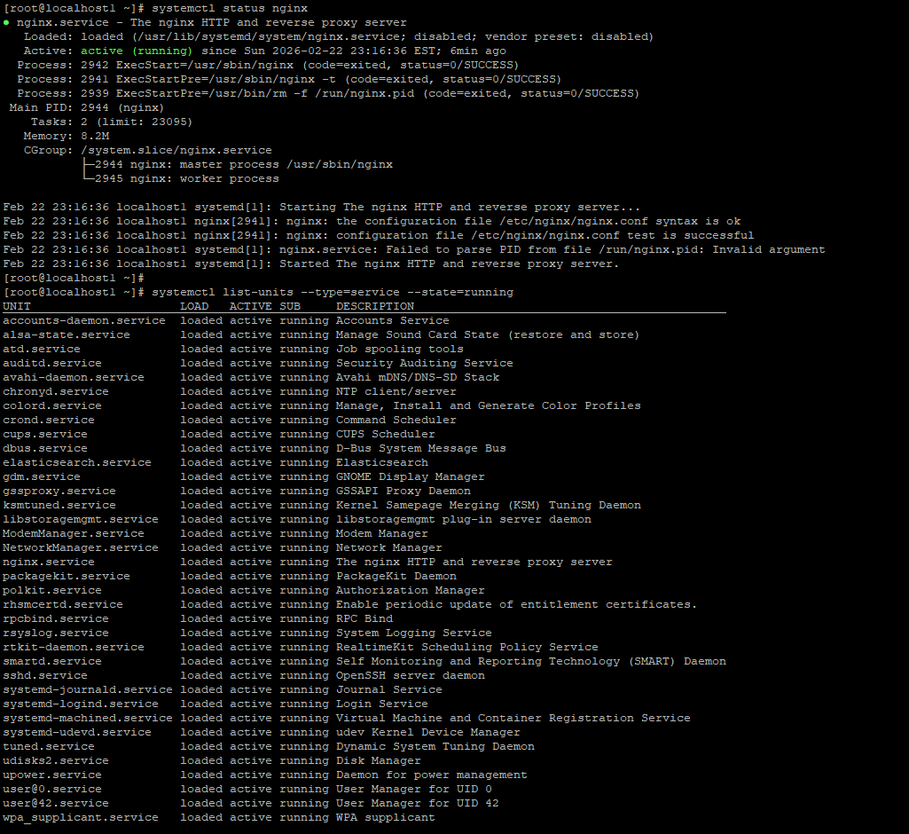
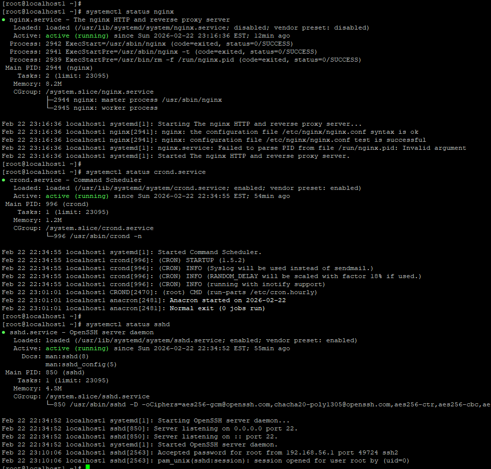

# Day 04 – Linux Practice: Processes and Services

Today I practiced basic Linux process and service inspection commands on my linux server.

---

# Process Checks

## 1. List running processes
Command:
ps -ef | grep nginx

Observation:
- nginx master and worker processes are running
- master PID: 2944
- worker PID: 2945

Command:
ps -ef | grep sshd

Observation:
- ssh daemon running
- multiple ssh sessions visible
- sshd parent PID: 850

Also verified using:
pgrep nginx → 2944 2945  
pgrep sshd → 850 2563 2583 

---

## 2. Find PID using pgrep
Command:
pgrep nginx

Output:
2944  
2945  

Also checked sshd:
pgrep sshd → 850 2563 2583

This confirms multiple ssh sessions.

---

## 3. Real-time process view
Command:
top

Observation:
- system load very low
- nginx and java visible
- systemd PID 1 running

---

# Service Checks

## 4. Inspect nginx service and List running services
Command:
systemctl status nginx

Observation:
- nginx active (running)
- main PID: 2944
- service started successfully

Command:
systemctl list-units --type=service --state=running

Observation:
- sshd, crond, nginx, rsyslog running
- confirms system services active
  

---

# Log Checks

## 5. Check nginx logs and SSH logs
Command:
journalctl -u nginx

Observation:
- nginx config test successful
- service started by systemd

Command:
tail -n 50 /var/log/secure

Observation:
- ssh login attempts visible
- root login from 192.168.56.1
- session open/close events recorded
  

---

# Mini Troubleshooting Flow (nginx)

1. Check service  
   systemctl status nginx  
   systemctl status sshd
   systemctl status crond

   
3. Check process  
   ps -ef | grep nginx  

4. Check logs  
   journalctl -u nginx  

5. Verify port  
   ss -tulnp | grep 80  

Result:
nginx running normally.

---

# Learning

- systemd manages services
- nginx runs as master + worker
- journalctl shows service logs
- ps/pgrep useful for PID checks
