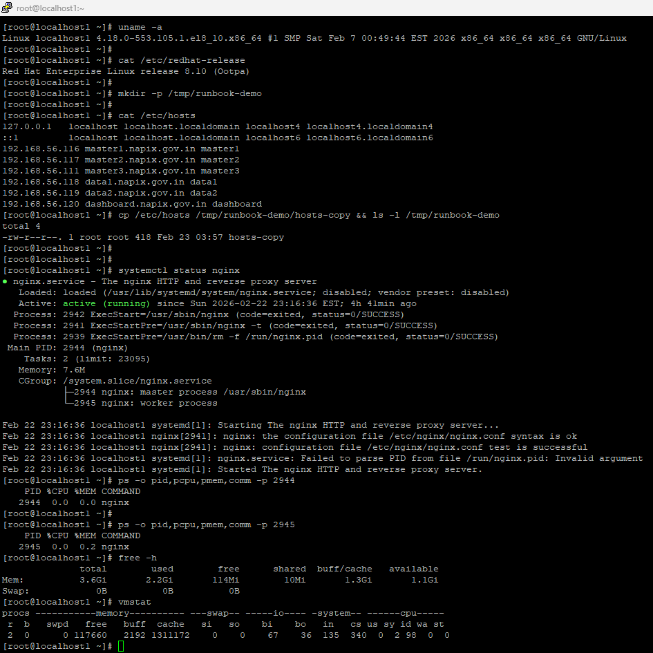
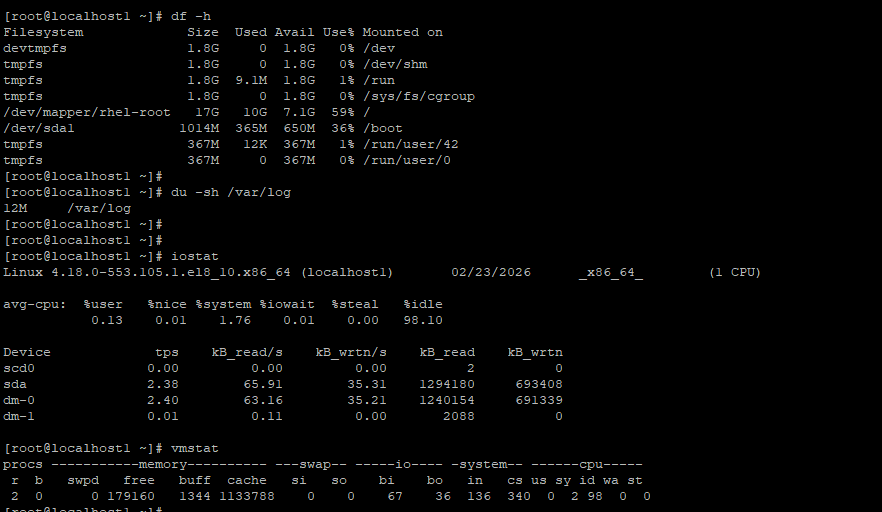
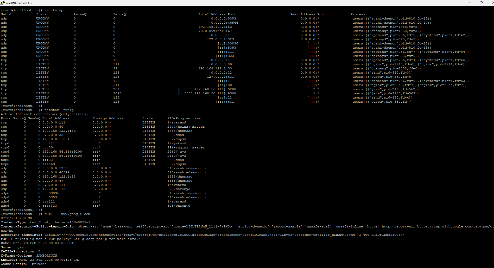

# Linux Troubleshooting Runbook – sshd

## Target Service
sshd (secure shell daemon)  
also checked sshd for logs

---

# Environment Check

uname -a  
→ RHEL 8.10 kernel 4.18  

cat /etc/redhat-release  
→ Red Hat Enterprise Linux 8.10  

System looks normal Linux server.

---

# Filesystem Sanity

mkdir -p /tmp/runbook-demo  
cp /etc/hosts /tmp/runbook-demo/hosts-copy  
ls -l /tmp/runbook-demo  

→ file created successfully  
→ filesystem writable  

---

# Service Status

systemctl status nginx  

→ nginx active (running)  
→ main PID 2944  
→ master + worker process  

Service healthy.

---

# CPU / Memory

ps -o pid,pcpu,pmem,comm -p 2944  
ps -o pid,pcpu,pmem,comm -p 2945  

→ nginx CPU 0%  
→ memory very low  

free -h  

→ 3.6G total RAM  
→ 1.1G available  
→ no swap used  

vmstat  

→ CPU idle ~98%  
→ system not loaded  

---

# Disk / IO

df -h  

→ root 59% used  
→ disk healthy  

du -sh /var/log  

→ 12M logs only  
→ normal  

iostat  

→ very low IO  
→ no disk wait  

---

# Network

ss -tulnp  

→ nginx listening on :80  
→ sshd on :22  

netstat -tulnp  

→ confirms nginx PID 2944 on port 80  

curl -I www.google.com  

→ HTTP 200 OK  
→ outbound network working  

---

# Logs Checked

journalctl -u sshd -n 50  

→ ssh service started normally  
→ login events present  

tail -n 50 /var/log/secure  

→ ssh logins from 192.168.56.x  
→ sessions open/close normal  

No errors seen.

---

# Quick Findings

- nginx running correctly  
- CPU & memory normal  
- disk & IO healthy  
- port 80 listening  
- network working  
- ssh logs normal  
No issue detected.

---

# If This Worsens

1. restart nginx  
   systemctl restart nginx  

2. check config  
   nginx -t  

3. check nginx logs  
   journalctl -u nginx  

4. check port conflict  
   ss -tulnp | grep 80  

5. capture process trace  
   strace -p 2944  
