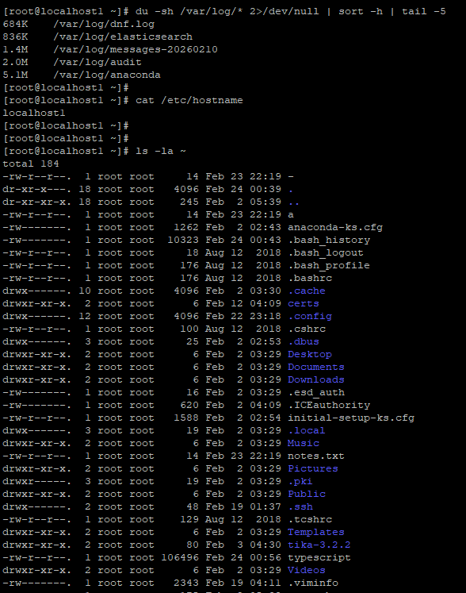
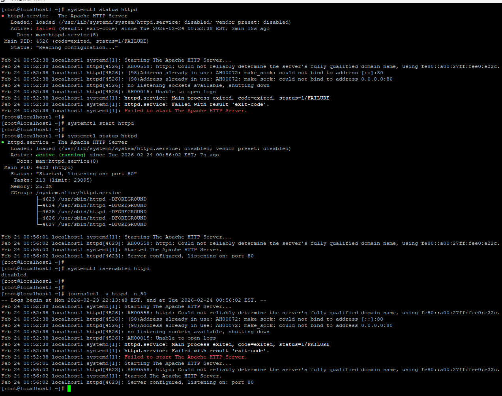
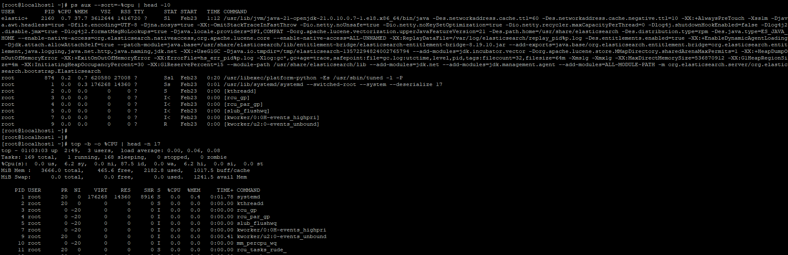
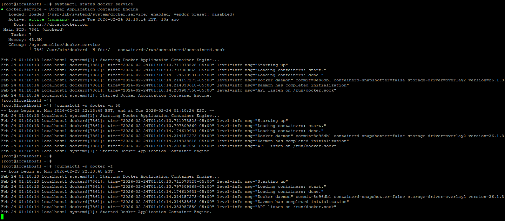
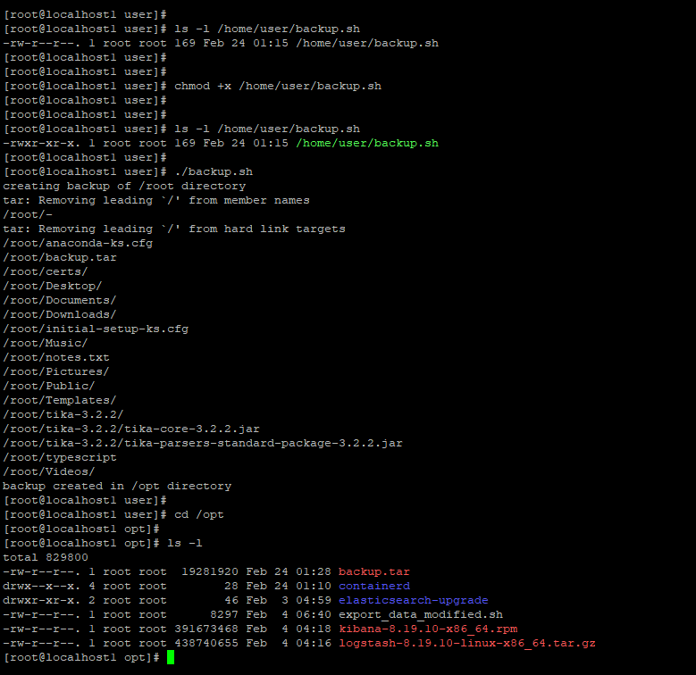

# Day 07 – Linux File System Hierarchy & Scenario Practice

## Part 1 – Linux File System Hierarchy

### / (root)
Top of Linux directory structure. All files and folders start here.  
Example seen: /root, /home, /etc  

I would use this when locating any system path.

---

### /home
Contains user home directories.  
Example seen: /home/user  

I would use this when accessing user files or scripts.

---

### /root
Home directory of root user.  
Example seen: notes.txt, backup.sh  

I would use this when working as root or storing admin scripts.

---

### /etc
Stores system configuration files.  
Command: cat /etc/hostname  
Output: localhost  

I would use this when checking or editing system configs.

---

### /var/log
Contains system and service logs.  
Command: du -sh /var/log/* | sort -h | tail -5  
Largest logs seen: anaconda, audit, messages  

I would use this when troubleshooting services or errors.

---

### /tmp
Temporary files stored here.  
Files auto-deleted on reboot.  

I would use this for temporary scripts or testing.

---

### /bin
Essential system binaries.  
Examples: ls, cp, mv  

I would use this when verifying core commands.

---

### /usr/bin
User-level binaries and applications.  
Examples: java, systemctl  

I would use this when checking installed programs.

---

### /opt
Optional/third-party software location.  
Command: ls -l /opt  
Seen: backup.tar, elasticsearch_upgrade, logstash  

I would use this when installing custom apps.

---

## Hands-on Observations

Largest logs:
/var/log/anaconda
/var/log/audit
/var/log/messages

hostname:
localhost1

Home directory contents:
notes.txt
Documents
Downloads

---

# Part 2 – Scenario Practice

## Scenario 1 – Service Not Starting (httpd)

Step 1: Check service status  
Command: systemctl status httpd  
Why: showed service failed and port conflict  

Step 2: Check logs  
Command: journalctl -u httpd -n 50  
Why: showed port 80 already in use  

Step 3: Start service  
Command: systemctl start httpd  
Why: attempted restart  

Step 4: Verify running  
Command: systemctl status httpd  
Why: confirmed active (running)  

What I learned: always read logs to find root cause.

---

## Scenario 2 – High CPU Usage

Step 1: Check top processes  
Command: ps aux --sort=-%cpu | head -10  
Why: find highest CPU process  

Step 2: Live CPU view  
Command: top  
Why: monitor CPU usage in real time  

Observation: java/elasticsearch process highest CPU.

---

## Scenario 3 – Finding Docker Logs

Step 1: Check service  
Command: systemctl status docker  
Why: confirm docker running  

Step 2: View logs  
Command: journalctl -u docker -n 50  
Why: recent docker logs  

Step 3: Follow logs  
Command: journalctl -u docker -f  
Why: real-time logs  

Learning: systemd services use journalctl logs.

---

## Scenario 4 – Permission Issue

Step 1: Check permission  
Command: ls -l /home/user/backup.sh  
Output: -rw-r--r--  
Why: no execute permission  

Step 2: Add execute  
Command: chmod +x /home/user/backup.sh  
Why: make script executable  

Step 3: Verify  
Command: ls -l /home/user/backup.sh  
Output: -rwxr-xr-x  

Step 4: Run script  
Command: ./backup.sh  
Why: confirmed execution  

Learning: scripts need x permission.

---

# Overall Learning

Linux File System helps know where logs, configs, and apps live.  
Troubleshooting flow:  
check status → read logs → fix → verify.
