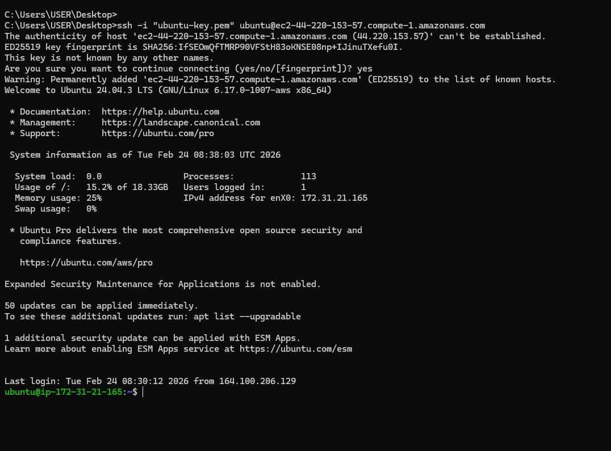
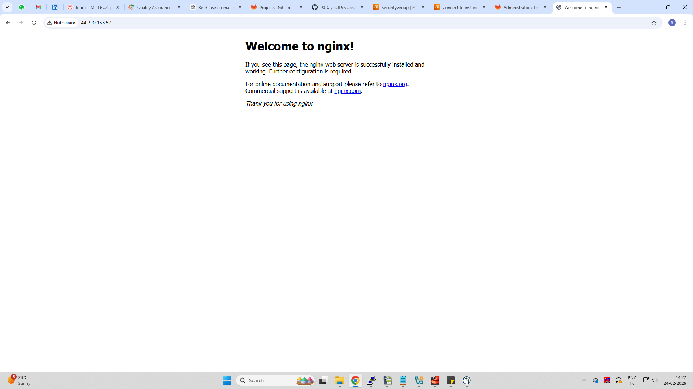
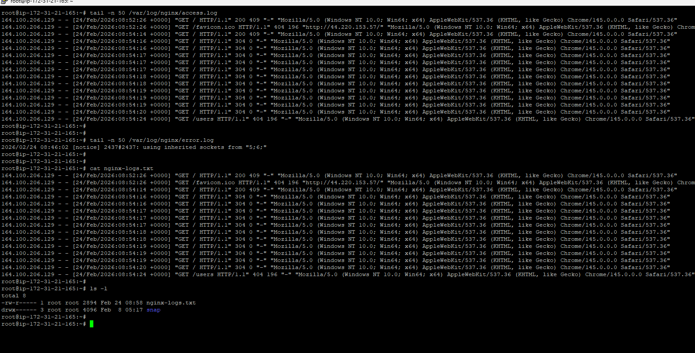

# Day 08 – Cloud Server Setup: Docker, Nginx & Web Deployment

Commands Used

# SSH login
ssh -i ubuntu-key.pem ubuntu@44.220.153.57

SSH Connection:

Nginx Web Server Verification:

Accessed URL: 

http://44.220.153.57

The default Nginx welcome page confirms successful installation and network access.

# Update system
sudo apt update

# Install nginx
sudo apt install nginx -y

# Check nginx status
systemctl status nginx

# View logs
tail -n 50 /var/log/nginx/access.log
tail -n 50 /var/log/nginx/error.log

# Save logs
cat /var/log/nginx/access.log > nginx-logs.txt

# Verify file
ls -l nginx-logs.txt

# Nginx Logs:

Log file successfully created:

nginx-logs.txt

# Challenges Faced

SSH host authenticity prompt appeared during first login
→ Resolved by typing yes to add host to known_hosts

Initially unsure if Nginx port was open
→ Added incoming rule for port 80 in security groups and Verified web page via browser using public IP

Needed correct log path for Ubuntu
→ Found logs in /var/log/nginx/

# What I Learned

How to launch and connect to a cloud Linux server via SSH

Installing and verifying Nginx web server on Ubuntu

Understanding Nginx access and error logs location

Extracting server logs into a file for analysis

Adding incoming rule for port 80 in security groups

Verifying web deployment via public IP access
