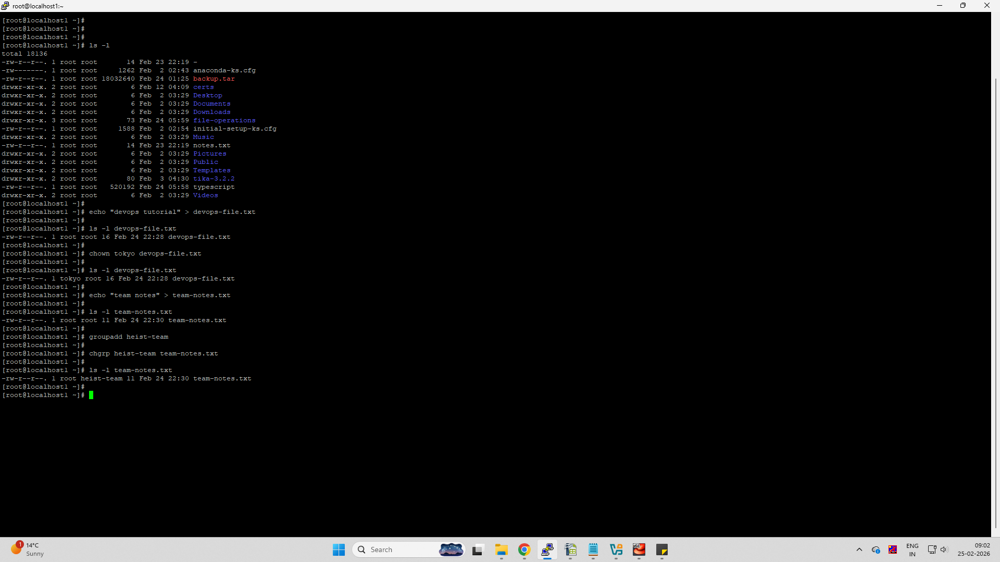
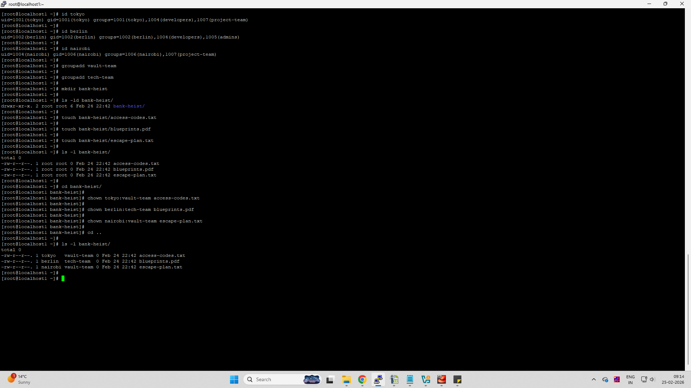

# Day 11 Challenge

## Files & Directories Created

- devops-file.txt  
- team-notes.txt  
- project-config.yaml  
- app-logs/  
- heist-project/  
  - vault/gold.txt  
  - plans/strategy.conf  
- bank-heist/  
  - access-codes.txt  
  - blueprints.pdf  
  - escape-plan.txt  

---

## Ownership Changes

- devops-file.txt: `root:root → tokyo:tokyo`  
- team-notes.txt: `root:root → root:heist-team`  
- project-config.yaml: `root:root → professor:heist-team`  
- app-logs/: `root:root → berlin:heist-team`  
- heist-project/: `root:root → professor:planners` (recursive)  
- bank-heist/access-codes.txt: `root:root → tokyo:vault-team`  
- bank-heist/blueprints.pdf: `root:root → berlin:tech-team`  
- bank-heist/escape-plan.txt: `root:root → nairobi:vault-team`  






---

## Commands Used

```bash
# Check ownership
ls -l
ls -l bank-heist/
ls -lR heist-project/

# Change owner
chown tokyo devops-file.txt

# Change group
groupadd heist-team
chgrp heist-team team-notes.txt

# Change owner and group together
chown professor:heist-team project-config.yaml
chown berlin:heist-team app-logs/

# Recursive ownership change
groupadd planners
chown -R professor:planners heist-project/

# Create users & groups
groupadd vault-team
groupadd tech-team

# Create directory and files
mkdir bank-heist
touch bank-heist/access-codes.txt
touch bank-heist/blueprints.pdf
touch bank-heist/escape-plan.txt

# Assign different ownership
chown tokyo:vault-team bank-heist/access-codes.txt
chown berlin:tech-team bank-heist/blueprints.pdf
chown nairobi:vault-team bank-heist/escape-plan.txt
```

---

## What I Learned

- File ownership in Linux consists of **user (owner)** and **group**, both control access permissions.  
- `chown` can change both owner and group, while `chgrp` changes only group.  
- Recursive ownership (`-R`) is essential for managing **application directories and project structures** in DevOps environments.  

---

## Difference Between Owner and Group

- **Owner:** The user who owns the file and has primary control.  
- **Group:** A set of users who share access permissions to the file.  

Example format:

```
-rw-r--r-- 1 owner group size date filename
```
