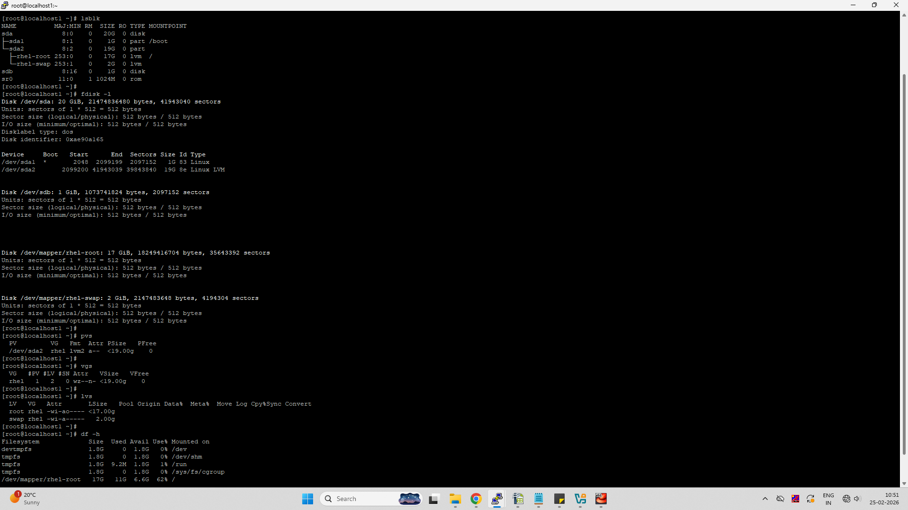
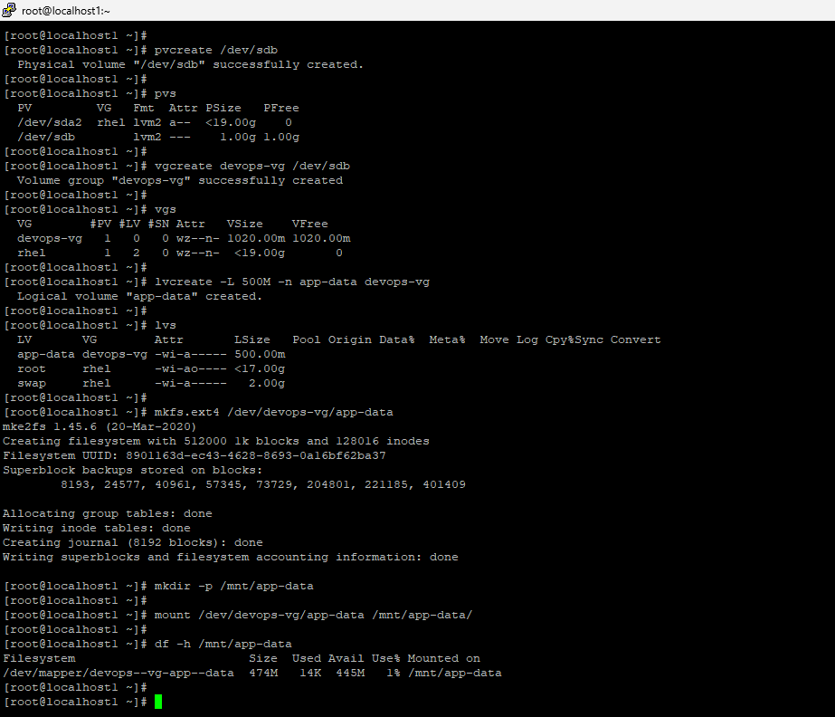
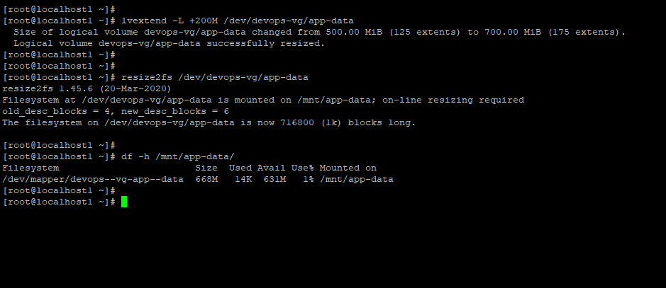

# Day 13 – Linux Volume Management (LVM)

## Commands Used

```bash
# Check existing storage
lsblk
fdisk -l
pvs
vgs
lvs
df -h

# Create Physical Volume
pvcreate /dev/sdb
pvs

# Create Volume Group
vgcreate devops-vg /dev/sdb
vgs

# Create Logical Volume
lvcreate -L 500M -n app-data devops-vg
lvs

# Create filesystem
mkfs.ext4 /dev/devops-vg/app-data

# Create mount point
mkdir -p /mnt/app-data

# Mount logical volume
mount /dev/devops-vg/app-data /mnt/app-data
df -h /mnt/app-data

# Extend logical volume
lvextend -L +200M /dev/devops-vg/app-data

# Resize filesystem after extension
resize2fs /dev/devops-vg/app-data
df -h /mnt/app-data
```

---

## Steps Performed (My Notes)

- Checked disks using `lsblk` → found new disk `/dev/sdb`
- Created physical volume on `/dev/sdb`
- Created volume group `devops-vg`
- Created logical volume `app-data` (500M)
- Formatted with ext4 filesystem
- Mounted at `/mnt/app-data`
- Extended volume by +200M
- Resized filesystem online
- Verified new size using `df -h`

---

## Screenshots

```md



```

---

## What I Learned

- LVM allows flexible disk management without repartitioning
- Logical volumes can be extended online without downtime
- After extending LV, filesystem resize (`resize2fs`) is required

---

## Verification Output

- PV created → `/dev/sdb`
- VG → `devops-vg`
- LV → `app-data`
- Mounted → `/mnt/app-data`
- Size increased from **500M → 700M**
