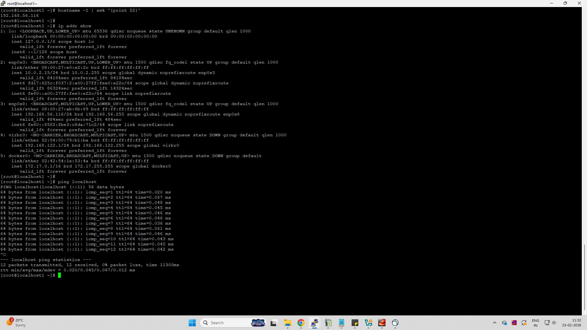
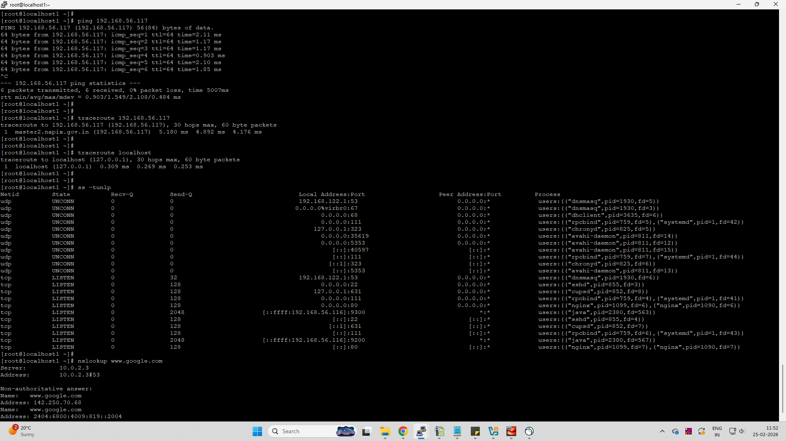
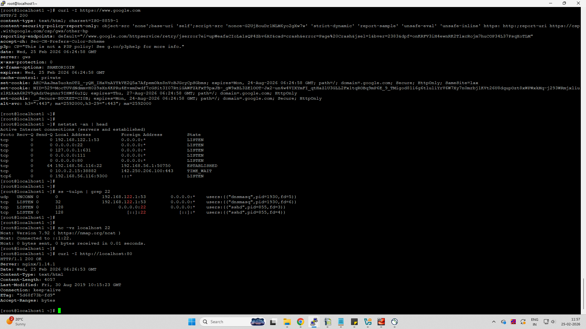

# Day 14 – Networking Fundamentals & Hands-on Checks

## Quick Concepts

- **OSI vs TCP/IP**
  - OSI has 7 layers (Physical → Application). TCP/IP has 4 (Link, Internet, Transport, Application).
  - TCP/IP is practical: Internet (IP), Transport (TCP/UDP), Application (HTTP, DNS).

- **Where protocols sit**
  - IP → Internet layer
  - TCP/UDP → Transport layer
  - HTTP/HTTPS, DNS → Application layer

- **Example**
  - `curl https://google.com` → Application (HTTP) over Transport (TCP) over Internet (IP)

---

## Hands-on Checks & Observations

### Identity
Command:
```
hostname -I
ip addr show
```
Observation: Host has IP **192.168.56.116** and loopback 127.0.0.1.



---

### Reachability
Command:
```
ping 192.168.56.117
```
Observation: Host reachable with low latency (~1 ms), 0% packet loss.



---

### Path
Command:
```
traceroute 192.168.56.117
```
Observation: Single-hop path (same LAN). No delays.

---

### Ports / Listening Services
Command:
```
ss -tulpn
```
Observation: SSH (22), HTTP (80), DNS (53) listening locally.


---

### Name Resolution
Command:
```
nslookup www.google.com
```
Observation: DNS resolved google.com → public IP.


---

### HTTP Check
Command:
```
curl -I http://localhost:80
curl -I https://www.google.com
```
Observation:
- Local nginx returned **HTTP/1.1 200 OK**
- Google returned **HTTP/2 200**



---

### Connections Snapshot
Command:
```
netstat -an | head
```
Observation: Multiple LISTEN ports and some ESTABLISHED connections (SSH, HTTPS).

---

## Mini Task – Port Probe

Listening port identified: **22 (SSH)**

Test:
```
nc -zv localhost 22
```
Result: Connection succeeded → SSH reachable.

If failed → next checks:
- `systemctl status sshd`
- `ss -tulpn | grep 22`
- firewall rules

---

## Reflection

- **Fastest signal:** `ping` (quick reachability check)
- **If DNS fails:** Check Application layer (DNS) → `/etc/resolv.conf`, DNS server reachability
- **If HTTP 500:** Application/service layer → web server logs, backend service

**Two follow-up checks in incident:**
- `ss -tulpn` → confirm service listening
- `journalctl -u <service>` → check errors

---

## Commands Used
```
hostname -I
ip addr show
ping
traceroute
ss -tulpn
nslookup
curl -I
netstat -an
nc -zv
```

## OSI Model – 7 Layers

1. **Physical (L1)** – Moves raw bits over physical media (cables, NIC, signals).
2. **Data Link (L2)** – Frames & MAC addressing inside LAN (Ethernet, ARP, switches).
3. **Network (L3)** – Logical addressing & routing (IP, ICMP, routing).
4. **Transport (L4)** – End‑to‑end communication using ports (TCP/UDP).
5. **Session (L5)** – Manages sessions/connections (SSH session, TLS session).
6. **Presentation (L6)** – Data format & encryption (SSL/TLS, encoding).
7. **Application (L7)** – User protocols/services (HTTP, HTTPS, DNS, FTP).

**Example:**  
`curl https://google.com` = Application → Transport (TCP 443) → Network (IP) → Data Link → Physical

---

# TCP/IP Model (Simplified Networking Stack)

The TCP/IP model has **4 layers** and is the practical networking model used on the internet.

## 1️⃣ Link Layer (Network Access)
Handles communication within the local network.

Examples: Ethernet, MAC address, ARP, switches  
OSI mapping: **Physical + Data Link (L1–L2)**  

 Moves data between devices in the same LAN.

---

## 2️⃣ Internet Layer
Responsible for logical addressing and routing between networks.

Examples: IP, ICMP, routing  
OSI mapping: **Network (L3)**  

 Determines how packets travel across networks.

---

## 3️⃣ Transport Layer
Provides end‑to‑end communication between applications.

Examples: TCP, UDP, ports  
OSI mapping: **Transport (L4)**  

 Ensures reliable delivery (TCP) or fast delivery (UDP).

---

## 4️⃣ Application Layer
User‑level protocols and services.

Examples: HTTP, HTTPS, DNS, SSH, FTP  
OSI mapping: **Session + Presentation + Application (L5–L7)**  

 What users and applications interact with.

---

# OSI vs TCP/IP Mapping

OSI Layer → TCP/IP Layer  

Application (L7) → Application  
Presentation (L6) → Application  
Session (L5) → Application  
Transport (L4) → Transport  
Network (L3) → Internet  
Data Link (L2) → Link  
Physical (L1) → Link  

---

# Practical Example (Day‑14 Lab)

Command:
```
curl -I https://www.google.com
```

Flow through TCP/IP stack:

Application → HTTP request  
Transport → TCP port 443  
Internet → IP routing  
Link → Ethernet/Wi‑Fi  
Physical → Network signal  
