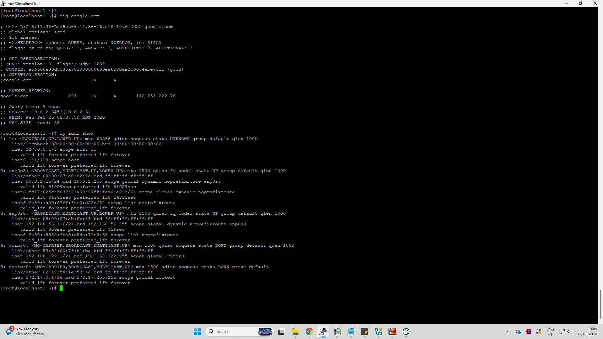
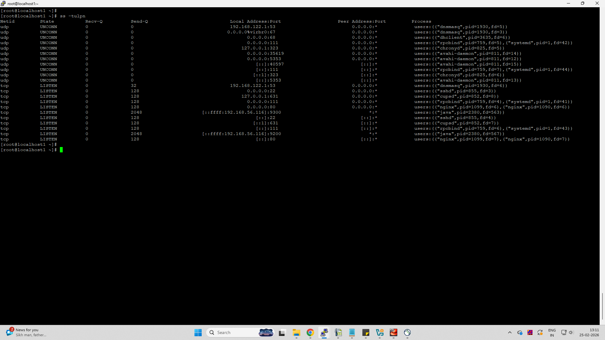

# Day 15 – Networking Concepts: DNS, IP, Subnets & Ports

## Task 1: DNS – How Names Become IPs

When we type **google.com** in a browser:
- The system checks local cache → OS resolver → configured DNS server.
- DNS resolver queries root → TLD (.com) → authoritative DNS server.
- DNS returns IP (A/AAAA record).
- Browser connects to that IP using TCP and HTTP/HTTPS.

**DNS Record Types**
- **A** → Domain → IPv4 address  
- **AAAA** → Domain → IPv6 address  
- **CNAME** → Alias to another domain  
- **MX** → Mail server for domain  
- **NS** → Authoritative name server  

**dig google.com (from screenshot)**
- A record IP → **142.251.222.78**
- TTL → **294 seconds**

---

## Task 2: IP Addressing

**What is IPv4?**
- 32-bit address written in 4 octets  
- Example: 192.168.56.116  

**Public vs Private IP**
- Public → Internet routable (example: 142.251.222.78)
- Private → Internal network (example: 192.168.56.116)

**Private IP Ranges**
- 10.0.0.0 – 10.255.255.255  
- 172.16.0.0 – 172.31.255.255  
- 192.168.0.0 – 192.168.255.255  

**ip addr show (from screenshot)**
- 10.0.2.15 → Private  
- 192.168.56.116 → Private  
- 172.17.0.1 → Private (Docker bridge)

---

## Task 3: CIDR & Subnetting

**What does /24 mean?**
- 24 bits network + 8 bits host  
- Example: 192.168.1.0/24  

**Usable Hosts**
- /24 → 256 total → 254 usable  
- /16 → 65536 total → 65534 usable  
- /28 → 16 total → 14 usable  

**Why subnet?**
- Divide networks logically  
- Reduce broadcast traffic  
- Improve security and management  

### CIDR Table

| CIDR | Subnet Mask     | Total IPs | Usable Hosts |
|------|-----------------|-----------|--------------|
| /24  | 255.255.255.0   | 256       | 254          |
| /16  | 255.255.0.0     | 65536     | 65534        |
| /28  | 255.255.255.240 | 16        | 14           |

---

## Task 4: Ports – The Doors to Services

**What is a port?**
- Logical communication endpoint on a host  
- Allows multiple services on same IP  

### Common Ports

| Port | Service |
|------|--------|
| 22   | SSH |
| 80   | HTTP |
| 443  | HTTPS |
| 53   | DNS |
| 3306 | MySQL |
| 6379 | Redis |
| 27017 | MongoDB |

**ss -tulpn (from screenshot)**
- 22 → sshd  
- 80 → nginx  
- 53 → dnsmasq  

---

## Task 5: Putting It Together

**curl http://myapp.com:8080 involves**
- DNS resolution → IP address
- TCP connection to port 8080
- HTTP request over TCP/IP stack

**App can't reach DB 10.0.1.50:3306 — checks**
- Network reachability (ping / traceroute)
- Port open (ss / nc)
- Firewall / security group
- DB service status

---

## What I Learned
- DNS resolves domain names to IPs using hierarchical servers.
- CIDR notation defines network size and host capacity.
- Ports map services to network communication and help troubleshooting.

---

## Screenshots

