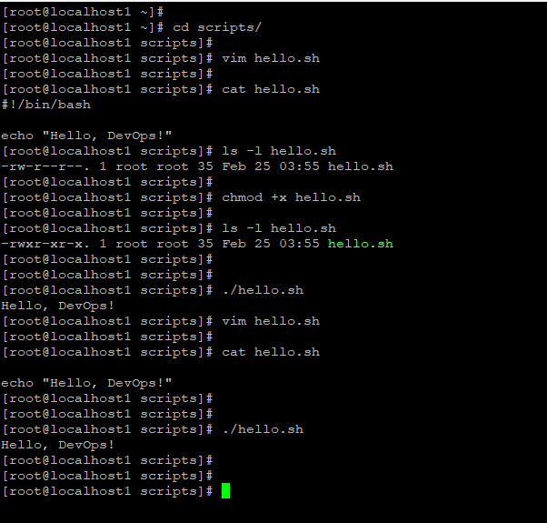
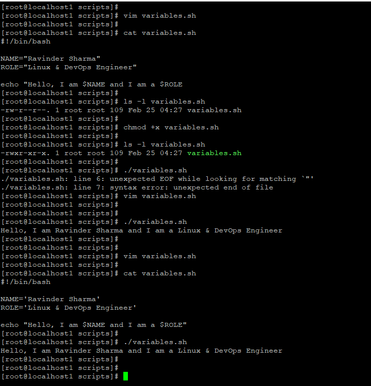
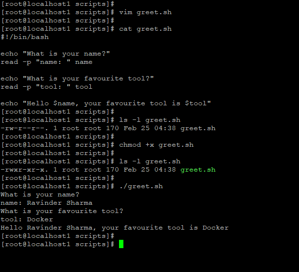
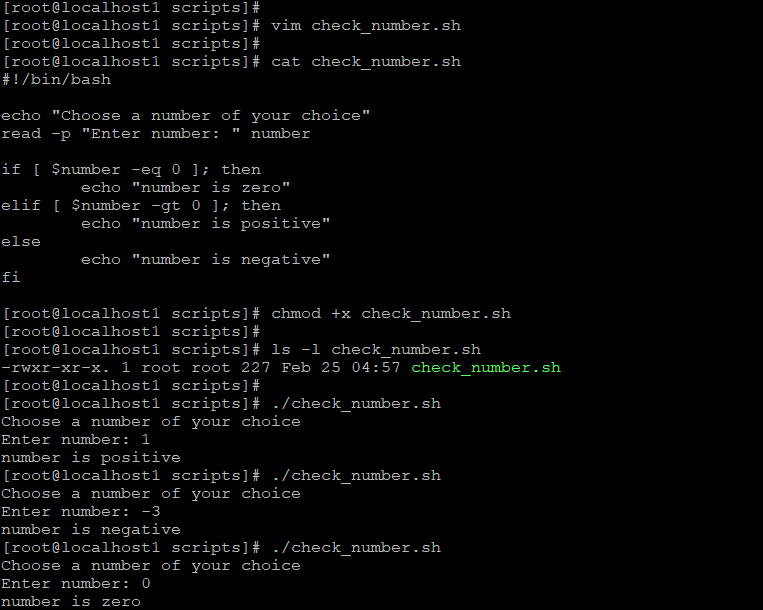
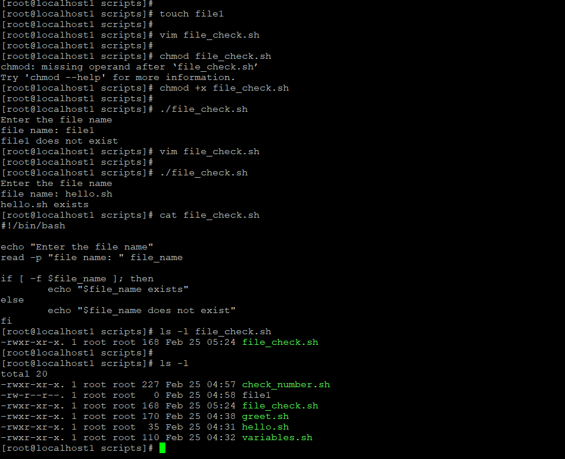
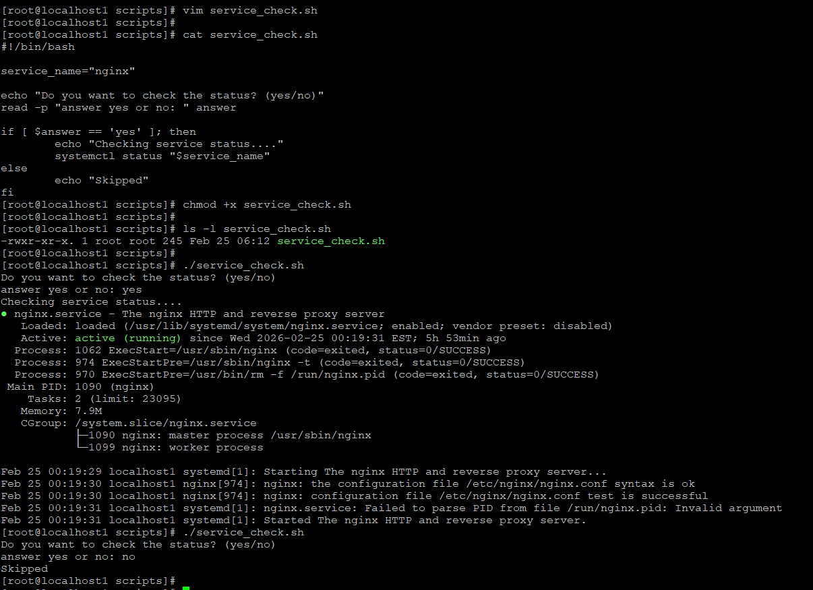

# Day 16 – Shell Scripting Basics 

## Task 1: Hello Script
**Script: hello.sh**
```bash
#!/bin/bash
echo "Hello, DevOps!"
```

**Steps I ran:**
- chmod +x hello.sh
- ./hello.sh

**Output:** Hello, DevOps!

**Note:** If I remove the shebang (#!/bin/bash), script may still run with `bash hello.sh`, but `./hello.sh` may fail or use wrong shell.



---

## Task 2: Variables
**Script: variables.sh**
```bash
#!/bin/bash
NAME="Ravinder Sharma"
ROLE="Linux & DevOps Engineer"

echo "Hello, I am $NAME and I am a $ROLE"
```

**Output:** Hello, I am Ravinder Sharma and I am a Linux & DevOps Engineer

**Observation:**
- Double quotes allow variable expansion → $NAME works
- Single quotes print literal → '$NAME' stays as text



---

## Task 3: User Input
**Script: greet.sh**
```bash
#!/bin/bash
echo "What is your name?"
read -p "name: " name

echo "What is your favourite tool?"
read -p "tool: " tool

echo "Hello $name, your favourite tool is $tool"
```

**Output Example:**
Hello Ravinder Sharma, your favourite tool is Docker



---

## Task 4: If‑Else Conditions

### check_number.sh
```bash
#!/bin/bash
echo "Choose a number of your choice"
read -p "Enter number: " number

if [ $number -eq 0 ]; then
    echo "number is zero"
elif [ $number -gt 0 ]; then
    echo "number is positive"
else
    echo "number is negative"
fi
```

**Output tested:**
- 1 → positive
- -3 → negative
- 0 → zero



### file_check.sh
```bash
#!/bin/bash
echo "Enter the file name"
read -p "file name: " file_name

if [ -f $file_name ]; then
    echo "$file_name exists"
else
    echo "$file_name does not exist"
fi
```

**Output:**
- hello.sh exists
- file1 does not exist



---

## Task 5: Service Check Script
**Script: service_check.sh**
```bash
#!/bin/bash
service_name="nginx"

echo "Do you want to check the status? (yes/no)"
read -p "answer yes or no: " answer

if [ $answer == "yes" ]; then
    echo "Checking service status...."
    systemctl status "$service_name"
else
    echo "Skipped"
fi
```

**Output:**
- yes → nginx status shown (active)
- no → Skipped



---

# What I Learned
- Shebang defines interpreter(shell) and execution method
- Variables and user input make scripts dynamic
- if‑else allows decision‑based automation

- task-4b.png → file_check.sh
- task-5.png → service_check.sh
