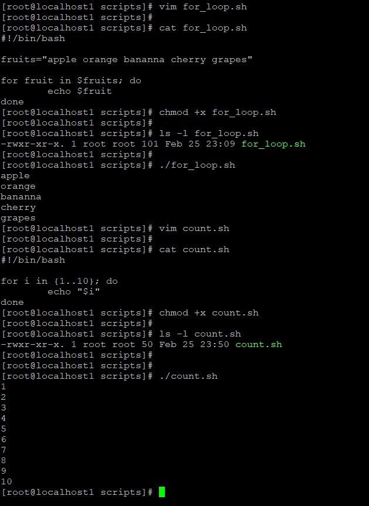
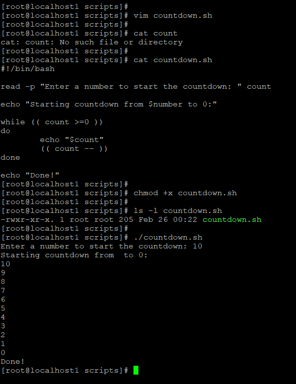
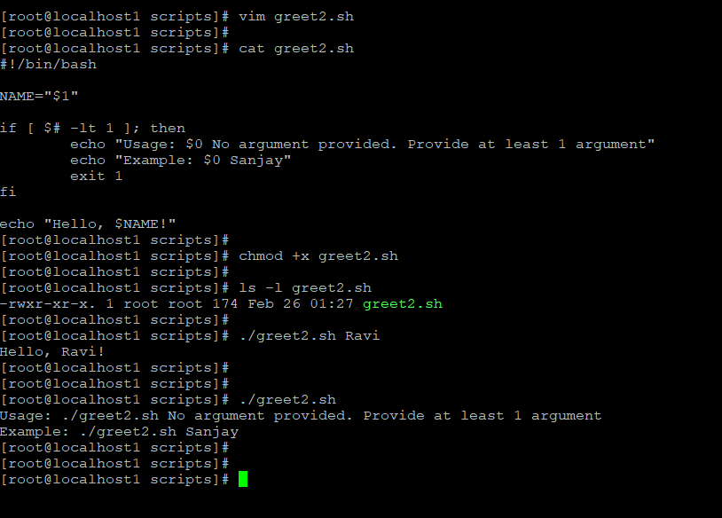
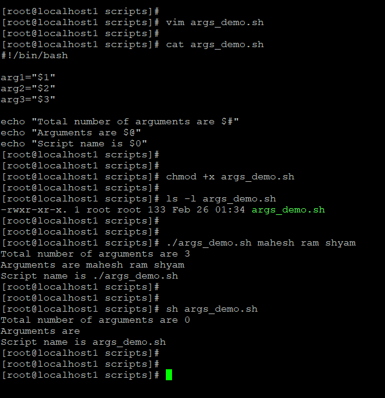
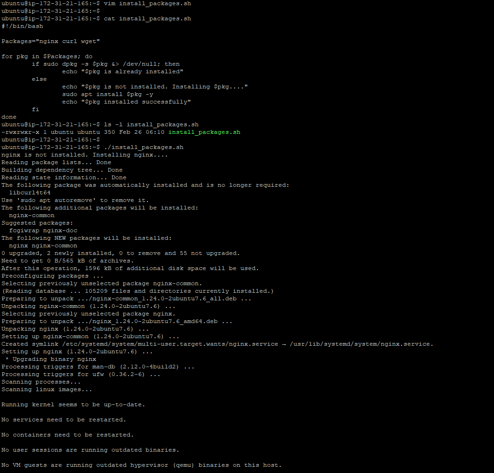
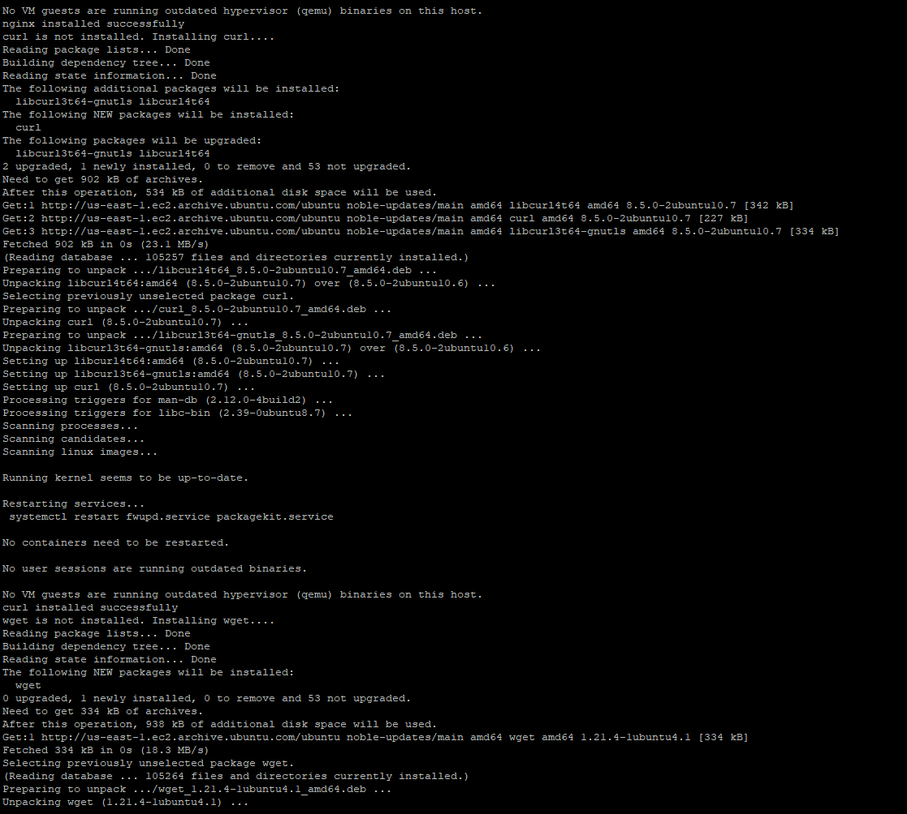
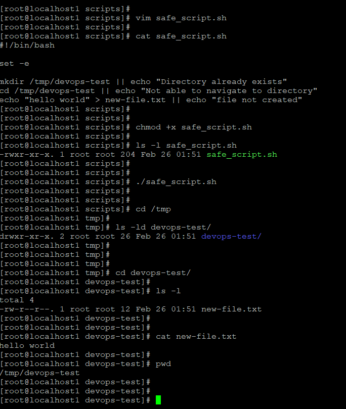
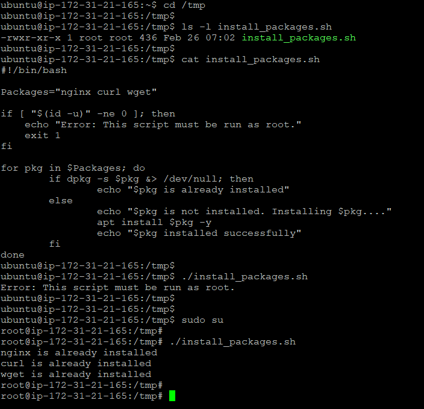

# Day 17 – Shell Scripting: Loops, Arguments & Error Handling

## Task 1 – For Loop

### for_loop.sh
```bash
#!/bin/bash
fruits="apple orange banana cherry grapes"

for fruit in $fruits; do
  echo $fruit
done
```

**Output:**
apple  
orange  
banana  
cherry  
grapes  

---

### count.sh
```bash
#!/bin/bash
for i in {1..10}; do
  echo "$i"
done
```

**Output:**
1 2 3 4 5 6 7 8 9 10



---

## Task 2 – While Loop

### countdown.sh
```bash
#!/bin/bash
read -p "Enter a number to start the countdown: " count

echo "Starting countdown from $count to 0:"
while (( count >= 0 ))
do
  echo "$count"
  (( count-- ))
done

echo "Done!"
```

**Output Example:**
10 9 8 7 6 5 4 3 2 1 0  
Done!



---

## Task 3 – Command-Line Arguments

### greet2.sh
```bash
#!/bin/bash
NAME="$1"

if [ $# -lt 1 ]; then
  echo "Usage: $0 <name>"
  exit 1
fi

echo "Hello, $NAME!"
```

**Output:**
./greet2.sh Ravi  
Hello, Ravi!



---

### args_demo.sh
```bash
#!/bin/bash

arg1="$1"
arg2="$2"
arg3="$3"

echo "Total number of arguments are $#"
echo "Arguments are $@"
echo "Script name is $0"
```

**Output:**
./args_demo.sh mahesh ram shyam  
Total number of arguments are 3  
Arguments are mahesh ram shyam  
Script name is ./args_demo.sh



---

## Task 4 – Install Packages via Script

### install_packages.sh
```bash
#!/bin/bash

Packages="nginx curl wget"

if [ "$(id -u)" -ne 0 ]; then
  echo "Error: This script must be run as root."
  exit 1
fi

for pkg in $Packages; do
  if dpkg -s $pkg &> /dev/null; then
    echo "$pkg is already installed"
  else
    echo "$pkg is not installed. Installing $pkg..."
    apt install $pkg -y
    echo "$pkg installed successfully"
  fi
done
```

**Output:**
nginx is already installed  
curl is already installed  
wget is already installed  




---

## Task 5 – Error Handling

### safe_script.sh
```bash
#!/bin/bash
set -e

mkdir /tmp/devops-test || echo "Directory already exists"
cd /tmp/devops-test || echo "Not able to navigate to directory"
echo "hello world" > new-file.txt || echo "file not created"
```

**Result:**
Directory created /tmp/devops-test  
File new-file.txt created successfully




## Root Privilege Check in install_packages.sh

To ensure package installation runs safely, I added a root-user check at the start of the script. This prevents accidental execution by non-root users.

### Code Added
```bash
#!/bin/bash

if [ "$(id -u)" -ne 0 ]; then
  echo "Error: This script must be run as root."
  exit 1
fi
```



---

# What I Learned

- for and while loops automate repetitive tasks in scripts.
- Command-line arguments ($1, $#, $@) make scripts dynamic and reusable.
- Error handling (set -e, ||, root checks) makes scripts safe for production.

---

# Notes

- Shebang (#!/bin/bash) tells Linux to use Bash interpreter.
- Always make scripts executable: chmod +x script.sh
- Run scripts: ./script.sh
