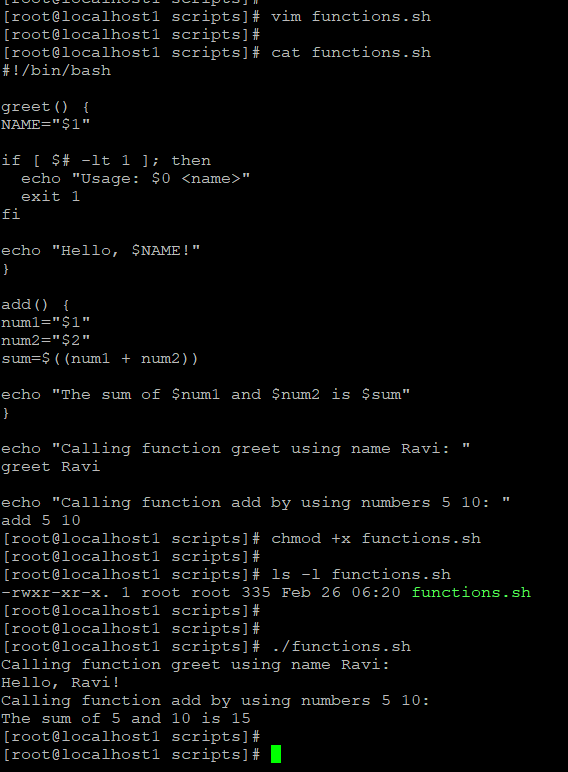
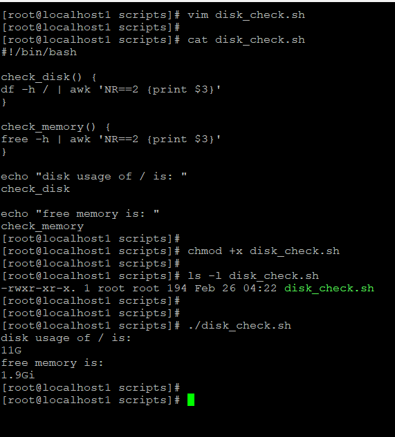
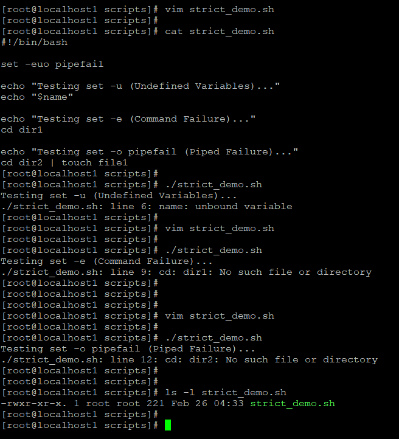
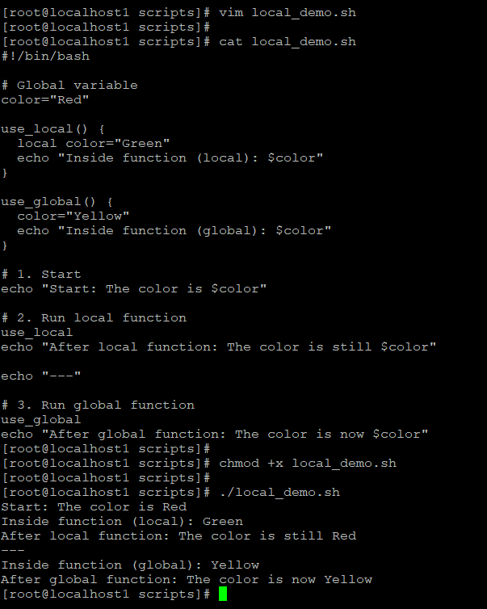
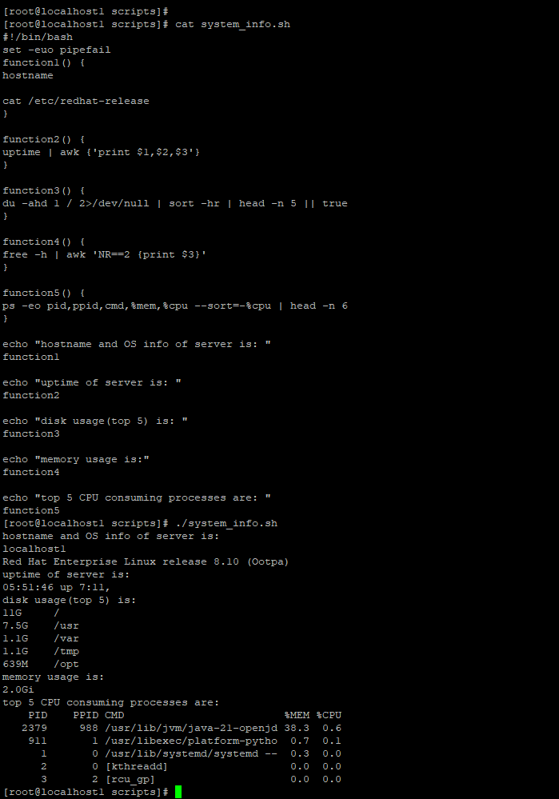

# Day 18 – Shell Scripting: Functions & Intermediate Concepts

## Task 1: Basic Functions

### Script: `functions.sh`
```bash
#!/bin/bash

greet() {
  NAME="$1"
  if [ $# -lt 1 ]; then
    echo "Usage: $0 <name>"
    exit 1
  fi
  echo "Hello, $NAME!"
}

add() {
  num1="$1"
  num2="$2"
  sum=$((num1 + num2))
  echo "The sum of $num1 and $num2 is $sum"
}

echo "Calling function greet using name Ravi:"
greet Ravi

echo "Calling function add by using numbers 5 10:"
add 5 10
```

**Output Screenshot:**  


---

## Task 2: Functions with Return Values

### Script: `disk_check.sh`
```bash
#!/bin/bash

check_disk() {
  df -h / | awk 'NR==2 {print $3}'
}

check_memory() {
  free -h | awk 'NR==2 {print $3}'
}

echo "disk usage of / is:"
check_disk

echo "free memory is:"
check_memory
```

**Output Screenshot:**  


---

## Task 3: Strict Mode — set -euo pipefail

### Script: `strict_demo.sh`
```bash
#!/bin/bash
set -euo pipefail

echo "Testing set -u (Undefined Variables)..."
echo "$name"

echo "Testing set -e (Command Failure)..."
cd dir1

echo "Testing set -o pipefail (Piped Failure)..."
cd dir2 | touch file1
```

**Output Screenshot:**  


### Explanation
- **set -e** → exit immediately if any command fails  
- **set -u** → treat unset variables as error  
- **set -o pipefail** → pipeline fails if any command fails  

---

## Task 4: Local Variables

### Script: `local_demo.sh`
```bash
#!/bin/bash

# Global variable
color="Red"

use_local() {
  local color="Green"
  echo "Inside function (local): $color"
}

use_global() {
  color="Yellow"
  echo "Inside function (global): $color"
}

echo "Start: The color is $color"
use_local
echo "After local function: The color is still $color"

echo "----"
use_global
echo "After global function: The color is now $color"
```

**Output Screenshot:**  


---

## Task 5: System Info Reporter

### Script: `system_info.sh`
```bash
#!/bin/bash
set -euo pipefail

function1() {
  hostname
  cat /etc/redhat-release
}

function2() {
  uptime | awk '{print $1,$2,$3}'
}

function3() {
  du -ahd 1 / 2>/dev/null | sort -hr | head -n 5 || true
}

function4() {
  free -h | awk 'NR==2 {print $3}'
}

function5() {
  ps -eo pid,ppid,cmd,%mem,%cpu --sort=-%cpu | head -n 6
}

echo "hostname and OS info of server is:"
function1

echo "uptime of server is:"
function2

echo "disk usage (top 5) is:"
function3

echo "memory usage is:"
function4

echo "top 5 CPU consuming processes are:"
function5
```

**Output Screenshot:**  


---

## What I Learned
- Functions make scripts modular and reusable
- Strict mode prevents silent failures and bugs
- Local variables avoid unintended global changes
