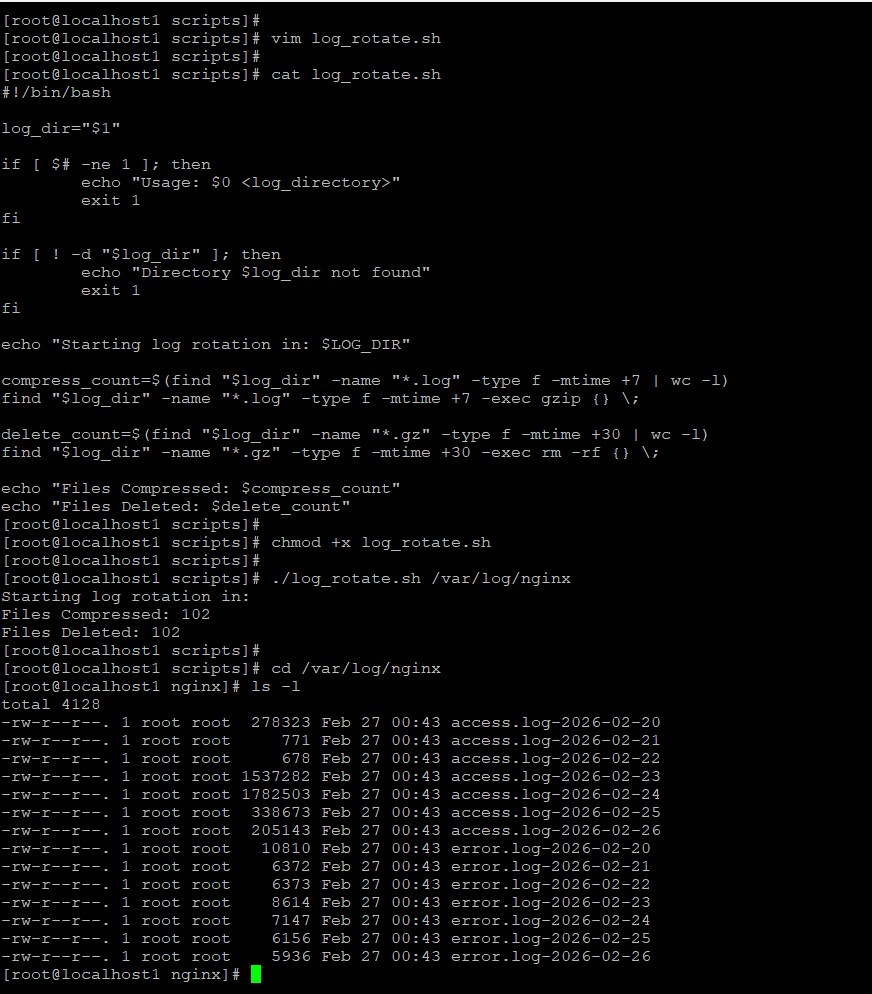
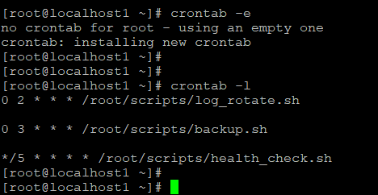
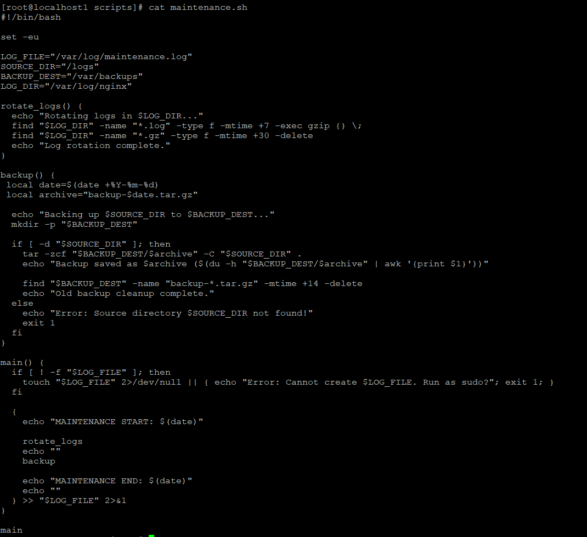
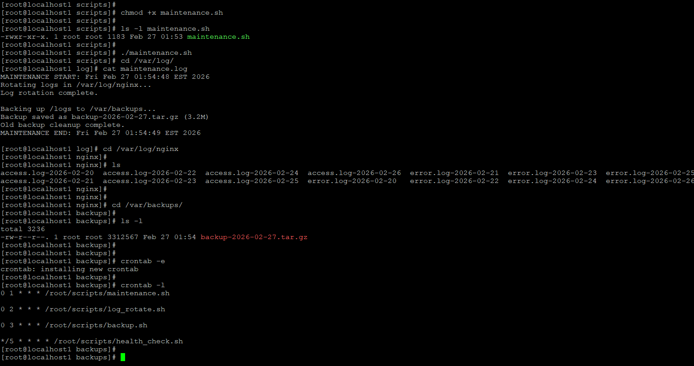

# Day 19 – Shell Scripting Project: Log Rotation, Backup & Crontab

## Overview
Built real-world automation scripts for log rotation, backups, and cron scheduling.

---

## Task 1: Log Rotation Script

### Script: log_rotate.sh
```bash
#!/bin/bash

log_dir="$1"

if [ $# -ne 1 ]; then
    echo "Usage: $0 <log_directory>"
    exit 1
fi

if [ ! -d "$log_dir" ]; then
    echo "Directory $log_dir not found"
    exit 1
fi

echo "Starting log rotation in: $log_dir"

compress_count=$(find "$log_dir" -name "*.log" -type f -mtime +7 | wc -l)
find "$log_dir" -name "*.log" -type f -mtime +7 -exec gzip {} \;

delete_count=$(find "$log_dir" -name "*.gz" -type f -mtime +30 | wc -l)
find "$log_dir" -name "*.gz" -type f -mtime +30 -exec rm -f {} \;

echo "Files Compressed: $compress_count"
echo "Files Deleted: $delete_count"
```


---

## Task 2: Backup Script

### Script: backup.sh
```bash
#!/bin/bash
set -eu

SOURCE_DIR="$1"
BACKUP_DEST="$2"
DATE=$(date +%Y-%m-%d)
ARCHIVE_NAME="backup-$DATE.tar.gz"

if [ $# -ne 2 ]; then
    echo "Usage: $0 <source_directory> <backup_destination>"
    exit 1
fi

if [ ! -d "$SOURCE_DIR" ]; then
    echo "Error: Source directory $SOURCE_DIR does not exist."
    exit 1
fi

mkdir -p "$BACKUP_DEST"

echo "Starting backup of $SOURCE_DIR..."

tar -czf "$BACKUP_DEST/$ARCHIVE_NAME" -C "$SOURCE_DIR" .

if [ -f "$BACKUP_DEST/$ARCHIVE_NAME" ]; then
    SIZE=$(du -h "$BACKUP_DEST/$ARCHIVE_NAME" | awk '{print $1}')
    echo "Backup successful"
    echo "Archive Name: $ARCHIVE_NAME"
    echo "Archive Size: $SIZE"
else
    echo "Error: Archive file not created."
    exit 1
fi

echo "Deleting backups older than 14 days..."
find "$BACKUP_DEST" -name "backup-*.tar.gz" -type f -mtime +14 -delete
echo "Done."
```


---

## Task 3: Cron Scheduling

```
0 2 * * * /root/scripts/log_rotate.sh /var/log/nginx
0 3 * * 0 /root/scripts/backup.sh /logs /backups
*/5 * * * * /root/scripts/health_check.sh
```


---

## Task 4: Maintenance Script

### Script: maintenance.sh
```bash
#!/bin/bash
set -eu

LOG_FILE="/var/log/maintenance.log"
LOG_DIR="/var/log/nginx"
BACKUP_SRC="/logs"
BACKUP_DEST="/var/backups"

rotate_logs() {
    find "$LOG_DIR" -name "*.log" -type f -mtime +7 -exec gzip {} \;
    find "$LOG_DIR" -name "*.gz" -type f -mtime +30 -delete
}

backup() {
    DATE=$(date +%Y-%m-%d)
    ARCHIVE="backup-$DATE.tar.gz"
    mkdir -p "$BACKUP_DEST"
    tar -czf "$BACKUP_DEST/$ARCHIVE" -C "$BACKUP_SRC" .
}

{
echo "MAINTENANCE START: $(date)"
rotate_logs
backup
echo "MAINTENANCE END: $(date)"
} >> "$LOG_FILE" 2>&1
```



---

## What I Learned
- Automating log rotation & backups
- Scheduling scripts with cron
- Writing reusable, safe shell scripts
