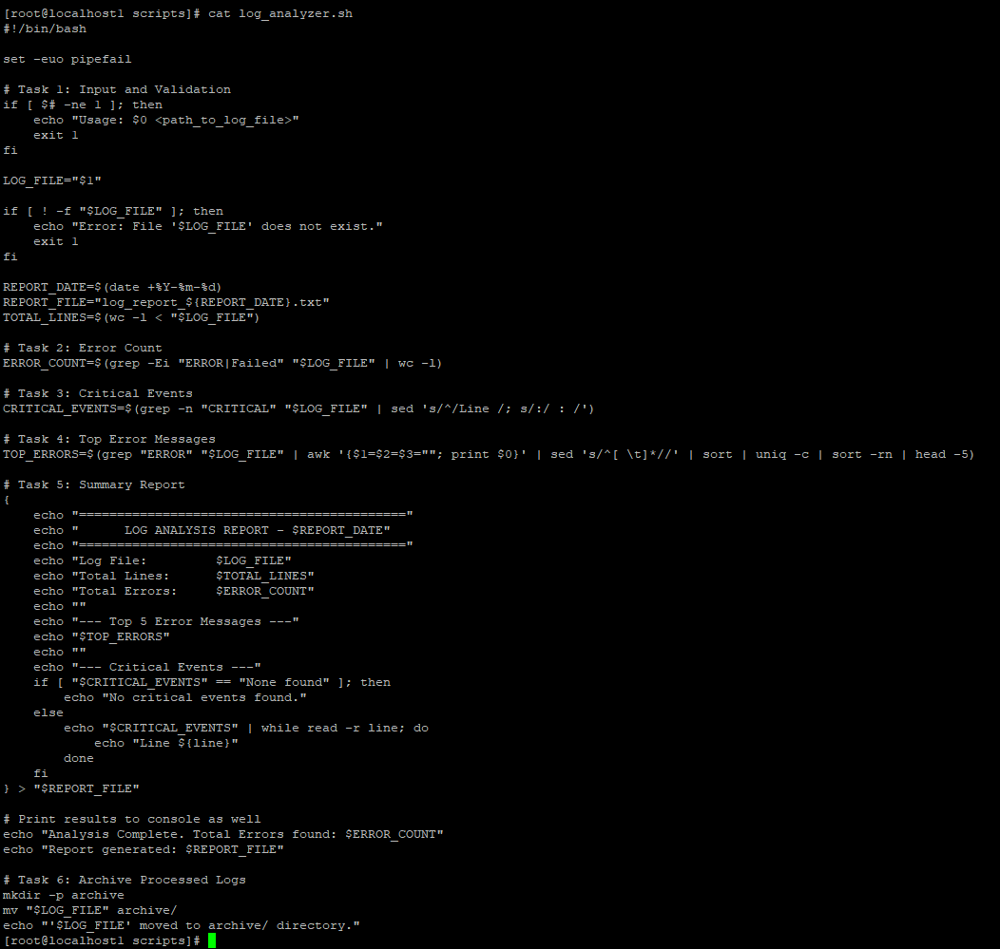
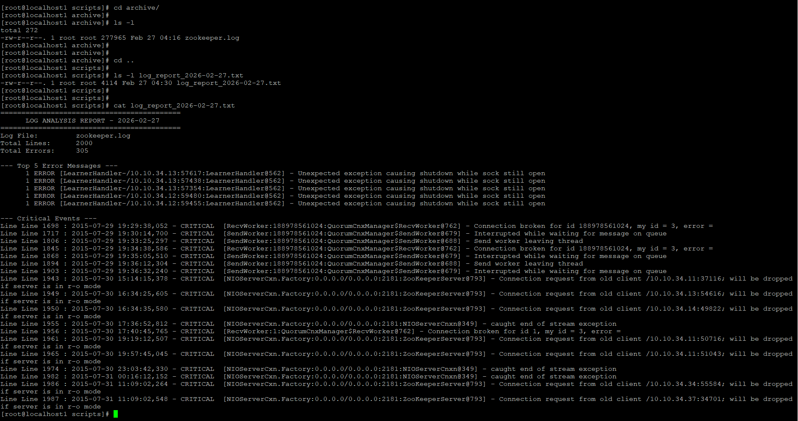

# Day 20 – Bash Scripting Challenge: Log Analyzer and Report Generator

## Script: `log_analyzer.sh`

```bash
#!/bin/bash
set -euo pipefail

# Task 1: Input Validation
if [ $# -ne 1 ]; then
  echo "Usage: $0 <path_to_log_file>"
  exit 1
fi

LOG_FILE="$1"

if [ ! -f "$LOG_FILE" ]; then
  echo "Error: File '$LOG_FILE' does not exist."
  exit 1
fi

REPORT_DATE=$(date +%Y-%m-%d)
REPORT_FILE="log_report_${REPORT_DATE}.txt"
TOTAL_LINES=$(wc -l < "$LOG_FILE")

# Task 2: Error Count
ERROR_COUNT=$(grep -Ei "ERROR|Failed" "$LOG_FILE" | wc -l)

# Task 3: Critical Events
CRITICAL_EVENTS=$(grep -n "CRITICAL" "$LOG_FILE" || true)

# Task 4: Top Error Messages
TOP_ERRORS=$(grep "ERROR" "$LOG_FILE"   | awk '{$1=$2=$3=""; print}'   | sed 's/^[ \t]*//'   | sort | uniq -c | sort -rn | head -5)

# Task 5: Summary Report
{
echo "========================================="
echo "      LOG ANALYSIS REPORT - $REPORT_DATE"
echo "========================================="
echo "Log File: $LOG_FILE"
echo "Total Lines: $TOTAL_LINES"
echo "Total Errors: $ERROR_COUNT"
echo ""
echo "--- Top 5 Error Messages ---"
echo "$TOP_ERRORS"
echo ""
echo "--- Critical Events ---"
if [ -z "$CRITICAL_EVENTS" ]; then
  echo "No critical events found."
else
  echo "$CRITICAL_EVENTS"
fi
} > "$REPORT_FILE"

echo "Analysis Complete. Total Errors: $ERROR_COUNT"
echo "Report generated: $REPORT_FILE"

# Task 6: Archive processed log
mkdir -p archive
mv "$LOG_FILE" archive/
echo "Log file moved to archive/"
```


---

## Sample Output

### Script Execution

```
./log_analyzer.sh zookeeper.log

Analysis Complete. Total Errors: 305
Report generated: log_report_2026-02-27.txt
Log file moved to archive/
```

### Generated Report (`log_report_2026-02-27.txt`)

```
LOG ANALYSIS REPORT - 2026-02-27
================================

Log File: zookeeper.log
Total Lines: 2000
Total Errors: 305

--- Top 5 Error Messages ---
1 Unexpected exception causing shutdown while sock still open
1 Interrupted while waiting for message on queue
1 Connection request from old client
1 caught end of stream exception
1 Send worker leaving thread

--- Critical Events ---
Line 1698: CRITICAL Connection broken
Line 1717: CRITICAL Interrupted while waiting
Line 1806: CRITICAL Send worker leaving thread
...
```


---

## Commands / Tools Used

- **grep** → search ERROR and CRITICAL log entries  
- **wc -l** → count total lines and errors  
- **awk** → extract error message text  
- **sort / uniq -c** → count occurrences of messages  
- **head** → get top 5 errors  
- **date** → generate report filename  
- **mv** → archive processed logs  
- **mkdir -p** → create archive directory safely  

---

## What I Learned

- How to parse and analyze large log files using grep, awk, sort, and uniq  
- How to generate automated reports with timestamps in Bash  
- How to build production-style scripts with validation, error handling, and archiving  
