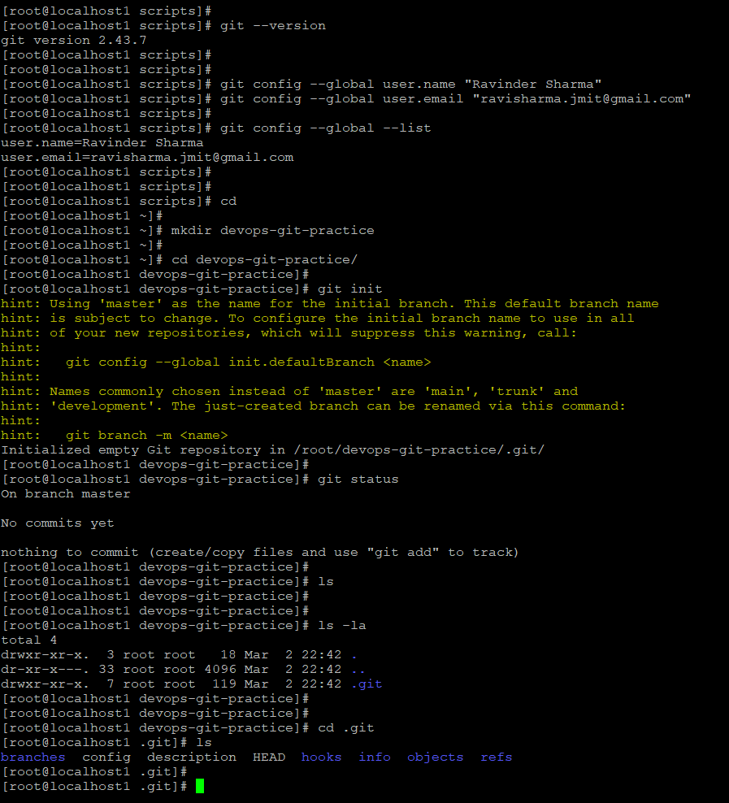
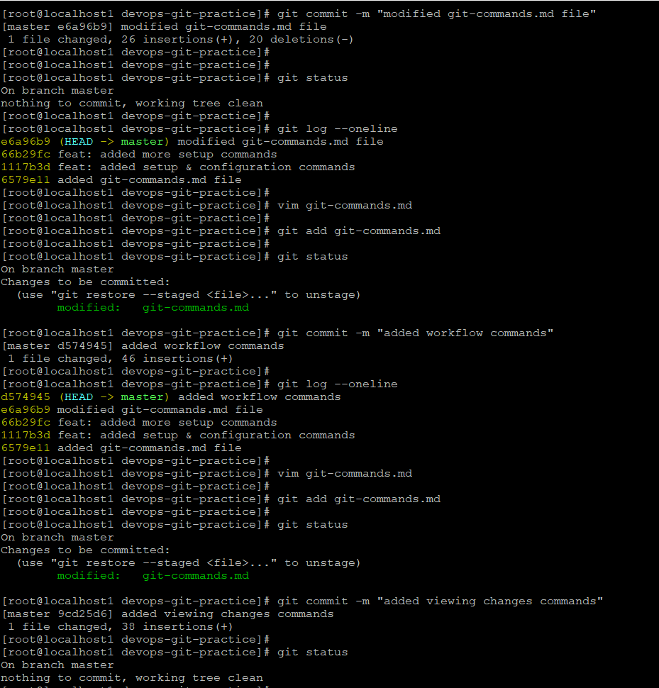

# Day 22 -- Introduction to Git: Your First Repository

## Overview

Today I started my Git journey and practiced the complete basic Git workflow from scratch. I initialized a repository, configured Git, created multiple commits, and explored the `.git` directory structure.

------------------------------------------------------------------------

# Task 1 -- Install and Configure Git

## Verify Installation

``` bash
git --version
```

Example output :

``` bash
git version 2.43.7
```

## Configure Git Identity

``` bash
git config --global user.name "Ravinder Sharma"
git config --global user.email "ravisharma.jmit@gmail.com"
```

## Verify Configuration

``` bash
git config --global --list
```

------------------------------------------------------------------------

# Task 2 -- Create Git Project

``` bash
mkdir devops-git-practice
cd devops-git-practice
git init
```

After initialization:

``` bash
git status
```

Git showed: - On branch master - No commits yet

### Explore .git Directory

``` bash
ls -la
cd .git
ls
```

The `.git` folder contains: - objects - refs - HEAD - config - hooks -
logs



------------------------------------------------------------------------

# Task 3 -- Git Commands Reference (git-commands.md)

Created a file: `git-commands.md`

Organized commands into:

## Setup & Config

-   git init -- Initialize repository
-   git config -- Configure Git identity

## Basic Workflow

-   git add -- Stage changes
-   git commit -- Commit staged changes

## Viewing Changes

-   git status -- Show working directory state
-   git log --oneline -- Compact commit history

------------------------------------------------------------------------

# Task 4 -- Stage and Commit

``` bash
git add git-commands.md
git status
git commit -m "added git-commands.md file"
git log --oneline
```

------------------------------------------------------------------------

# Task 5 -- Build Commit History

Repeated editing and committing multiple times:

``` bash
git commit -m "added setup & configuration commands"
git commit -m "feat: added more setup commands"
git commit -m "modified git-commands.md file"
git commit -m "added workflow commands"
git commit -m "added viewing changes commands"
```

Compact history:

``` bash
git log --oneline
```



------------------------------------------------------------------------

# Task 6 -- Git Workflow Understanding

## Difference between git add and git commit

-   git add moves changes to staging area.
-   git commit permanently saves staged changes to repository history.

## What does staging area do?

It allows selecting specific changes before committing instead of committing everything at once.

## What does git log show?

-   Commit ID
-   Commit message
-   Author
-   Branch position (HEAD)

## What is .git folder?

It stores complete version history and repository metadata. If deleted, the project is no longer a Git repository.

## Working Directory vs Staging Area vs Repository

-   Working Directory → Current files
-   Staging Area → Selected changes ready for commit
-   Repository → Saved commit history

------------------------------------------------------------------------

# What I Learned

1.  Git tracks changes using commits and stores them inside `.git`.
2.  The staging area provides granular control before committing.
3.  Clean commit messages improve project readability.
4.  `git status` and `git log --oneline` are essential daily commands.


