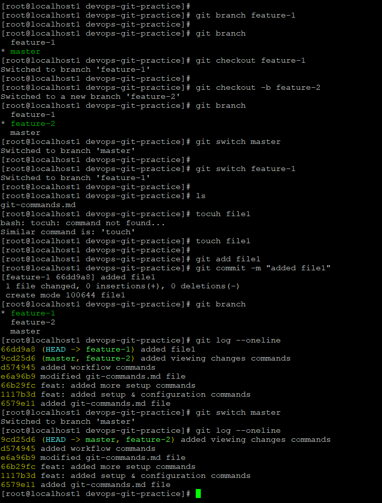
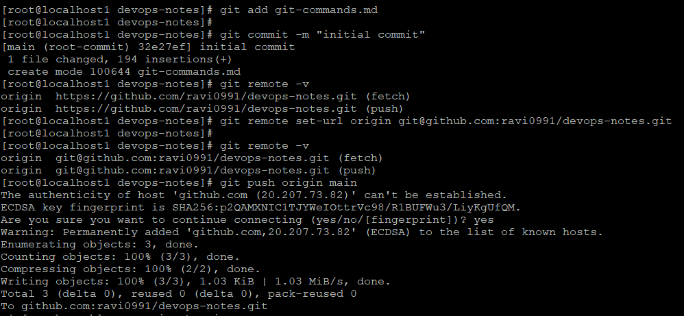
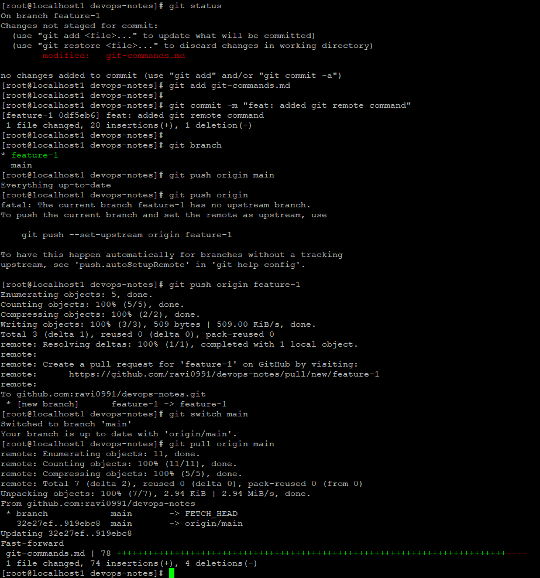

# Day 23 – Git Branching & Working with GitHub

## Overview

Today I practiced **Git branching and working with GitHub**.  
Branches allow developers to work on features separately without affecting the main branch.

I created feature branches, switched between them, committed changes, and pushed them to GitHub.

---

# Task 1 – Understanding Branches

### What is a branch in Git?
A branch is an independent line of development in a Git repository. It allows you to work on features or fixes without modifying the main branch.

### Why do we use branches instead of committing everything to main?
Branches help isolate changes. This prevents breaking the main codebase and allows multiple developers to work simultaneously.

### What is HEAD in Git?
HEAD is a pointer that indicates the current commit or branch you are currently working on.

### What happens when you switch branches?
When switching branches, Git updates your working directory to match the files stored in that branch.

---

# Task 2 – Branching Commands (Hands‑On)

### List all branches
```bash
git branch
```

### Create a new branch
```bash
git branch feature-1
```

### Switch to a branch
```bash
git checkout feature-1
```

### Create and switch branch in one command
```bash
git checkout -b feature-2
```

### Switch branches using modern command
```bash
git switch feature-1
```

### Commit changes in feature branch
```bash
git add file1
git commit -m "added file1"
```

### Switch back to main branch
```bash
git switch master
```

### Delete a branch
```bash
git branch -d feature-2
```

---

# Task 3 – Push to GitHub

### Check configured remotes
```bash
git remote -v
```

### Change remote URL to SSH
```bash
git remote set-url origin git@github.com:ravi0991/devops-notes.git
```

### Push main branch
```bash
git push origin main
```

### Push feature branch
```bash
git push origin feature-1
```

### Difference between origin and upstream

- **origin** → your GitHub repository  
- **upstream** → original repository that your fork came from  

---

# Task 4 – Pull Changes

### Pull changes from remote repository
```bash
git pull origin main
```

### Difference between git fetch and git pull

| Command | Description |
|-------|-------------|
| git fetch | Downloads changes but does not merge |
| git pull | Downloads and merges changes automatically |

---

# Task 5 – Clone vs Fork

### Clone
Creates a local copy of a repository.

```bash
git clone https://github.com/user/repository.git
```

### Fork
Creates a copy of a repository in your GitHub account.

### Difference

| Clone | Fork |
|------|------|
| Local copy | GitHub copy |
| Git command | GitHub feature |
| Used for collaboration | Used for contributing to external projects |

### Keep fork updated
```bash
git remote add upstream https://github.com/original/repo.git
git fetch upstream
git merge upstream/main
```

---

# Screenshots

## GitHub push and pull operations



## Branch push and pull with GitHub



## Git Branch creation and commit history



---

# What I Learned

1. Git branching allows safe feature development without affecting the main branch.
2. GitHub remote repositories help collaborate and share code easily.
3. Commands like `git switch`, `git push`, and `git pull` are essential for daily Git workflows.

---

# Repository Path

```
2026/day-23/day-23-notes.md
```
