# Day 24 – Advanced Git: Merge, Rebase, Stash & Cherry Pick

## Task
Today I practiced advanced Git workflows used in real development environments.

Focus areas:
- Git Merge
- Git Rebase
- Squash Merge
- Git Stash
- Git Cherry-Pick

These commands help developers manage branches, maintain clean history, and move commits between branches.

---

# Task 1 – Git Merge (Hands-On)

## Create feature-login branch

```bash
git checkout -b feature-login
```

## Add commits

```bash
vim git-commands.md
git add git-commands.md
git commit -m "updated git commands"

vim git-commands.md
git add git-commands.md
git commit -m "modified git commands by removing unnecessary commands"
```

## Switch to main

```bash
git switch main
```

## Merge branch

```bash
git merge feature-login
```

### Screenshot
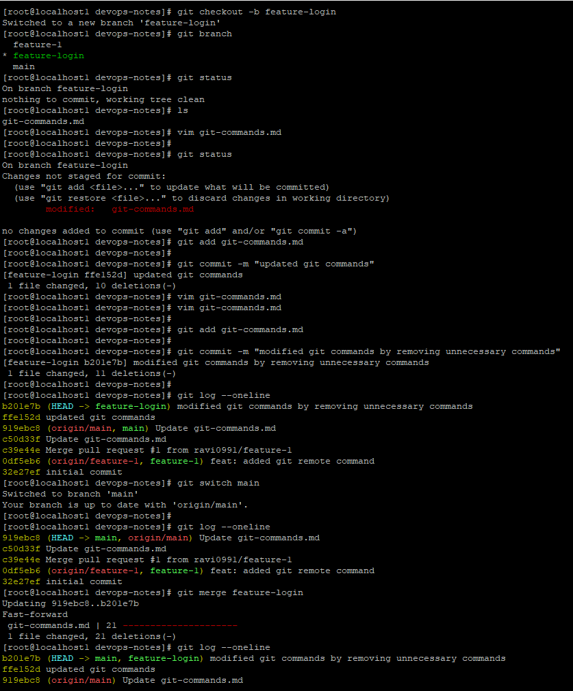
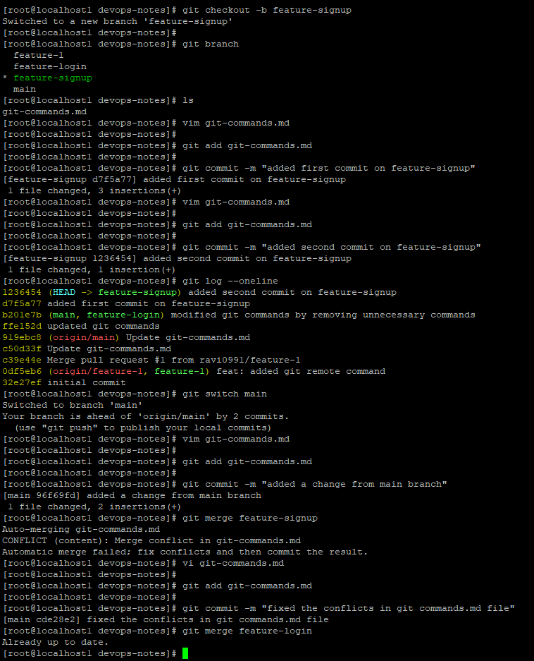

### Observations

### Fast‑forward merge
A fast‑forward merge happens when the main branch has no new commits and Git simply moves the branch pointer forward.

Example:

main: A --- B  
feature:        C --- D  

After merge:

main: A --- B --- C --- D

No merge commit is created.

### Merge Conflict

A merge conflict occurs when the same file and same line are modified in two branches.

Git shows conflict markers:

```
<<<<<<< HEAD
code from main
=======
code from branch
>>>>>>> feature-branch
```

---

# Task 2 – Git Rebase (Hands-On)

## Create branch

```bash
git checkout -b feature-dashboard
```

## Add commits

```bash
vim git-commands.md
git add git-commands.md
git commit -m "added first commit in feature-dashboard branch"
```

## Add commit in main

```bash
git switch main
vim git-commands.md
git commit -am "added commit from main branch"
```

## Rebase

```bash
git switch feature-dashboard
git rebase main
```

### Screenshot
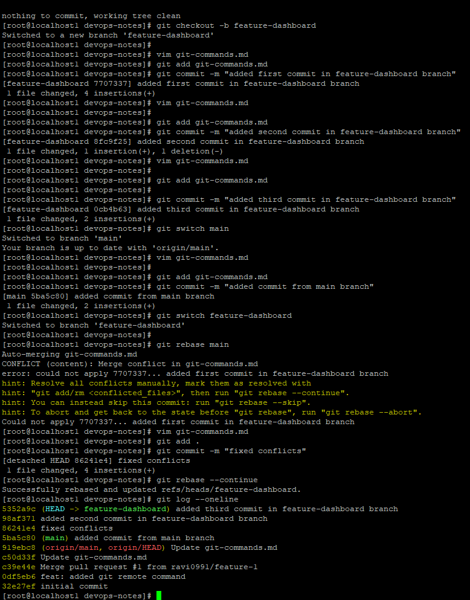

### Observations

Rebase moves your commits to a new base commit.

Before rebase

A --- B --- C (main)  
       \  
        D --- E (feature)

After rebase

A --- B --- C --- D' --- E'

Git rewrites commits.

### Why not rebase shared commits?

Because commit hashes change and other developers’ history can break.

Rule: Never rebase shared or public branches.

---

# Task 3 – Squash Merge vs Regular Merge

## Create branch

```bash
git checkout -b feature-profile
```

Add multiple commits.

## Squash merge

```bash
git merge feature-profile --squash
```

### Screenshots
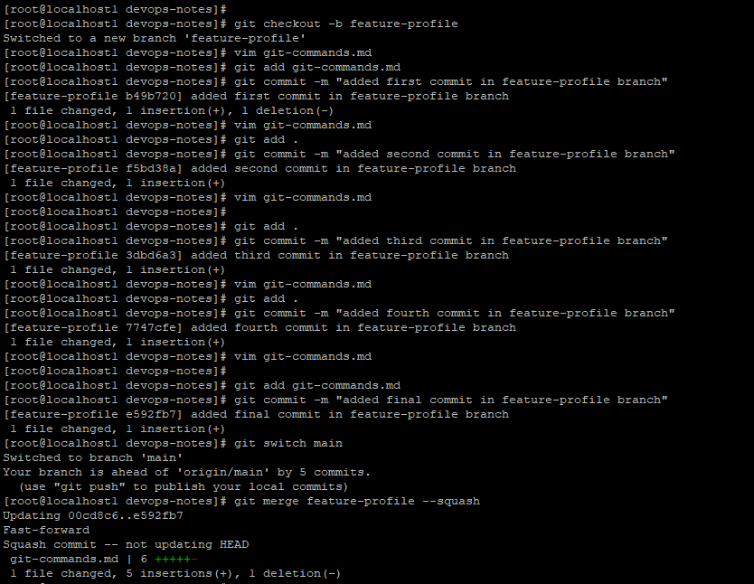
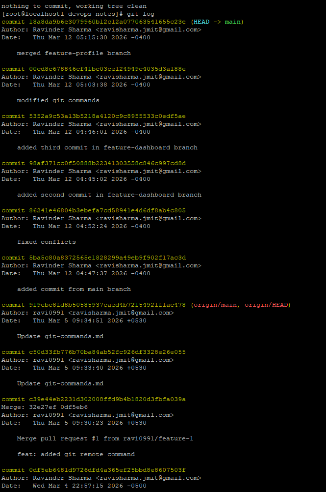
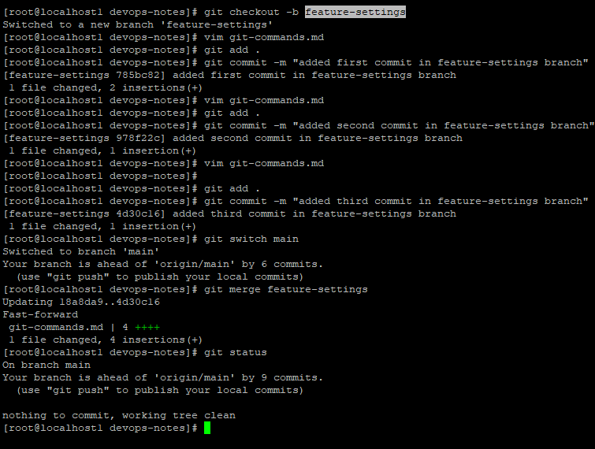
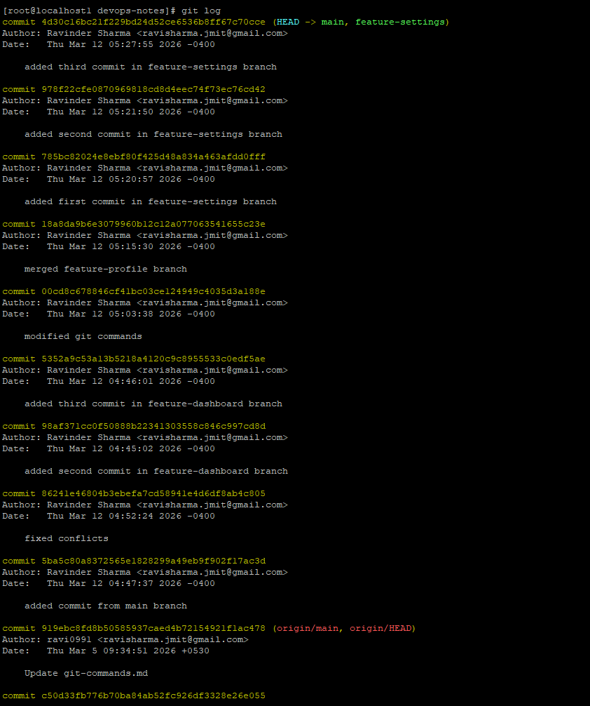

### Observations

Squash merge combines multiple commits into a single commit.

Example

feature commits:
A
B
C
D

After squash merge:

main
 |
 E

Only one commit is added.

### Comparison

| Feature | Squash Merge | Regular Merge |
|--------|-------------|--------------|
History | Clean | Detailed |
Commits | Single | Multiple |
Debugging | Harder | Easier |

---

# Task 4 – Git Stash

Sometimes you have uncommitted changes but must switch branches.

Example:

```bash
vim git-commands.md
```

Try switching branch.

Git prevents it.

Use stash:

```bash
git stash
git switch dev
git stash pop
```

### Screenshots
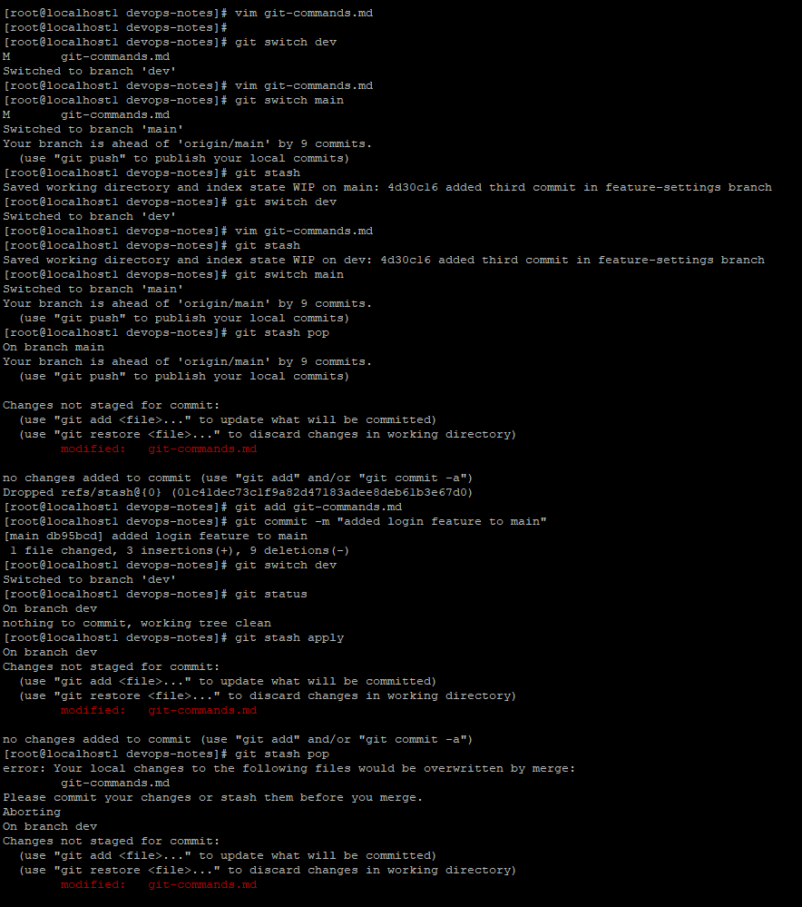
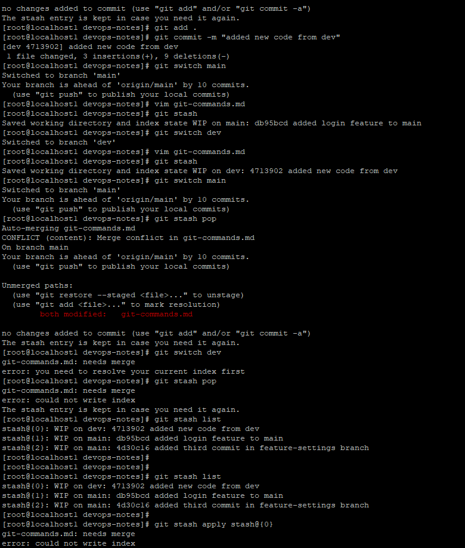

### Observations

| Command | Meaning |
|--------|--------|
git stash | Save work temporarily |
git stash list | Show all stashes |
git stash pop | Apply and remove stash |
git stash apply | Apply but keep stash |

---

# Task 5 – Cherry Picking

Cherry-pick applies a specific commit from another branch.

## Create branch

```bash
git checkout -b feature-hotfix
```

## Cherry pick commit

```bash
git cherry-pick <commit-hash>
```

Example:

```bash
git cherry-pick 9011138
```

### Screenshots
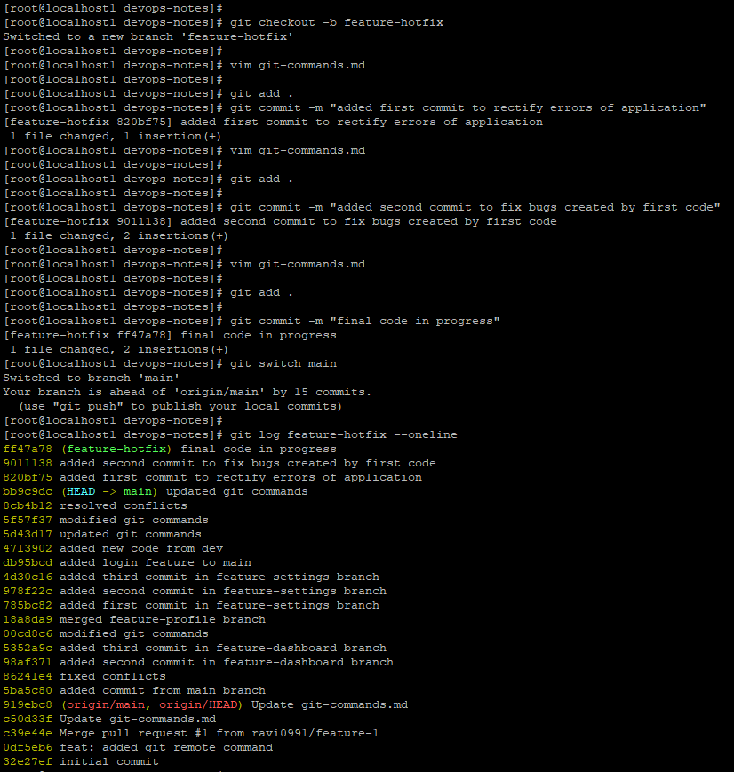
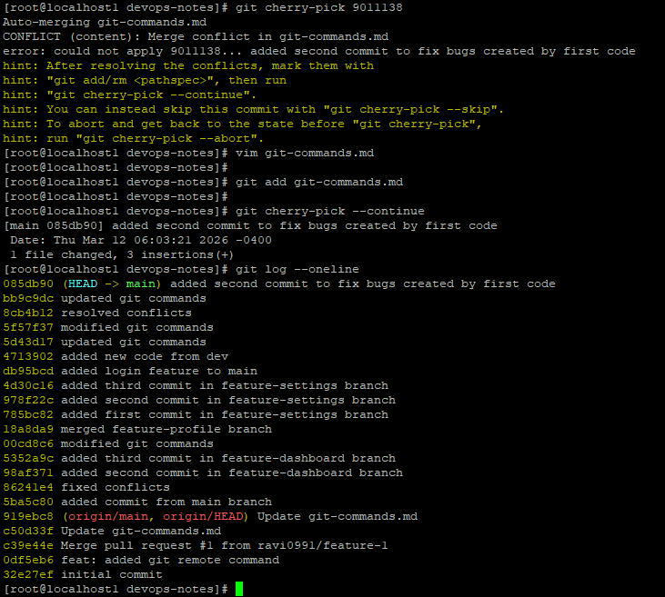

### Observations

Cherry-pick copies one specific commit.

Example

feature branch:
A
B
C

Cherry pick B

main becomes

A
B

### Risks

- Duplicate commits
- Merge conflicts
- Harder history tracking

Usually used for hotfixes.

---

# Git Commands Learned Today

```bash
git merge
git merge --squash
git rebase
git rebase --continue
git rebase --abort
git stash
git stash pop
git stash apply
git stash list
git cherry-pick
git cherry-pick --continue
```

---

# What I Learned

1. Merge keeps history intact while rebase rewrites commit history.

2. Git stash allows temporarily saving work when switching branches.

3. Cherry-pick is useful for applying specific commits like hotfixes without merging the entire branch.
