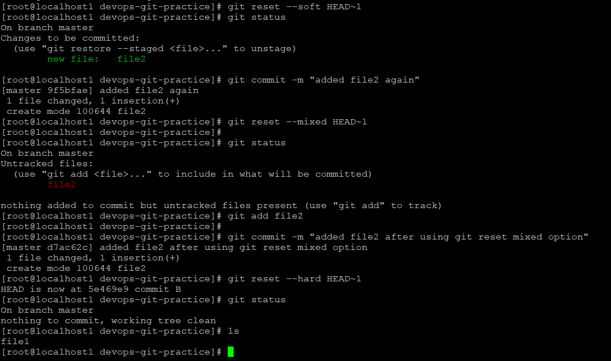
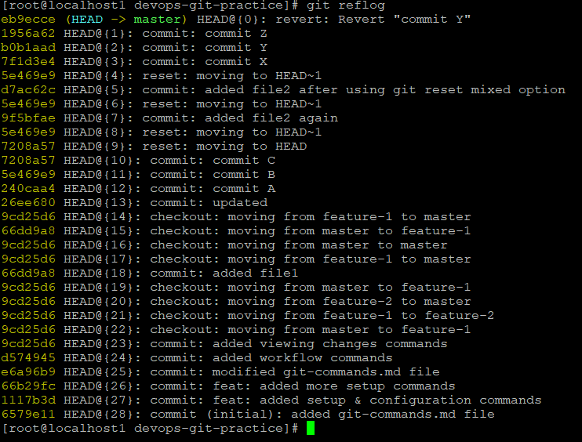

# Day 25 – Git Reset vs Revert & Branching Strategies

## Task
Today I practiced how to safely undo mistakes in Git and explored common branching strategies used by engineering teams.

Topics covered:

- Git Reset
- Git Revert
- Git Reflog
- Branching Strategies (GitFlow, GitHub Flow, Trunk-Based Development)

---

# Task 1 – Git Reset (Hands-On)

### Step 1: Create commits

```bash
touch file1
git add .
git commit -m "commit A"

echo "hello dosto" > file1
git add .
git commit -m "commit B"

echo "hi world" > file2
git add file2
git commit -m "commit C"
```

### Screenshot


---

### git reset --soft

```bash
git reset --soft HEAD~1
```

Observation:

- Commit is removed
- Changes stay **staged**

Example:

```
Changes to be committed:
file2
```

---

### git reset --mixed

```bash
git reset --mixed HEAD~1
```

Observation:

- Commit removed
- Changes move to **working directory**
- Not staged

---

### git reset --hard

```bash
git reset --hard HEAD~1
```

Observation:

- Commit removed
- Changes deleted
- Working directory cleaned

### Screenshot



---

### Difference between reset options

| Option | What happens |
|------|------|
--soft | commit removed, changes staged |
--mixed | commit removed, changes unstaged |
--hard | commit removed and changes deleted |

### Which one is destructive?

`git reset --hard` is destructive because it **permanently deletes uncommitted changes.**

### When to use each

**--soft**
- Modify last commit message
- Combine commits

**--mixed**
- Re-edit files before committing

**--hard**
- Remove unwanted commits completely

### Should you reset pushed commits?

No.

Because it **rewrites history** and can break collaboration.

---

# Task 2 – Git Revert (Hands-On)

### Create commits

```bash
git commit -m "commit X"
git commit -m "commit Y"
git commit -m "commit Z"
```

### Revert commit Y

```bash
git revert <commit-hash>
```

Example:

```bash
git revert b0b1aad
```

### Screenshot


Observation:

- Git creates a **new commit**
- It reverses the changes made by commit Y
- Commit Y still exists in history

Example history:

```
commit Z
revert commit Y
commit Y
commit X
```

---


# Task 3 – Reset vs Revert — Summary

### Revert vs Reset

| Feature | git reset | git revert |
|------|------|------|
Removes commit from history | Yes | No |
Creates new commit | No | Yes |
Safe for shared branches | No | Yes |
Use case | local fixes | undo production commit |

---

### Git Reflog

Git reflog records **every action done in Git**, including resets and checkouts.

Example:

```bash
git reflog
```

### Screenshot



Observation:

Reflog allows you to recover commits even after:

- reset --hard
- rebase
- branch delete

It acts as **Git’s safety net**.

---

# Task 4 – Branching Strategies

## 1. GitFlow

Structure:

```
main
 │
develop
 ├─ feature branches
 ├─ release branches
 └─ hotfix branches
```

Used for:

- Large teams
- Scheduled releases

Pros:

- Structured workflow
- Stable releases

Cons:

- Complex
- Slower development cycle

---

## 2. GitHub Flow

Structure:

```
main
 └─ feature branch → pull request → merge
```

Used for:

- Web applications
- Continuous deployment

Pros:

- Simple workflow
- Fast development

Cons:

- Requires strong CI/CD

---

## 3. Trunk-Based Development

Structure:

```
main
 ├─ short lived branches
 └─ frequent commits
```

Used for:

- Large engineering teams
- Continuous integration environments

Pros:

- Very fast integration
- Reduces merge conflicts

Cons:

- Requires strong testing

---

# Strategy Comparison

| Strategy | Best for |
|------|------|
GitFlow | enterprise teams |
GitHub Flow | startups |
Trunk Based | CI/CD driven teams |

### Answers

**Startup shipping fast:** GitHub Flow

**Large team with releases:** GitFlow

**Example open source workflow:**

Kubernetes uses a **GitHub Flow style model with release branches.**

---

# Git Commands Learned

```bash
git reset --soft
git reset --mixed
git reset --hard
git revert
git reflog
```

---

# What I Learned

1. Git reset rewrites history while git revert safely creates a reverse commit.

2. Git reflog helps recover lost commits and acts as a safety net.

3. Branching strategies help teams organize development and release workflows effectively.
