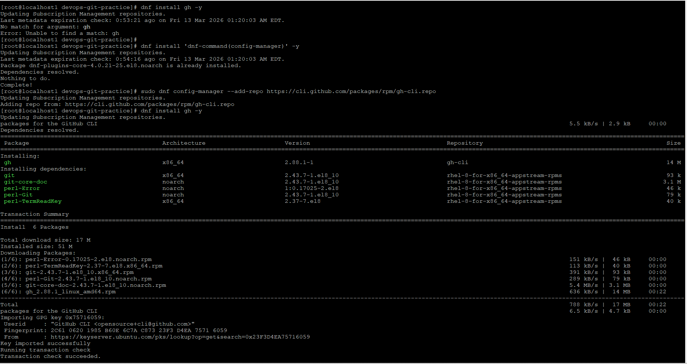
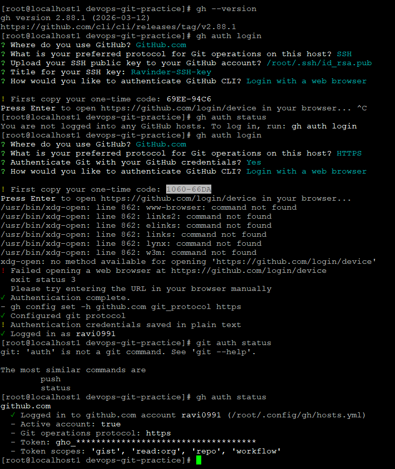
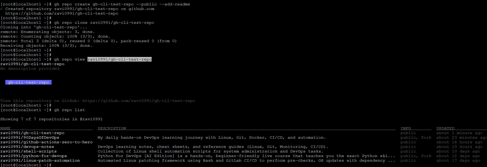
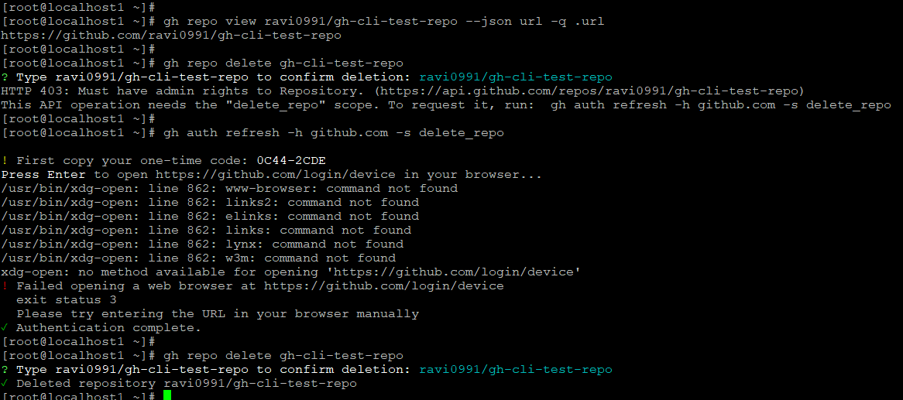
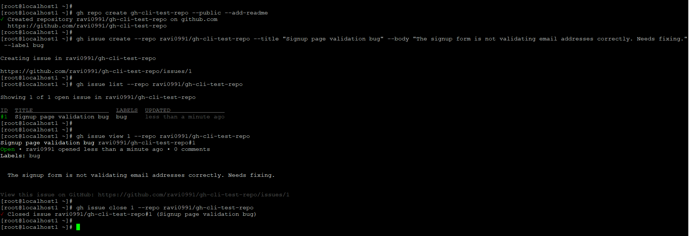
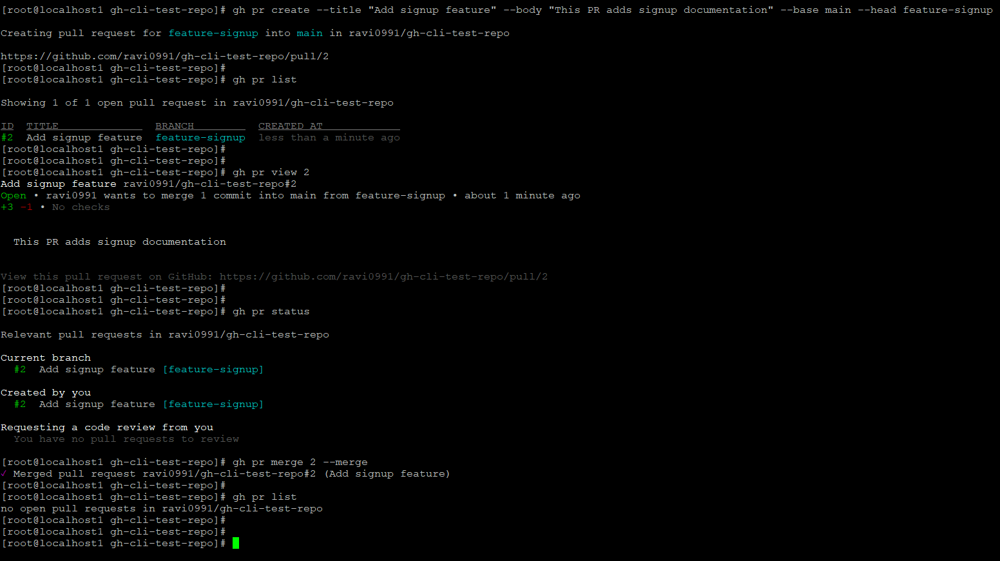
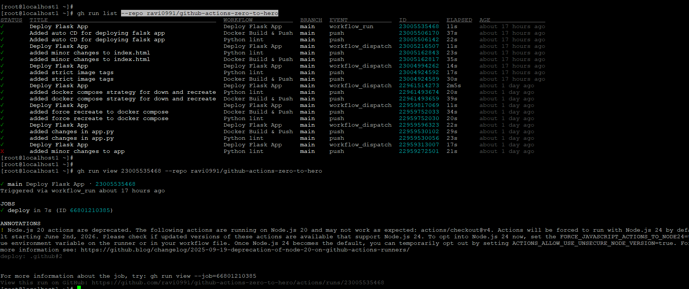
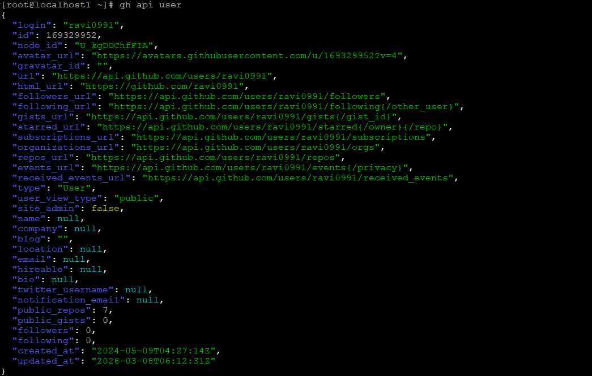
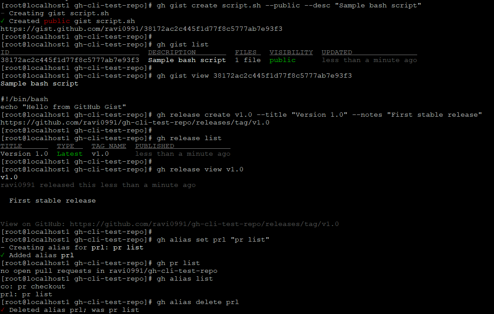
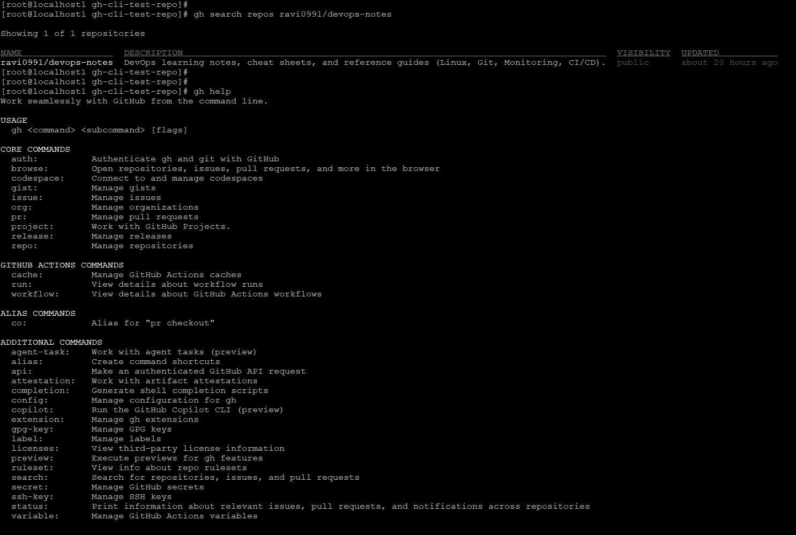

# Day 26 – GitHub CLI: Manage GitHub from Your Terminal

## Overview
Today I learned how to use the **GitHub CLI (`gh`)** to manage repositories, issues, pull requests, and workflows directly from the terminal.

GitHub CLI is extremely useful for DevOps engineers because it allows automation and repository management without switching to the browser.

---

# Task 1 – Install and Authenticate

## Install GitHub CLI

Example installation on RHEL:

```bash
sudo dnf config-manager --add-repo https://cli.github.com/packages/rpm/gh-cli.repo
sudo dnf install gh -y
```

### Screenshot


Verify version:

```bash
gh --version
```

Authenticate:

```bash
gh auth login
```

Check authentication status:

```bash
gh auth status
```

### Screenshot


### Authentication Methods Supported

GitHub CLI supports:

- Login with **Web Browser**
- **HTTPS with Personal Access Token**
- **SSH authentication**
- GitHub Enterprise authentication

---

# Task 2 – Working with Repositories

Create a repository:

```bash
gh repo create gh-cli-test-repo --public --add-readme
```

Clone repository:

```bash
gh repo clone ravi0991/gh-cli-test-repo
```

View repository details:

```bash
gh repo view ravi0991/gh-cli-test-repo
```

List repositories:

```bash
gh repo list
```

### Screenshot


Open repo in browser:

```bash
gh repo view --web
```

Delete repository:

```bash
gh repo delete gh-cli-test-repo
```

### Screenshot


---

# Task 3 – GitHub Issues

Create issue:

```bash
gh issue create --repo ravi0991/gh-cli-test-repo --title "Signup page validation bug" --body "Signup form not validating email correctly" --label bug
```

List issues:

```bash
gh issue list --repo ravi0991/gh-cli-test-repo
```

View issue:

```bash
gh issue view 1 --repo ravi0991/gh-cli-test-repo
```

Close issue:

```bash
gh issue close 1 --repo ravi0991/gh-cli-test-repo
```

### Screenshot


### Automation Use Case

`gh issue` can be used in automation to:

- Automatically create bug reports from monitoring alerts
- Auto-close resolved issues after deployment
- Generate issues from CI/CD pipeline failures

---

# Task 4 – Pull Requests

Create pull request:

```bash
gh pr create --title "Add signup feature" --body "This PR adds signup documentation" --base main --head feature-signup
```

List PRs:

```bash
gh pr list
```

View PR details:

```bash
gh pr view 2
```

Merge PR:

```bash
gh pr merge 2 --merge
```

### Screenshot


### Merge Methods Supported

`gh pr merge` supports:

- `--merge` (merge commit)
- `--squash`
- `--rebase`

### Reviewing PRs

You can review PRs with:

```bash
gh pr checkout <PR-number>
gh pr view
gh pr review --approve
gh pr review --comment
```

---

# Task 5 – GitHub Actions

List workflow runs:

```bash
gh run list --repo ravi0991/github-actions-zero-to-hero
```

View workflow run:

```bash
gh run view <run-id>
```

### Screenshot


### Use in CI/CD

`gh run` and `gh workflow` help to:

- Monitor CI/CD pipelines
- Debug failed workflows
- Trigger workflow runs
- Automate deployment monitoring

---

# Task 6 – Useful gh Commands

## GitHub API

```bash
gh api user
```

### Screenshot


---

## GitHub Gist

Create gist:

```bash
gh gist create script.sh --public --desc "Sample bash script"
```

List gists:

```bash
gh gist list
```

View gist:

```bash
gh gist view <id>
```

### Screenshot


---

## GitHub Release

Create release:

```bash
gh release create v1.0 --title "Version 1.0" --notes "First stable release"
```

List releases:

```bash
gh release list
```

### Screenshot


---

## Command Aliases

Create shortcut:

```bash
gh alias set prl "pr list"
```

List aliases:

```bash
gh alias list
```

Delete alias:

```bash
gh alias delete prl
```

---

## Search GitHub Repositories

```bash
gh search repos devops-notes
```

---

# Commands Learned

```
gh auth login
gh auth status
gh repo create
gh repo clone
gh repo view
gh repo list
gh repo delete
gh issue create
gh issue list
gh issue view
gh issue close
gh pr create
gh pr list
gh pr view
gh pr merge
gh run list
gh run view
gh api
gh gist create
gh gist list
gh gist view
gh release create
gh release list
gh alias set
gh alias list
gh alias delete
gh search repos
```

---

# What I Learned

1. GitHub CLI allows managing GitHub entirely from the terminal.
2. It is extremely useful for **automation and DevOps workflows**.
3. Pull requests, issues, repositories, and actions can all be managed without using the browser.
4. `gh api` allows direct interaction with the GitHub REST API.

