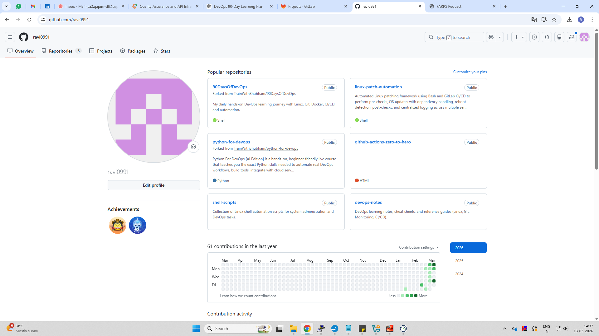
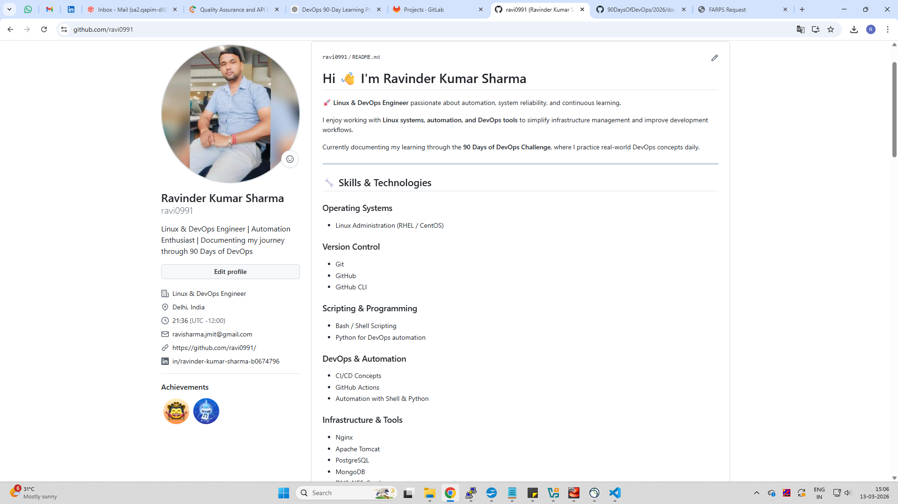
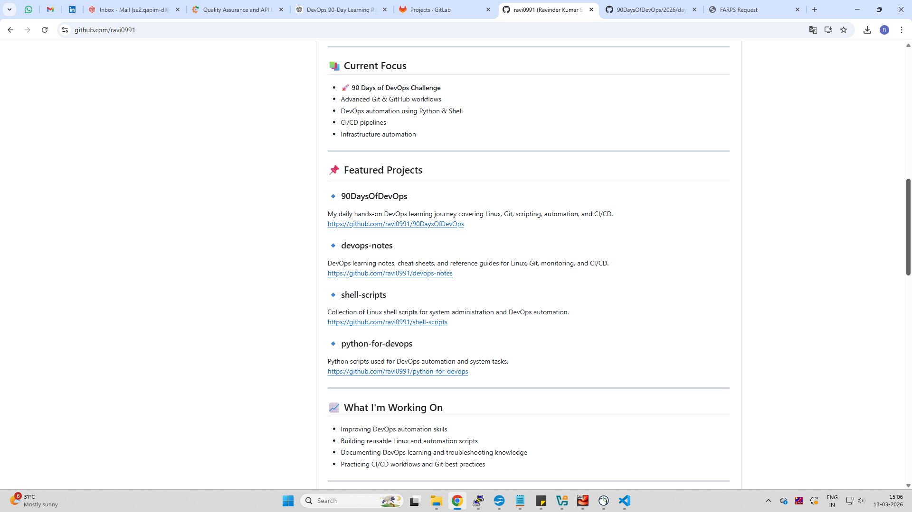
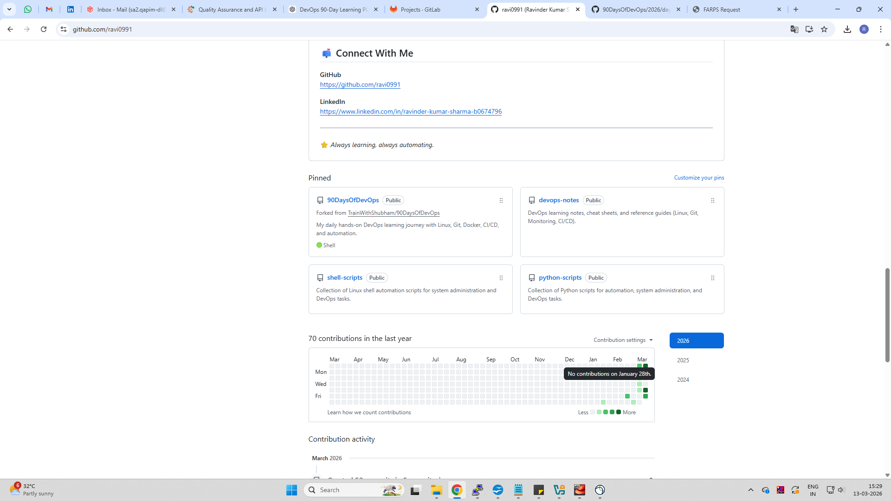

# Day 27 -- GitHub Profile Makeover: Build Your Developer Identity

# Task 1: Audit My GitHub Profile (Before Improvements)

Before making any changes, I reviewed my GitHub profile from a
recruiter's perspective to understand what needed improvement.

### Observations

**Profile picture** A profile picture existed, but the profile overall
needed a more professional presentation.

**Bio** The bio was minimal and did not clearly explain my DevOps
learning journey or skills.

**Pinned repositories** Pinned repositories were not fully optimized to
highlight my DevOps learning and automation work.

**Repository descriptions** Some repositories did not have clear
descriptions explaining what the project contains.

**Repository organization** Projects existed but were not clearly
categorized (scripts, notes, DevOps projects, etc.).

**Recruiter perspective** If a recruiter visited my profile, it would
not clearly communicate:

-   What technologies I am learning
-   What DevOps projects I am working on
-   What scripts or automation tools I have built

Because of this, the profile required better organization and
documentation.

------------------------------------------------------------------------

# Task 2: Create Profile README

I created the special GitHub repository:

    github.com/ravi0991/ravi0991

The README.md inside this repository appears directly on my GitHub
profile page.

### The profile README includes:

-   Personal introduction
-   DevOps learning journey
-   Skills & technologies
-   Current focus
-   Featured repositories
-   Contact information

Sections added:

-   Introduction
-   Skills & Technologies
-   Current Focus
-   Featured Projects
-   Contact Information

------------------------------------------------------------------------

# Task 3: Organize My Repositories

I organized my repositories into clear categories.

## 1️⃣ 90DaysOfDevOps

Description:

Daily hands‑on DevOps learning journey covering Linux, Git, scripting,
automation, and CI/CD.

Example structure:

    90DaysOfDevOps
     └── 2026
          ├── day-22
          ├── day-23
          ├── day-24
          ├── day-25
          ├── day-26
          └── day-27

Contents:

-   Markdown documentation
-   Screenshots
-   Commands used

------------------------------------------------------------------------

## 2️⃣ shell-scripts

Collection of Linux shell automation scripts for system administration
and DevOps tasks.

Examples:

-   log analysis
-   disk monitoring
-   automation utilities

------------------------------------------------------------------------

## 3️⃣ python-scripts

Collection of Python scripts used for DevOps automation and system
tasks.

Examples:

-   log parsing scripts
-   monitoring scripts
-   automation tools

------------------------------------------------------------------------

## 4️⃣ devops-notes

DevOps learning notes and cheat sheets.

Includes:

-   Shell scripting cheat sheet
-   Git commands reference
-   DevOps documentation

------------------------------------------------------------------------

## Repository Best Practices Applied

Each repository now contains:

-   Clear repository name
-   One‑line description
-   README.md explaining the project
-   .gitignore file

------------------------------------------------------------------------

# Task 4: Pin Best Repositories

Pinned repositories were selected to represent my DevOps learning and
projects.

Pinned repositories:

1.  90DaysOfDevOps
2.  devops-notes
3.  shell-scripts
4.  python-scripts
5.  linux-patch-automation
6.  github-actions-zero-to-hero

These repositories demonstrate:

-   DevOps learning journey
-   Linux administration
-   automation scripting
-   CI/CD practice

------------------------------------------------------------------------

# Task 5: Repository Cleanup

Actions performed:

-   Removed unused repositories
-   Added descriptions to repositories
-   Ensured each repository has README documentation
-   Checked repositories for secrets

Verified that the following sensitive files are not present:

-   .env files
-   API keys
-   credentials
-   passwords

------------------------------------------------------------------------

# Task 6: Before & After GitHub Profile

## Before Improvement

------------------------------------------------------------------------

## After Improvement

------------------------------------------------------------------------

# Key Improvements

### 1️⃣ Created a Professional GitHub Profile README

Added structured sections including:

-   Introduction
-   Skills
-   DevOps learning journey
-   Featured projects

This helps recruiters quickly understand my profile.

------------------------------------------------------------------------

### 2️⃣ Organized Repositories

Created dedicated repositories for:

-   DevOps learning
-   Shell scripts
-   Python scripts
-   DevOps notes

This improves navigation and clarity.

------------------------------------------------------------------------

### 3️⃣ Pinned Relevant Projects

Pinned repositories now highlight my most important work including:

-   DevOps learning projects
-   automation scripts
-   CI/CD practice

------------------------------------------------------------------------

# Final Result

GitHub Profile:

https://github.com/ravi0991

My profile now clearly represents:

-   DevOps learning journey
-   automation skills
-   scripting experience
-   documentation practices

------------------------------------------------------------------------

# Key Takeaways

-   GitHub acts as a developer portfolio.
-   Organizing repositories improves credibility.
-   Good documentation improves project visibility.
