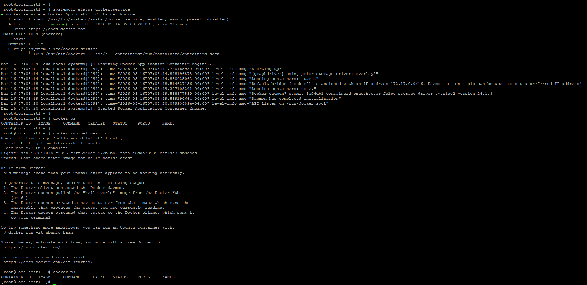
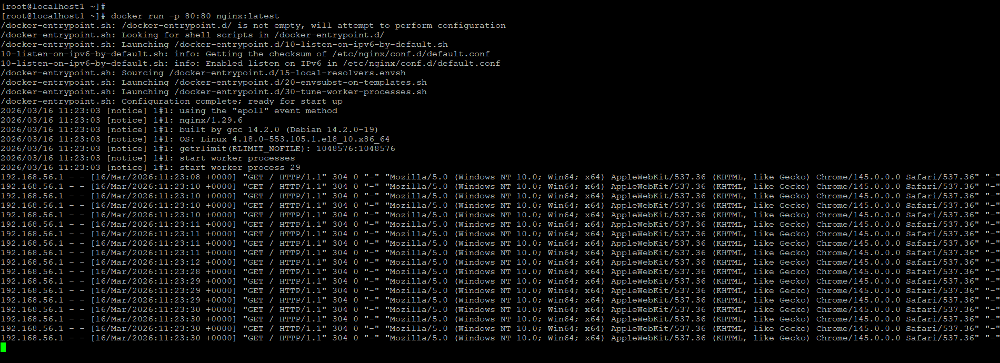
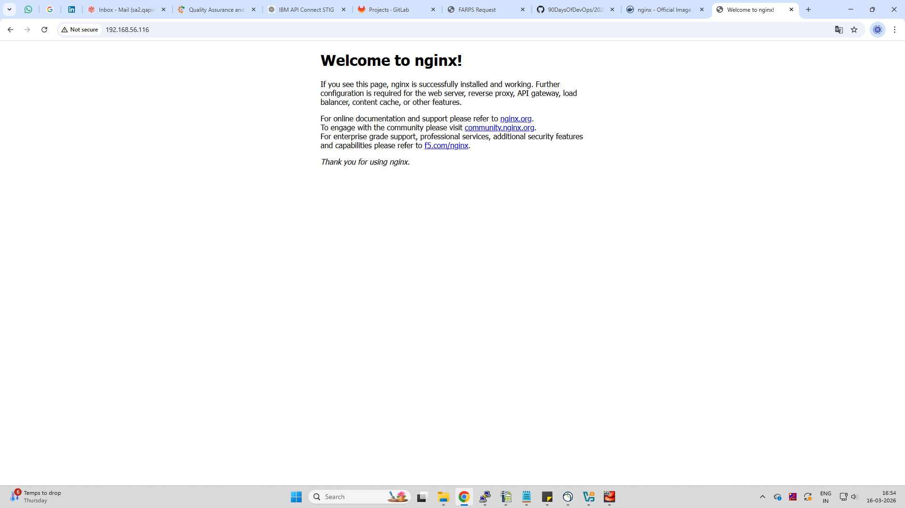
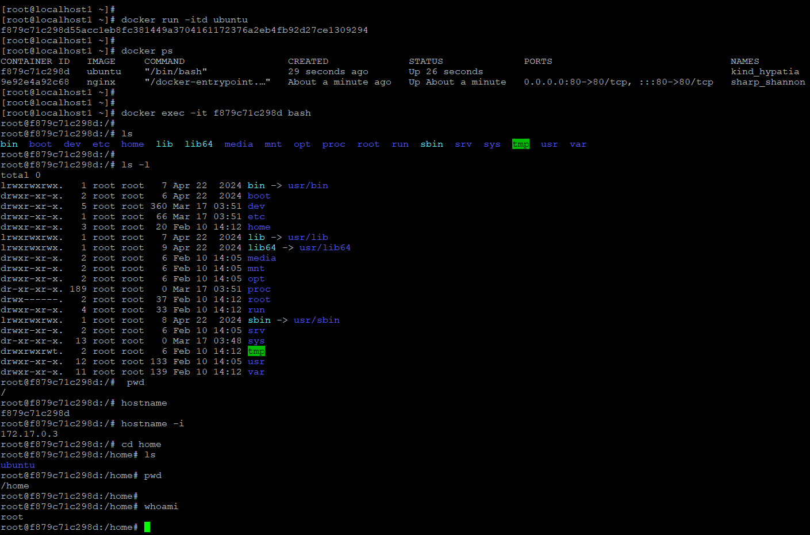
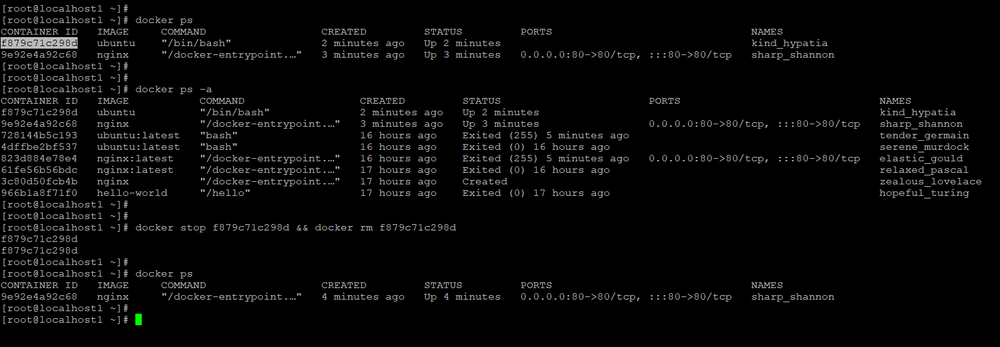
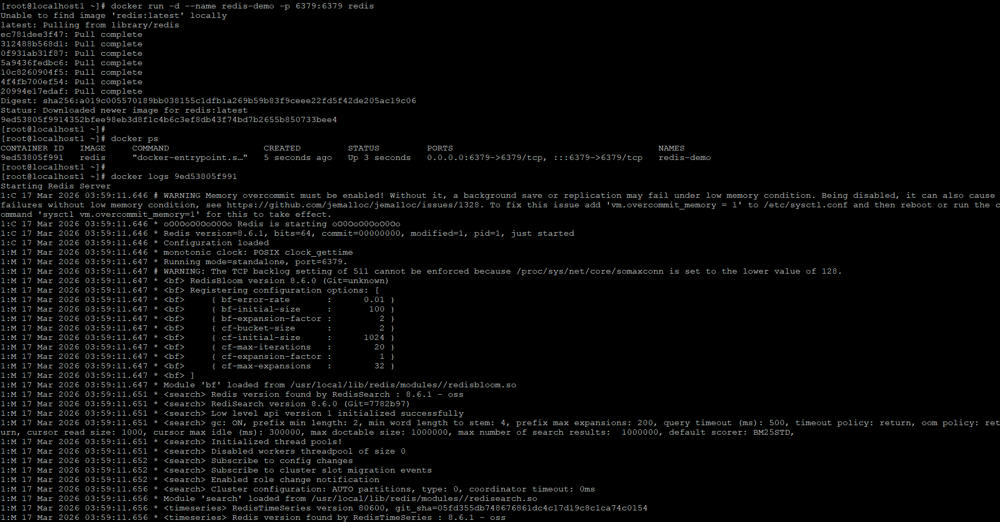
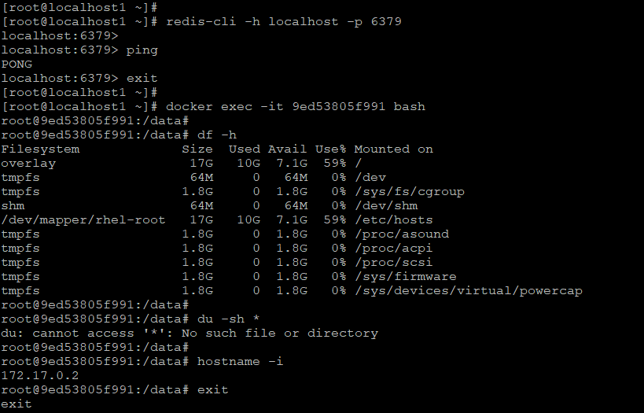

# Day 29 – Introduction to Docker

## Overview
Today I started learning Docker — the foundation of modern DevOps.

---

## Task 1: What is Docker?

### What is a Container? Why do we need them?
A container is a lightweight, portable unit that packages an application with its dependencies. We need containers because Containers package an application with its dependencies to ensure consistent, fast, and portable deployment across environments while using fewer resources than virtual machines

### Containers vs Virtual Machines
- Containers share OS kernel (lightweight)
- VMs have full OS (heavy)
- Containers start faster and use fewer resources

### Docker Architecture
- Docker Client → interacts with Docker Daemon
- Docker Daemon → builds & runs containers
- Images → templates
- Containers → running instances
- Registry (Docker Hub) → stores images

---

## Task 2: Install Docker

### Commands Used
```
systemctl status docker
docker run hello-world
```

Verified Docker installation successfully.

---

## Task 3: Run Real Containers

### Run Nginx
```
docker run -d -p 80:80 nginx
```

Accessed via browser successfully.

### Run Ubuntu Container
```
docker run -it ubuntu
```

Explored Linux environment inside container.

### Container Management
```
docker ps
docker ps -a
docker stop <id>
docker rm <id>
```

---

## Task 4: Explore Docker Features

### Detached Mode
```
docker run -d nginx
```

### Named Container
```
docker run -d --name redis-demo redis
```

### Logs
```
docker logs <container_id>
```

### Exec into Container
```
docker exec -it <container_id> bash
```

---

## Screenshots

### Docker Installation


### Nginx Running



### Ubuntu Container in interactive mode


### Containers List and Container Cleanup


### Redis Container and Container Logs


### Redis Container Exec and Testing


---

## Key Takeaways

- Docker makes applications portable
- Containers are lightweight compared to VMs
- Easy to run, stop, and manage applications
- Important foundation for Kubernetes & CI/CD

---

## Summary

Today I successfully installed Docker, ran multiple containers, and explored key commands.

This is the beginning of containerization in my DevOps journey 
