# Day 30 – Docker Images & Container Lifecycle

## Overview
Today I focused on understanding how Docker images and containers work internally, including image layers and the full container lifecycle.

---

## Task 1: Docker Images

### Commands Used
```
docker pull nginx:latest
docker pull ubuntu:latest
docker pull alpine
docker images
docker inspect ubuntu
docker rmi alpine
```

### Observations
- Nginx: ~161MB  
- Ubuntu: ~78MB  
- Alpine: ~8MB (very lightweight)

### Why Alpine is smaller?
Alpine uses a minimal Linux distribution, making it lightweight and faster.

---

## Task 2: Image Layers

### Command
```
docker image history nginx
```

### Understanding Layers
- Each line represents a layer
- Some layers show 0B (metadata/config)
- Layers are cached → faster builds and reuse

---

## Task 3: Container Lifecycle

### Commands Practiced
```
docker create nginx
docker start <id>
docker pause <id>
docker unpause <id>
docker stop <id>
docker restart <id>
docker kill <id>
docker rm <id>
```

### Key Learning
Containers move through states:
Created → Running → Paused → Stopped → Removed

---

## Task 4: Working with Running Containers

### Commands
```
docker run -d -p 80:80 nginx
docker logs <id>
docker logs -f <id>
docker exec -it <id> bash
docker exec <id> ls -l /usr/share/nginx/html/index.html
docker inspect <id>
```

### Observations
- Accessed container filesystem
- Checked logs and real-time logs
- Found container IP and port mappings

---

## Task 5: Cleanup

### Commands
```
docker stop $(docker ps -q)
docker container prune
docker rmi <image_id>
docker system df
```

### Learning
- Clean environment is important
- Helps free disk space

---

## Screenshots

### Image Pull & List
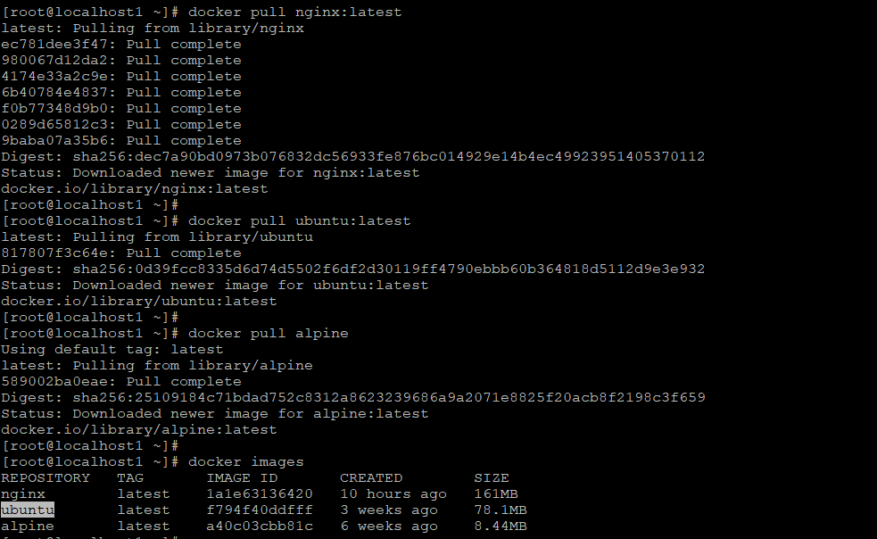

### Inspect & Remove Image
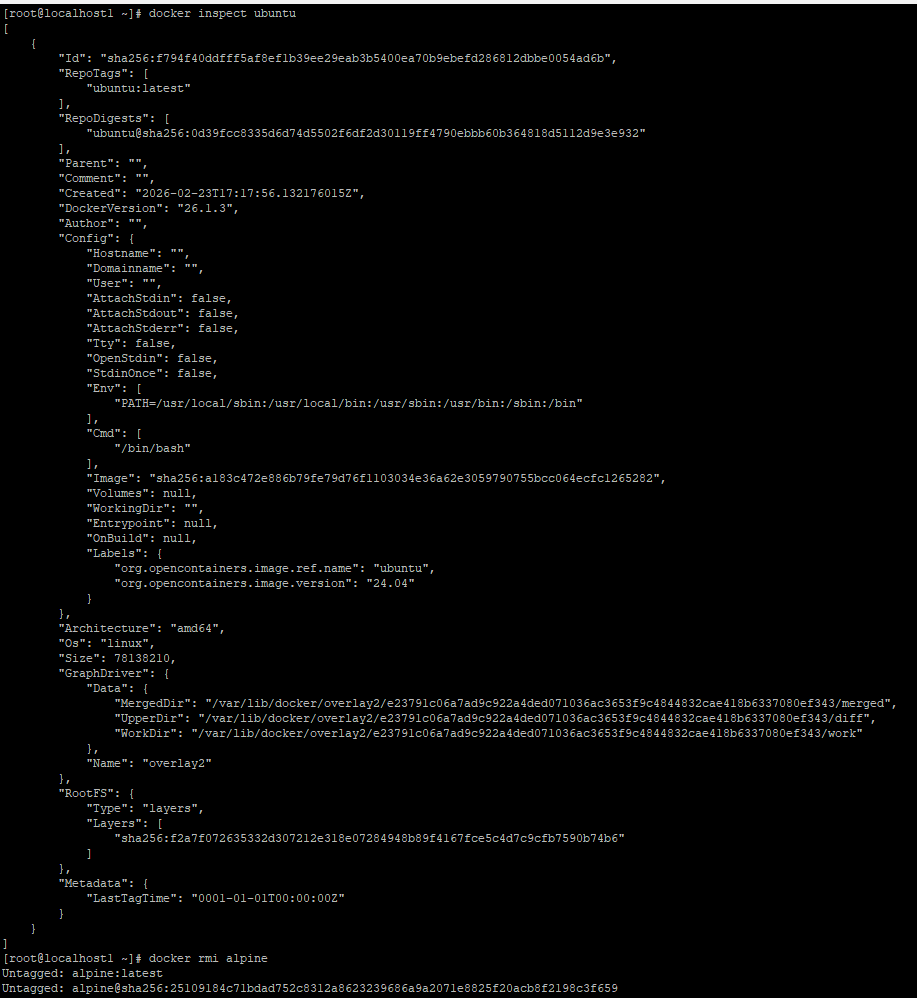

### Image Layers
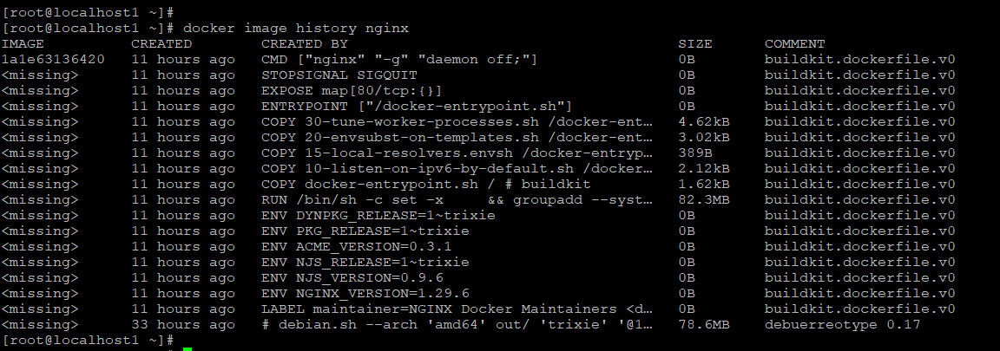

### Container Lifecycle
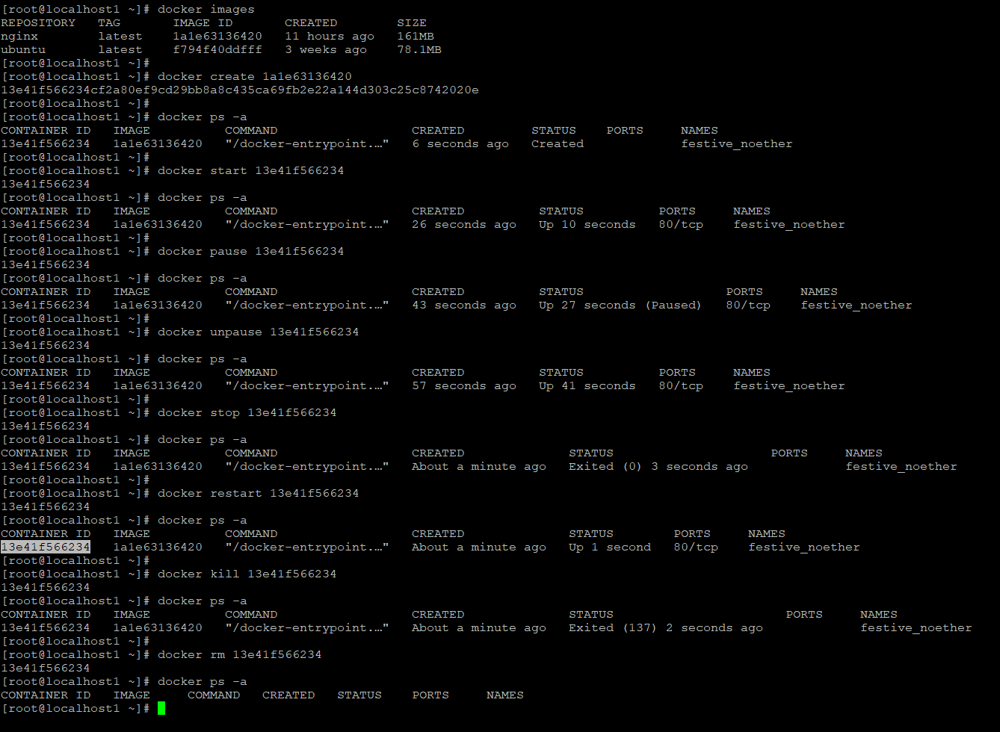

### Run & Logs
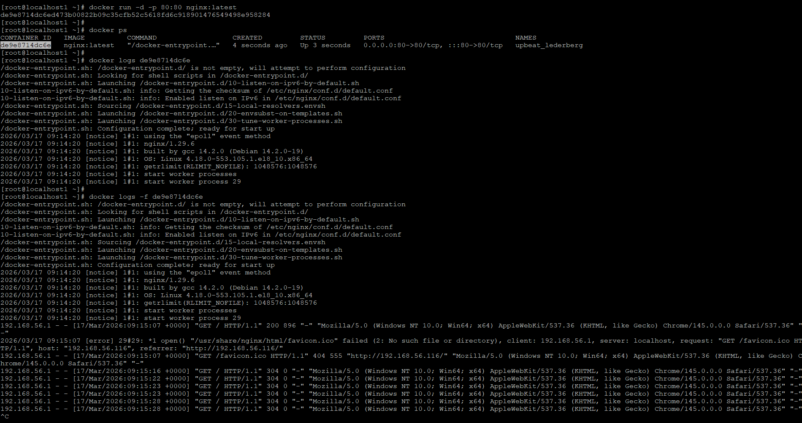

### Exec Inside Container
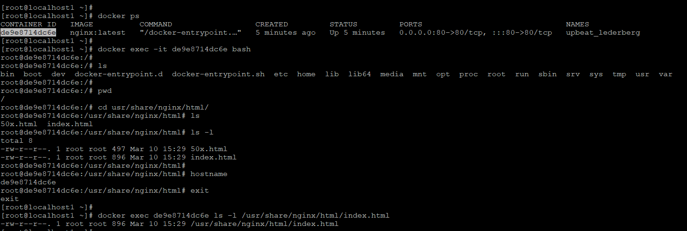

### Inspect Container
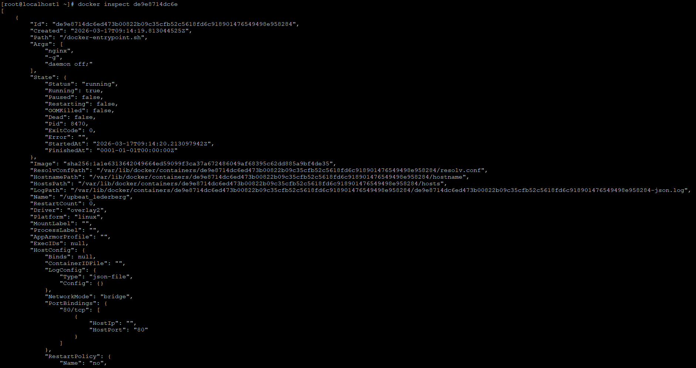

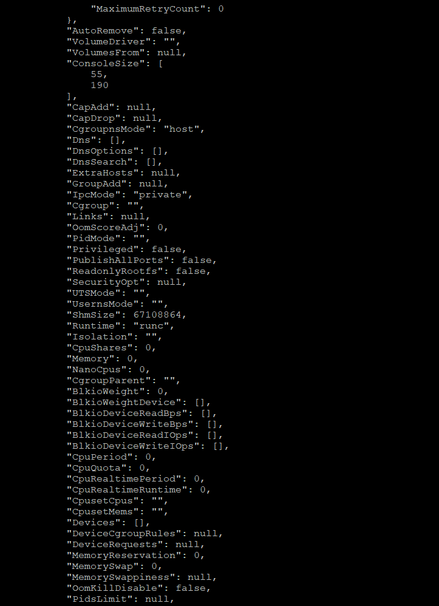

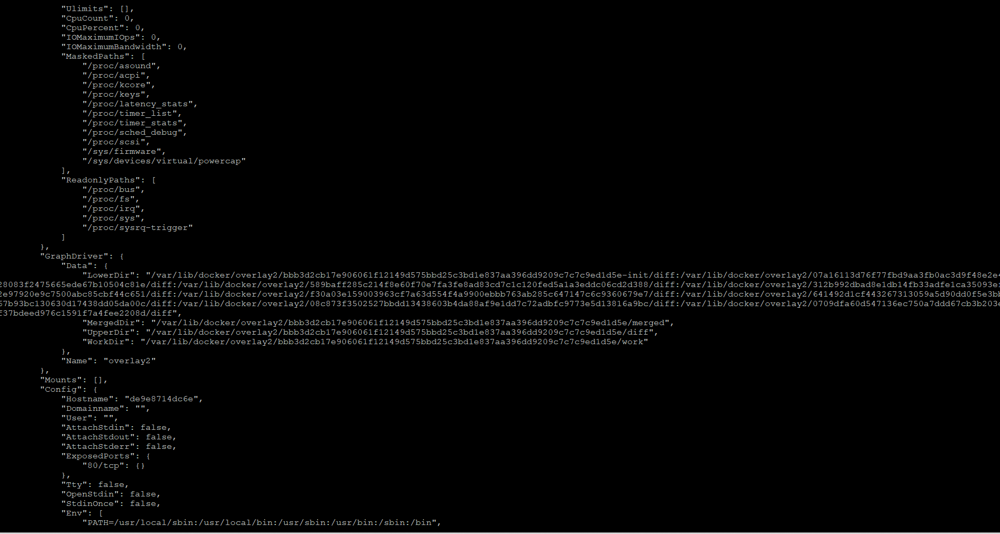

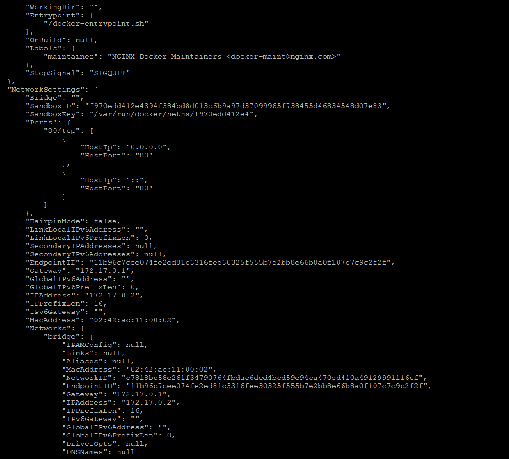

### Cleanup
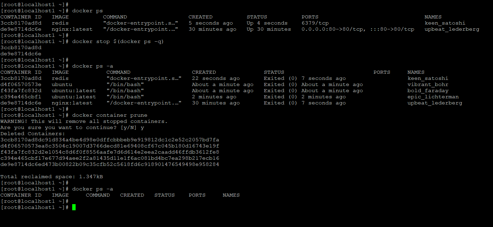

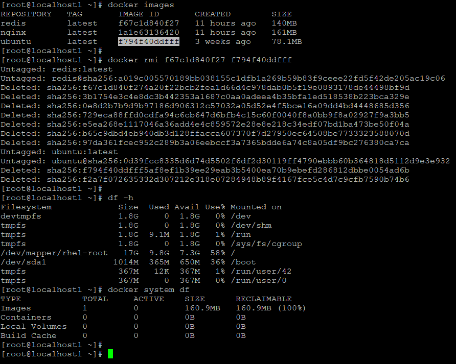

---

## Key Takeaways

- Images are templates, containers are running instances
- Layers improve efficiency and reuse
- Full lifecycle understanding is critical for debugging
- Cleanup is essential in real-world environments

---

## Summary

Today I gained a deeper understanding of Docker internals — images, layers, and container lifecycle.  
This knowledge is essential for working with Kubernetes and CI/CD pipelines 🚀
