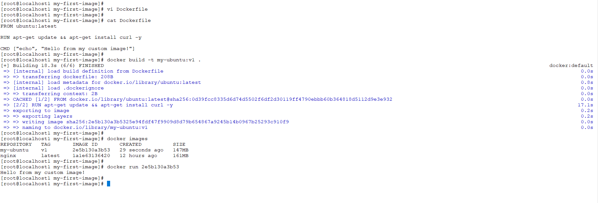
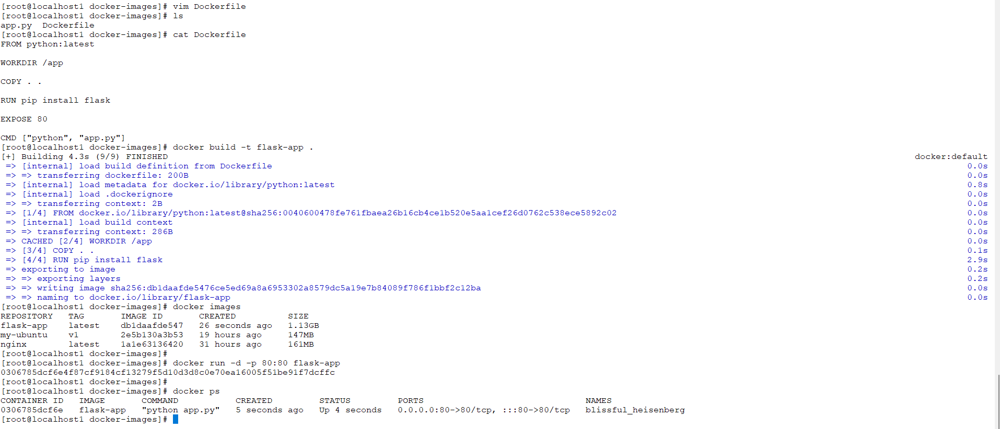
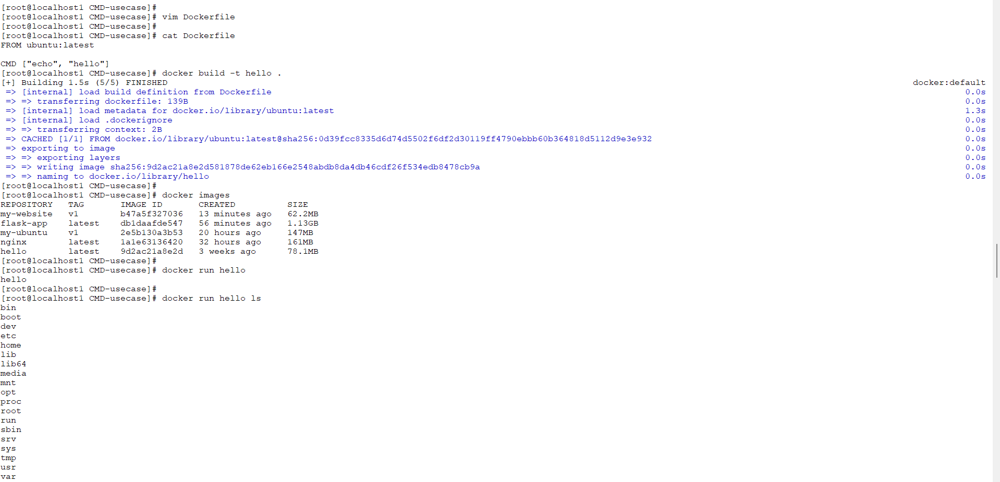
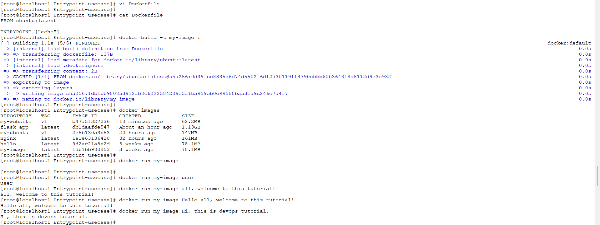
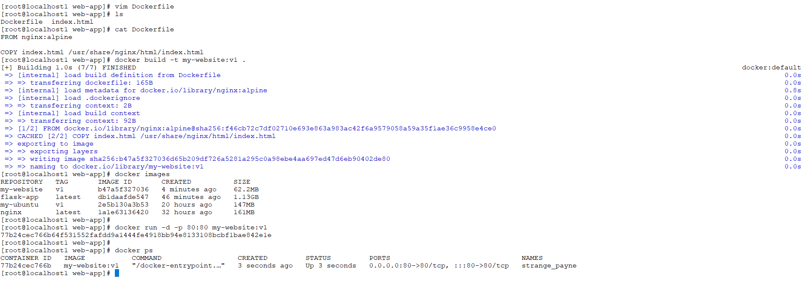
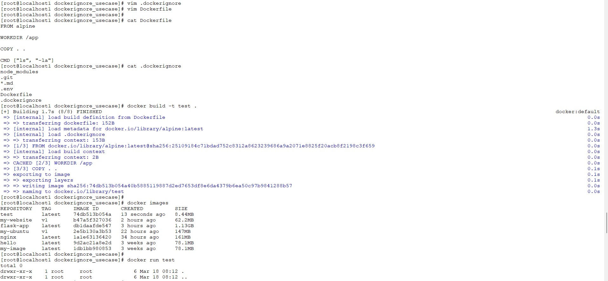
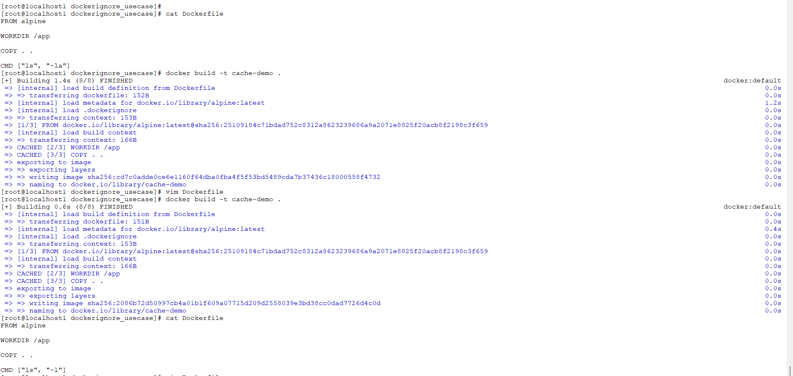
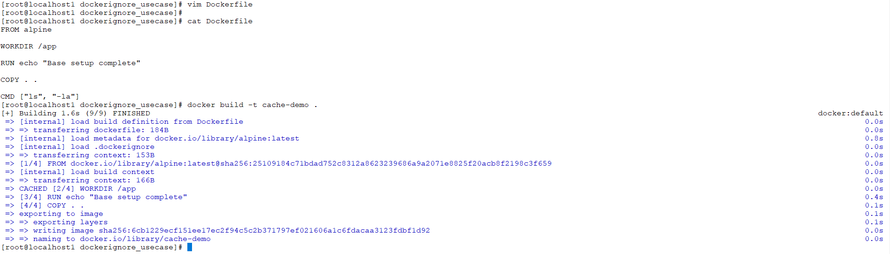

# Day 31 – Dockerfile: Build Your Own Images

##  Task
Today's goal is to write Dockerfiles and build custom images.

This is the skill that separates someone who uses Docker from someone who actually ships with Docker.

---

##  Task 1: My First Dockerfile

### Dockerfile
```Dockerfile
FROM ubuntu:latest

RUN apt-get update && apt-get install curl -y

CMD ["echo", "Hello from my custom image!"]
```

### Steps Performed
```bash
docker build -t my-ubuntu:v1 .
docker run my-ubuntu:v1
```

###  Output
Hello from my custom image!

###  Screenshot


---

##  Task 2: Dockerfile Instructions

### Dockerfile
```Dockerfile
FROM python:latest

WORKDIR /app

COPY . .

RUN pip install flask

EXPOSE 80

CMD ["python", "app.py"]
```

###  Screenshot


---

##  Task 3: CMD vs ENTRYPOINT

### CMD
```Dockerfile
CMD ["echo", "hello"]
```

### ENTRYPOINT
```Dockerfile
ENTRYPOINT ["echo"]
```

### Use CMD when:
- You want a default command that can be easily overridden
- Useful for flexible containers (e.g., debugging, testing)
- Example: running different commands in same image

### Use ENTRYPOINT when:
- You want the container to behave like a fixed executable
- The command should always run
- Additional arguments are passed to it
- Example: utility containers, scripts, CLI tools

###  Screenshots



---

##  Task 4: Simple Web App (Nginx)

### Dockerfile
```Dockerfile
FROM nginx:alpine

COPY index.html /usr/share/nginx/html/index.html
```

### Commands
```bash
docker build -t my-website:v1 .
docker run -d -p 80:80 my-website:v1
```

###  Screenshot


---

##  Task 5: .dockerignore

### File Content
```
node_modules
.git
*.md
.env
```

###  Screenshot


---

##  Task 6: Build Optimization

### Key Points
- Docker uses cached layers
- Only changed layers are rebuilt
- Order matters for performance

### Why does layer order matter for build speed?
- Docker builds images layer by layer
- Each layer is cached
- If a layer changes → all layers below it are rebuilt

###  Screenshots



---

##  Key Takeaways

- Dockerfile builds custom images
- CMD vs ENTRYPOINT difference is important
- .dockerignore improves build performance
- Layer caching speeds up builds

---

