# Day 32 – Docker Volumes & Networking

##  Task
Today's goal is to solve two real problems: data persistence and container communication.

Containers are ephemeral — they lose data when removed. And by default, containers can't easily talk to each other.

---

##  Task 1: The Problem (Data Loss)

### Steps
- Ran Postgres container
- Created database and table with data
- Stopped and removed container
- Ran a new container

###  Observation
- Data was lost

###  Why?
Containers are ephemeral — data is deleted when container is removed.

###  Screenshots
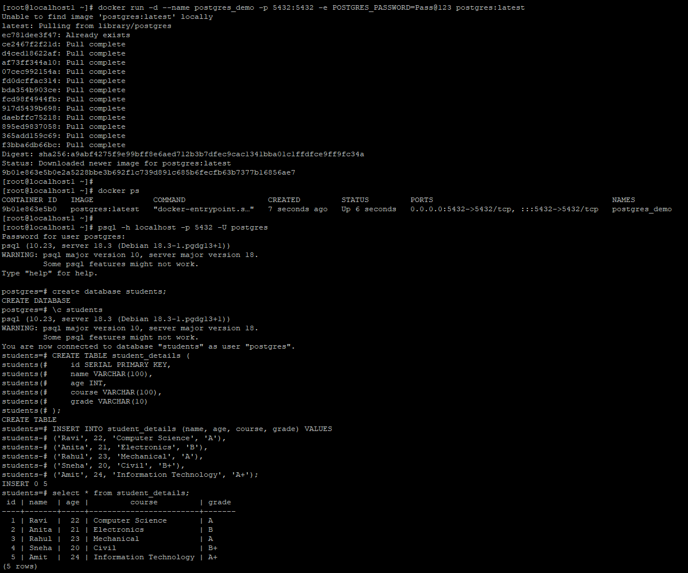
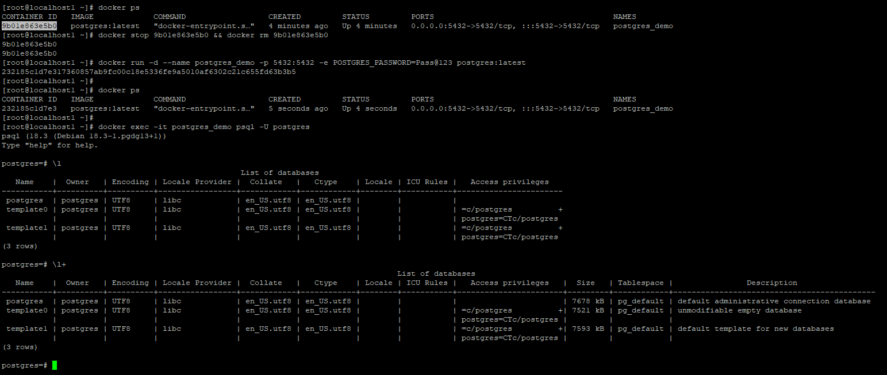

---

##  Task 2: Named Volumes

### Steps
- docker volume create pg_data
- Attached volume to container
- Created data
- Removed container
- Started new container with same volume

###  Observation
- Data persisted

###  Screenshots
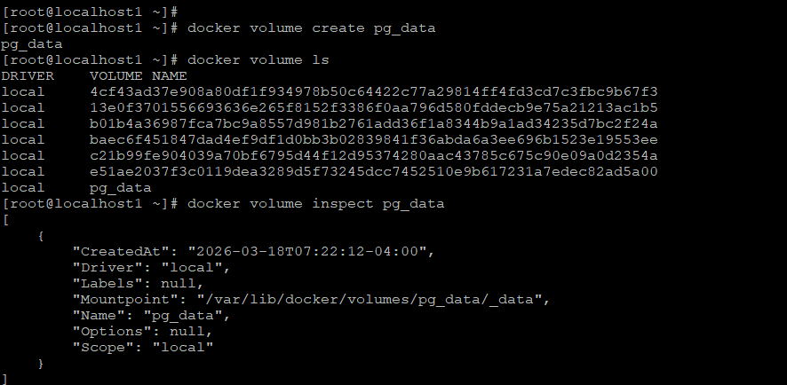
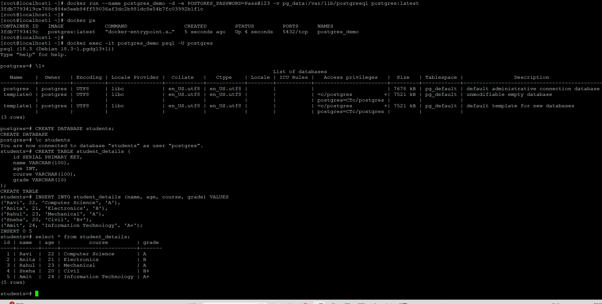
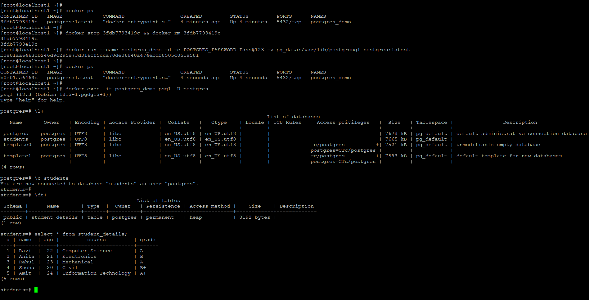

---

##  Task 3: Bind Mounts

### Steps
- Mounted host folder to container
- Accessed via browser
- Updated file on host

###  Difference

- Named Volume → managed by Docker
- Bind Mount → direct host mapping

###  Screenshots
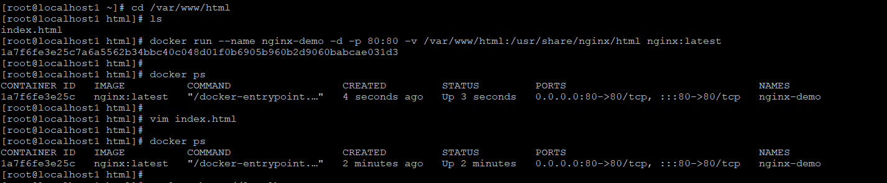
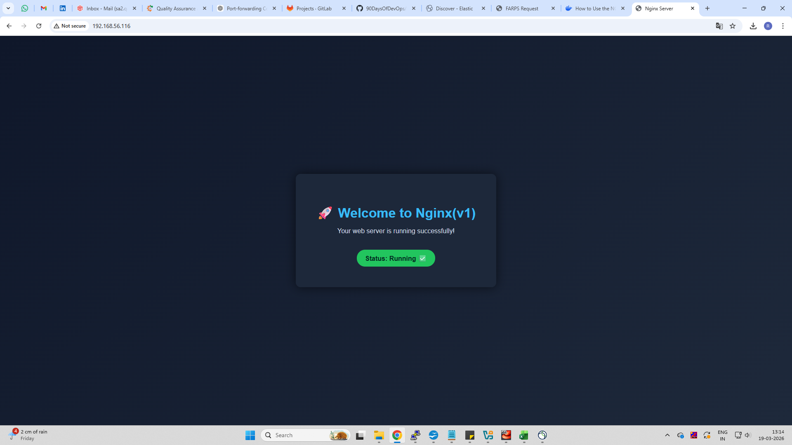

---

##  Task 4: Docker Networking Basics

### Observation
- Default bridge:
  -  No name resolution
  -  Works with IP

###  Screenshots
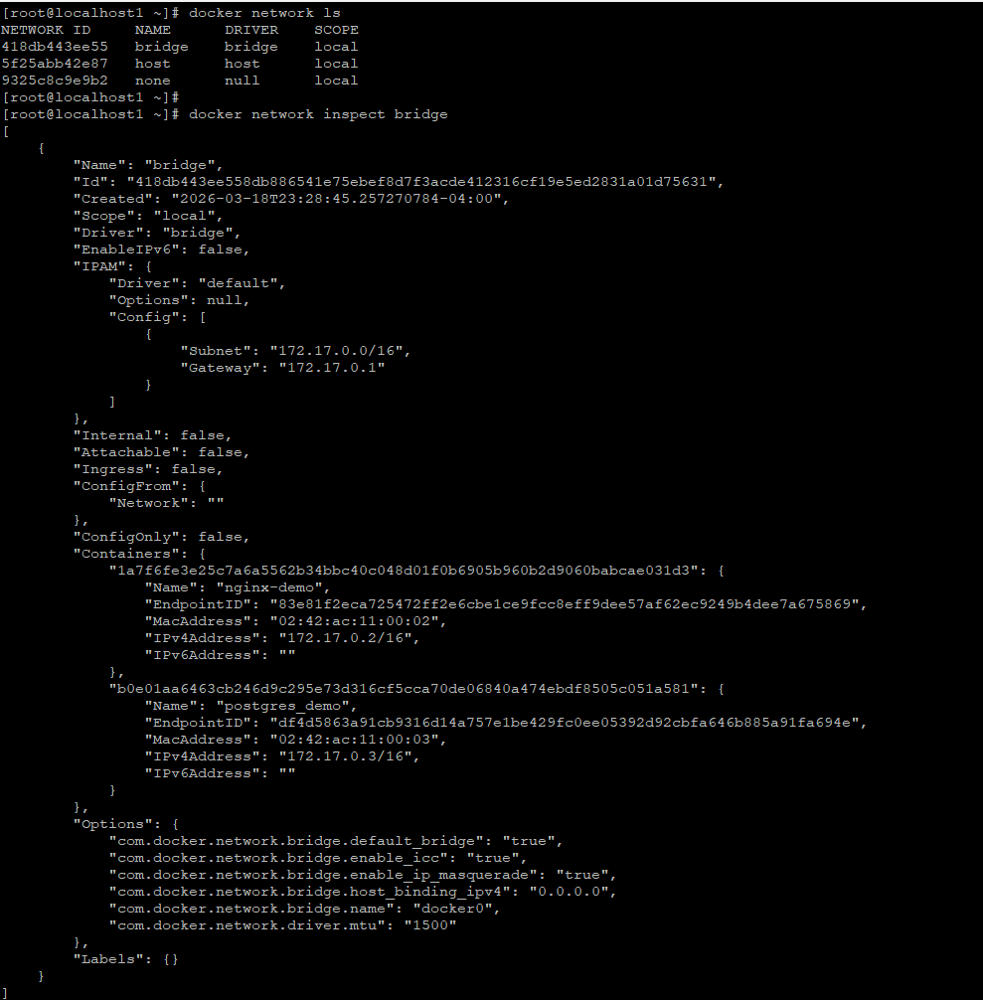
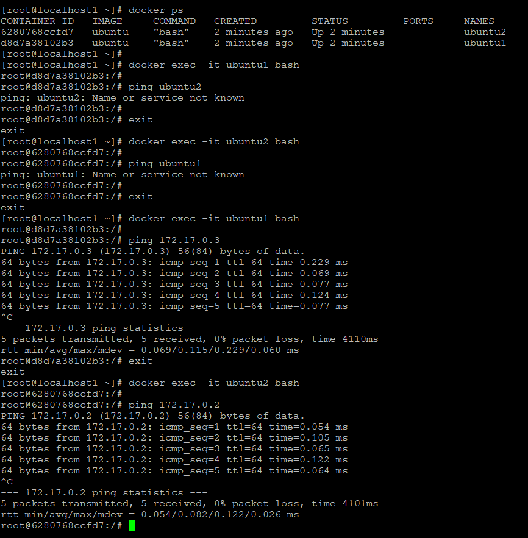

---

##  Task 5: Custom Networks

### Observation
- Containers communicate using names

###  Screenshot
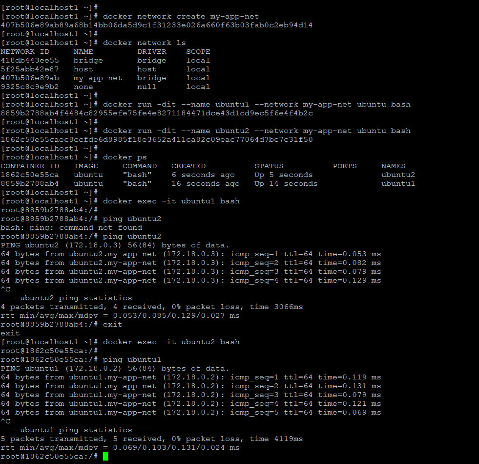

- Custom networks support DNS-based name resolution, so containers can talk using names.
- Default bridge does not support name resolution, only works with IP.
  
---

##  Task 6: Put It Together

### Result
- App container connected to DB using container name

###  Screenshot
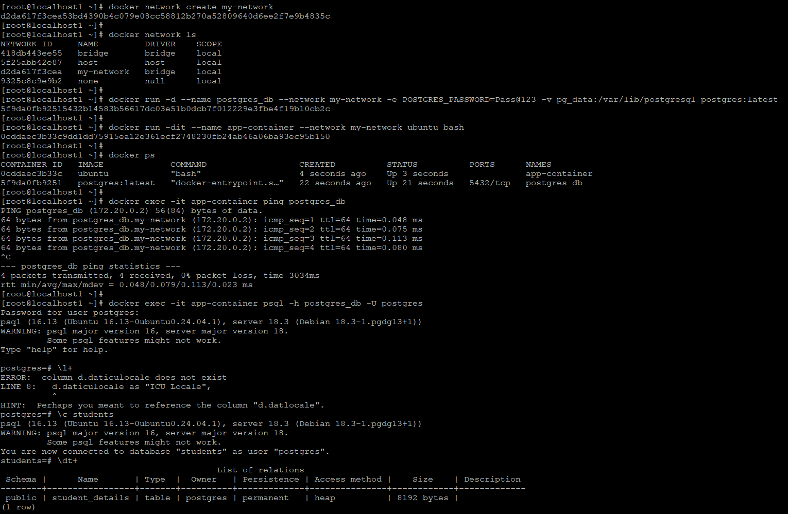

---

##  Key Takeaways

- Use volumes for persistence
- Bind mounts for development
- Custom networks enable service discovery

---

