# Day 33 – Docker Compose: Multi-Container Basics

## Task
Today's goal is to run multi-container applications with a single command.

Yesterday I manually created networks and volumes and ran containers one by one. Docker Compose simplifies everything using a single YAML file.

---

## Task 1: Install & Verify

Checked whether Docker Compose is installed and verified its version.

### Commands Used
```bash
rpm -qa | grep docker-compose
docker compose version
```

### Observation
Docker Compose plugin is installed and working correctly.

### Screenshot
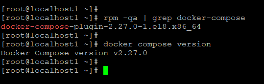

---

## Task 2: Your First Compose File

Created a basic Docker Compose setup to run an Nginx container.

### docker-compose.yml
```yaml
services:
  web:
    image: nginx:latest
    ports:
      - "80:80"
```

### Commands Used
```bash
mkdir compose-basics
cd compose-basics
mkdir nginx
cd nginx
vim docker-compose.yml

docker compose up
docker compose up -d
docker ps
docker compose down
```

### Screenshots
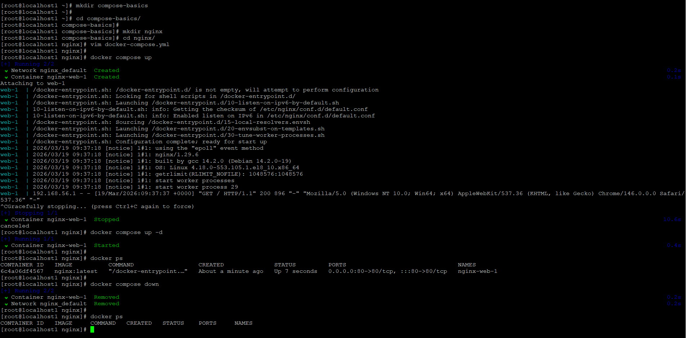
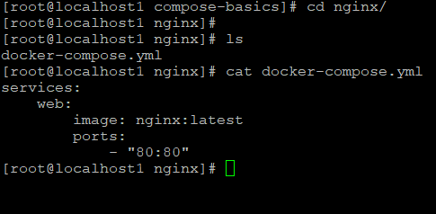

---

## Task 3: Two-Container Setup (WordPress + MySQL)

### docker-compose.yml
```yaml
services:
  wordpress:
    image: wordpress:latest
    restart: always
    ports:
      - 8080:80
    environment:
      WORDPRESS_DB_HOST: db
      WORDPRESS_DB_USER: mysql
      WORDPRESS_DB_PASSWORD: Pass@123
      WORDPRESS_DB_NAME: wordpress_db
    volumes:
      - wordpress:/var/www/html

  db:
    image: mysql:latest
    restart: always
    ports:
      - 3306:3306
    environment:
      MYSQL_DATABASE: wordpress_db
      MYSQL_USER: mysql
      MYSQL_PASSWORD: Pass@123
      MYSQL_ROOT_PASSWORD: Mysql@123
    volumes:
      - db:/var/lib/mysql

volumes:
  wordpress:
  db:
```

### Commands Used
```bash
docker volume create wordpress
docker volume create db

docker compose up -d
docker ps

docker compose down
docker compose up -d
```

### Observations
- WordPress successfully connected to MySQL using service name `db`
- Data persisted after restart due to volumes

### Screenshots
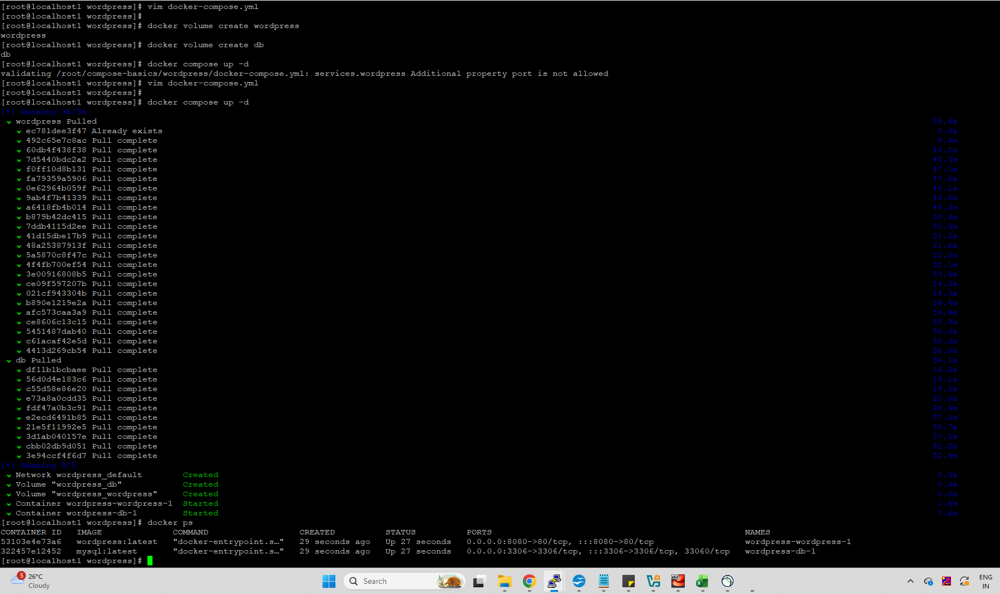
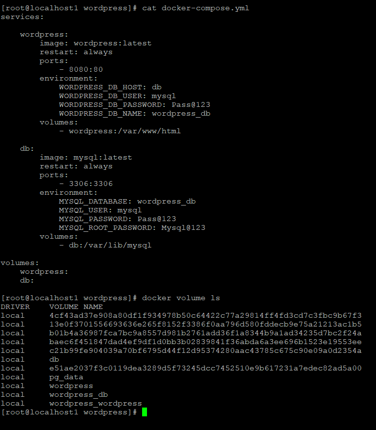
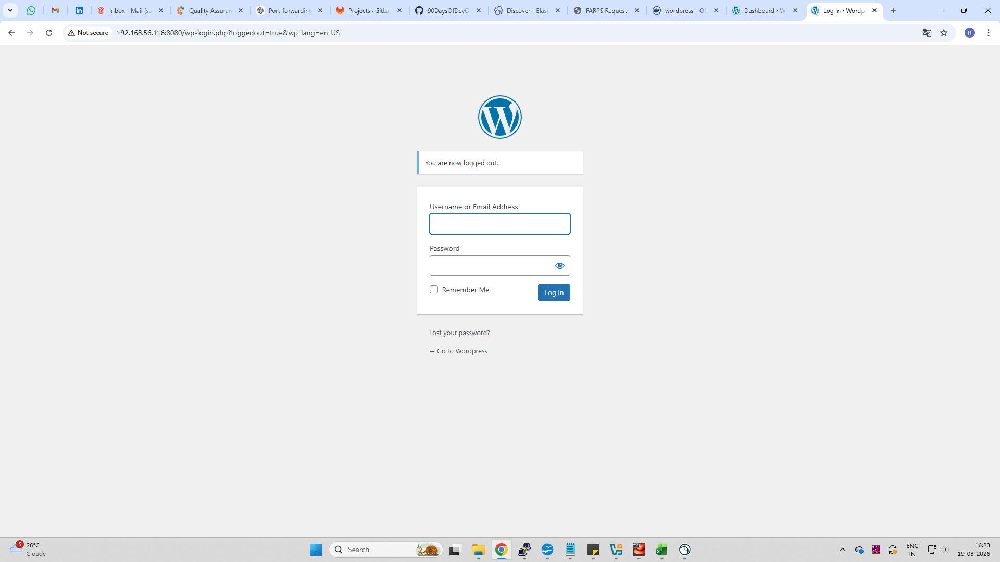
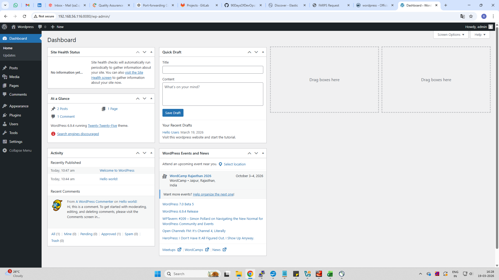
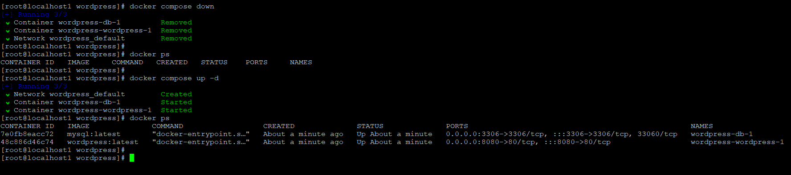
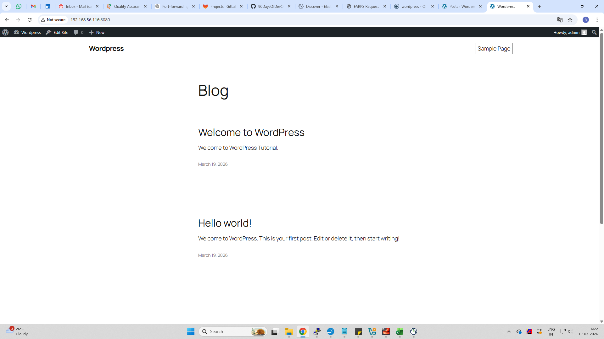

---

## Task 4: Compose Commands

### Commands Used
```bash
docker compose up -d
docker ps

docker compose logs
docker compose logs web
docker compose logs php

docker compose stop
docker compose start

docker compose down
docker compose build
docker compose up --build
```

### Observations
- `logs` shows all service logs
- Can filter logs by service name
- `stop` keeps containers, `down` removes everything
- `--build` rebuilds images if changes are made

### Screenshot
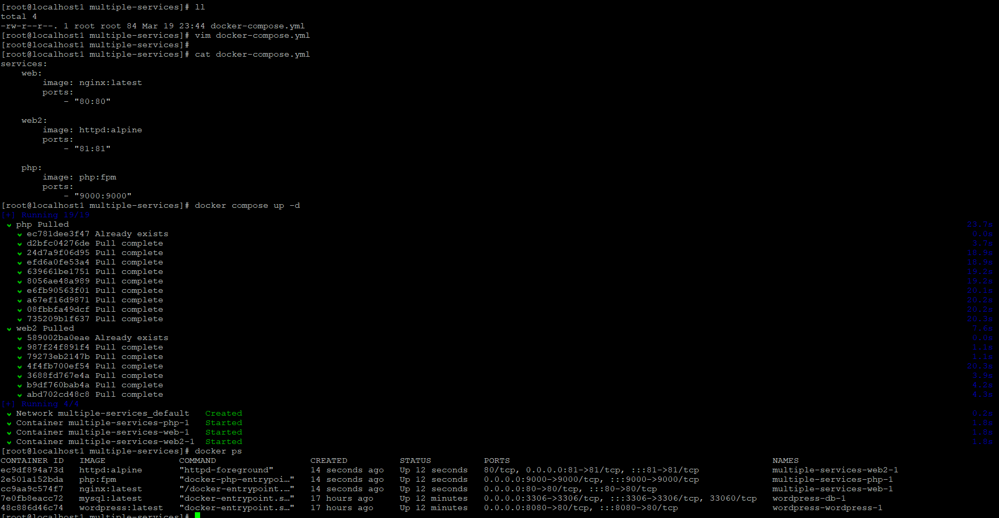

---

## Task 5: Environment Variables

### Observations
- Variables defined inside YAML are directly picked up
- Service names act as DNS (e.g., WordPress connects to MySQL using `db`)
- Can also use `.env` file for better management

### Screenshots
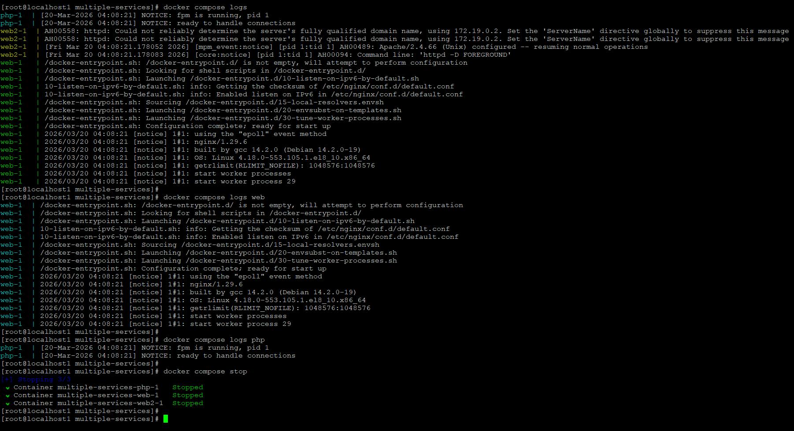
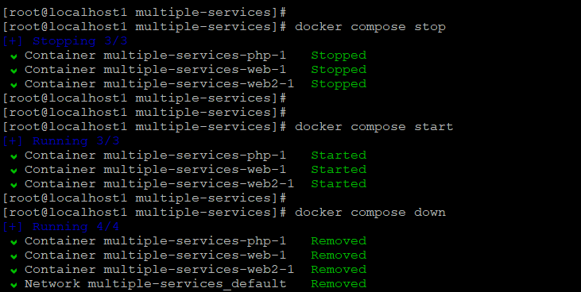
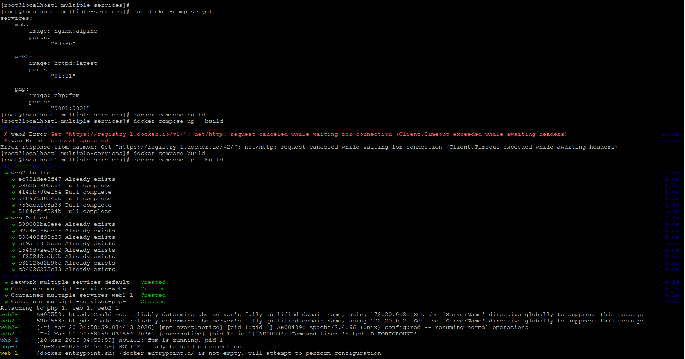

---

## Key Learnings

- Docker Compose simplifies multi-container setups
- No need to manually create networks (auto-created)
- Service names act as hostnames (DNS)
- Volumes ensure data persistence
- One command (`docker compose up`) can start entire application stack

---

## Submission

Path:
```
2026/day-33/day-33-compose.md
```

Included:
- docker-compose.yml files
- Screenshots of all tasks
- Commands and observations

Committed and pushed to GitHub 🚀
