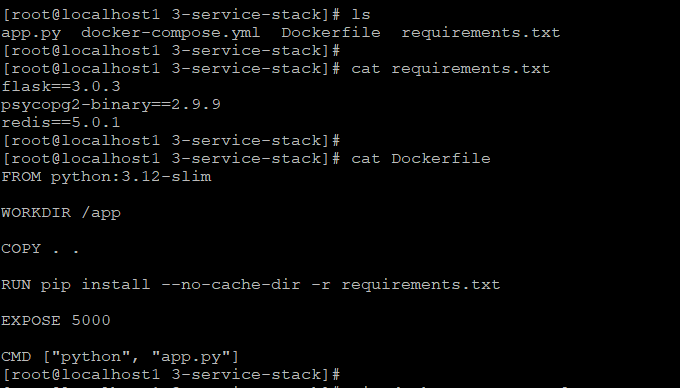
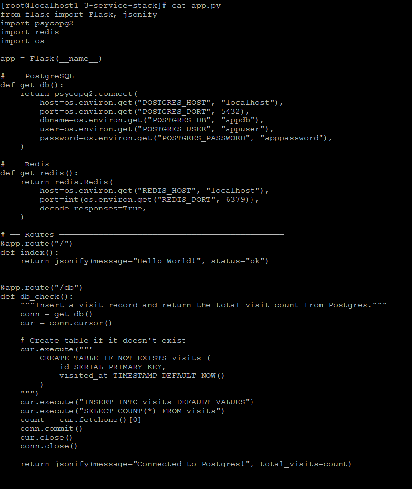
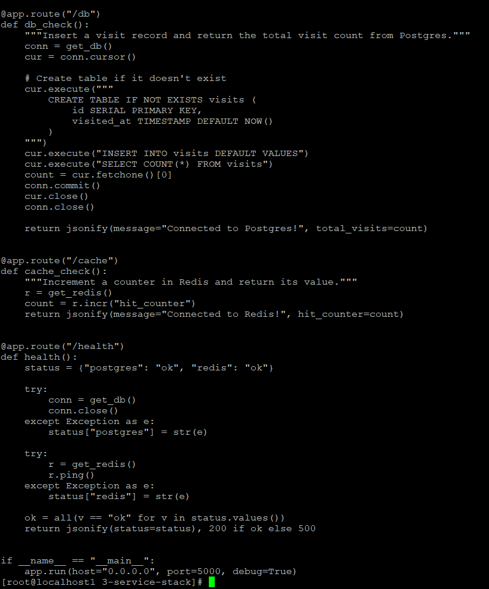
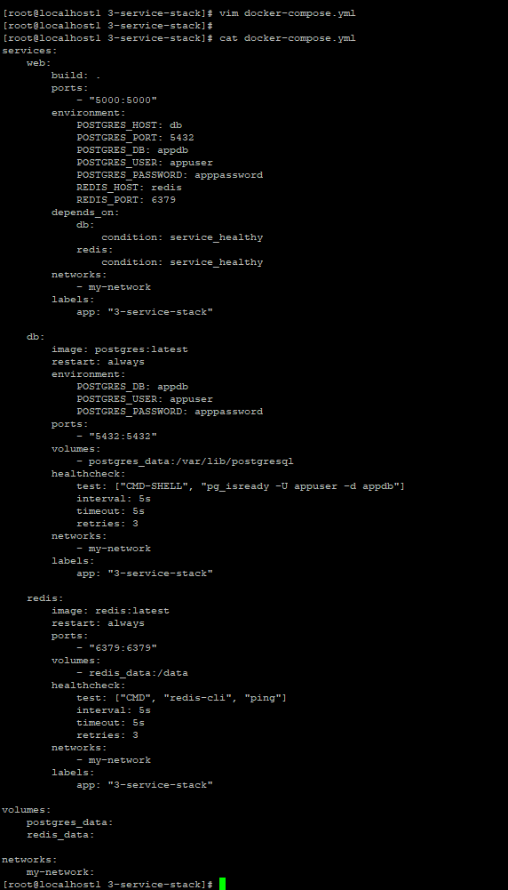
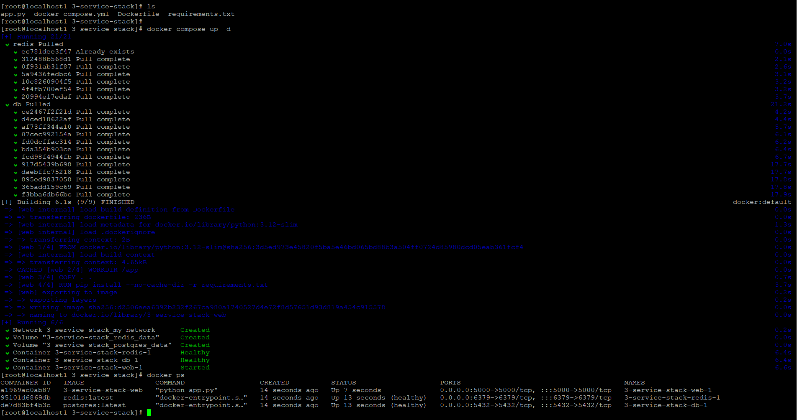
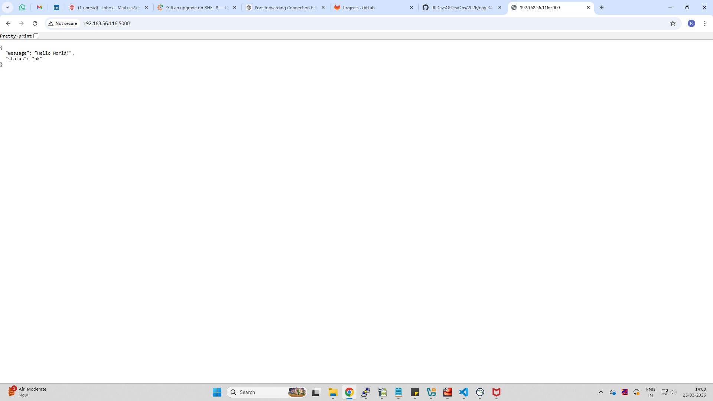
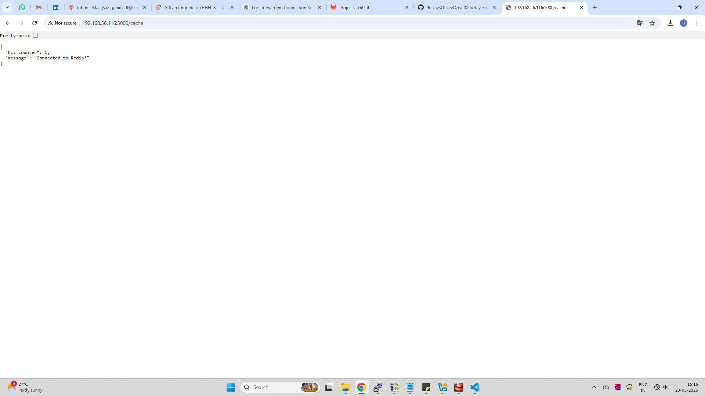
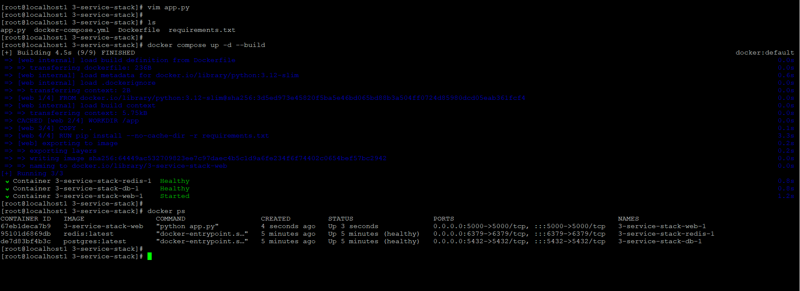
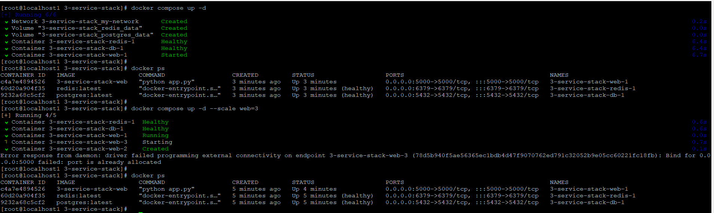

# Day 34 – Docker Compose: Real-World Multi-Container Apps

## Task
Today's goal is to build more complex, production-like setups with Docker Compose.

Yesterday was basics. Today I handled real scenarios — app + database + cache, healthchecks, restart policies, and service dependencies.

---

## Task 1: Build Your Own App Stack

Created a 3-service stack:

- Web App (Flask)
- Database (Postgres)
- Cache (Redis)

---

## docker-compose.yml

```yaml
services:
  web:
    build: .
    ports:
      - "5000:5000"
    environment:
      POSTGRES_HOST: db
      POSTGRES_PORT: 5432
      POSTGRES_DB: appdb
      POSTGRES_USER: appuser
      POSTGRES_PASSWORD: apppassword
      REDIS_HOST: redis
      REDIS_PORT: 6379
    depends_on:
      db:
        condition: service_healthy
      redis:
        condition: service_healthy
    networks:
      - my-network
    labels:
      app: "3-service-stack"

  db:
    image: postgres:latest
    restart: always
    environment:
      POSTGRES_DB: appdb
      POSTGRES_USER: appuser
      POSTGRES_PASSWORD: apppassword
    ports:
      - "5432:5432"
    volumes:
      - postgres_data:/var/lib/postgresql/data
    healthcheck:
      test: ["CMD-SHELL", "pg_isready -U appuser -d appdb"]
      interval: 5s
      timeout: 5s
      retries: 3
    networks:
      - my-network

  redis:
    image: redis:latest
    restart: always
    ports:
      - "6379:6379"
    volumes:
      - redis_data:/data
    healthcheck:
      test: ["CMD", "redis-cli", "ping"]
      interval: 5s
      timeout: 5s
      retries: 3
    networks:
      - my-network

volumes:
  postgres_data:
  redis_data:

networks:
  my-network:
```

---

## Dockerfile

```dockerfile
FROM python:3.12-slim

WORKDIR /app

COPY . .

RUN pip install --no-cache-dir -r requirements.txt

EXPOSE 5000

CMD ["python", "app.py"]
```

---

## requirements.txt

```
flask==3.0.3
psycopg2-binary==2.9.9
redis==5.0.1
```

---

## Task 2: depends_on & Healthchecks

- Used `depends_on` with `service_healthy`
- Ensured DB & Redis are ready before app starts

---

## Task 3: Restart Policies

- Used `restart: always`

### Notes
- `always` → production (auto recovery)
- `on-failure` → debugging / retry scenarios

---

## Task 4: Custom Dockerfiles

```bash
docker compose up -d --build
```

---

## Task 5: Networks & Volumes

- Custom network: `my-network`
- Volumes:
  - postgres_data
  - redis_data

---

## Task 6: Scaling

```bash
docker compose up -d --scale web=3
```

### Observation

Scaling failed due to:

```
port is already allocated
```

### Reason

Port mapping (5000:5000) cannot be shared across multiple containers.

---

## Screenshots

### Dockerfile & Requirements 



### App Code





### Compose File



### docker compose command output



### Build Output






### Change app code and Running Containers



### Rebuild Output


### Scale Error


---

## Key Learnings

- Compose can manage full production-like stacks
- Healthchecks ensure proper startup order
- Restart policies improve reliability
- Scaling requires load balancer (not direct port binding)

---

