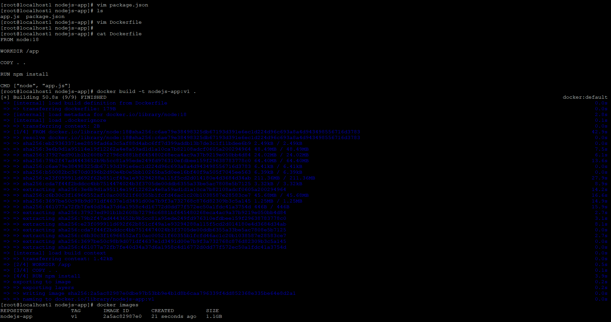
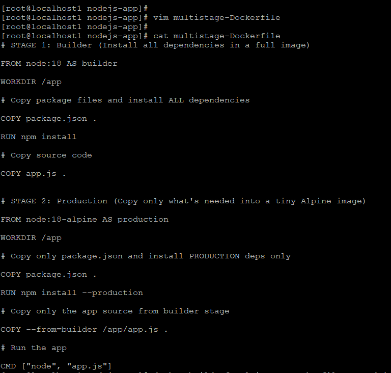
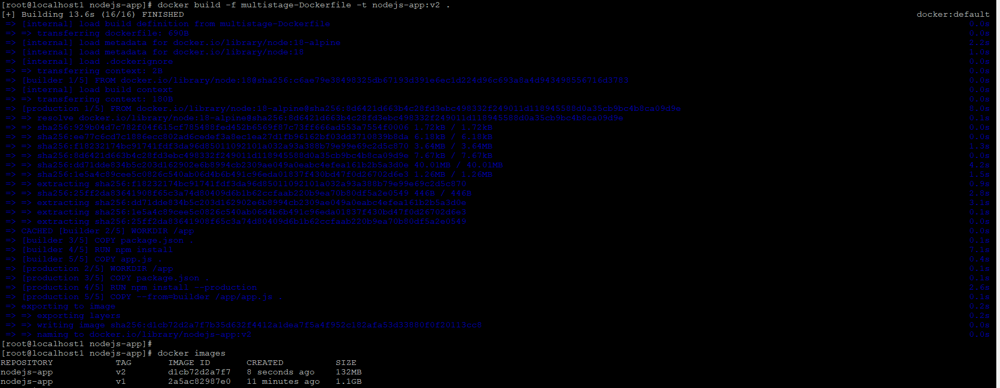
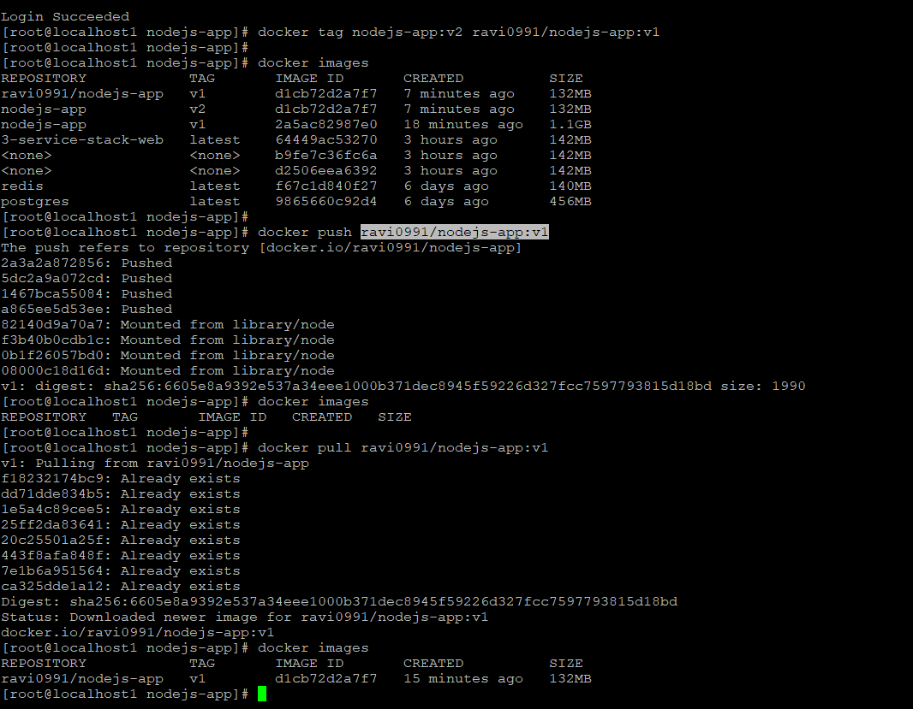
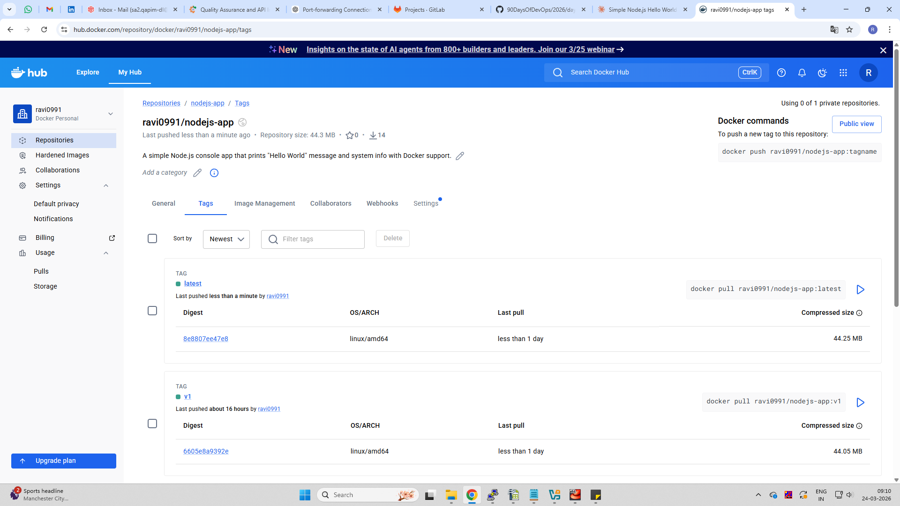
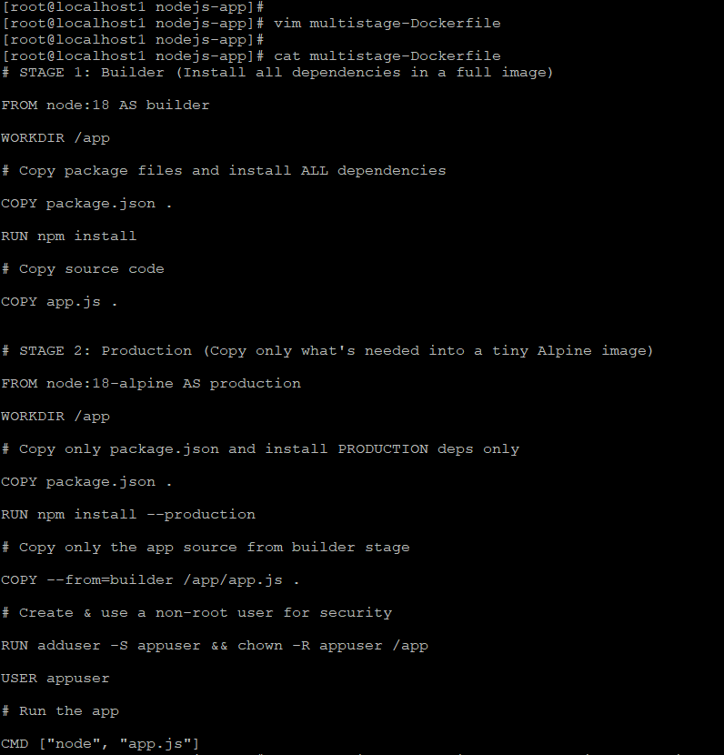
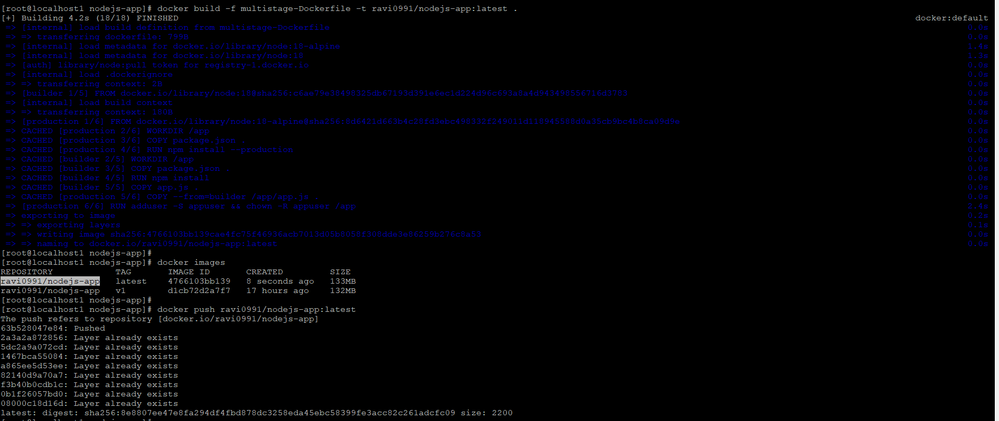
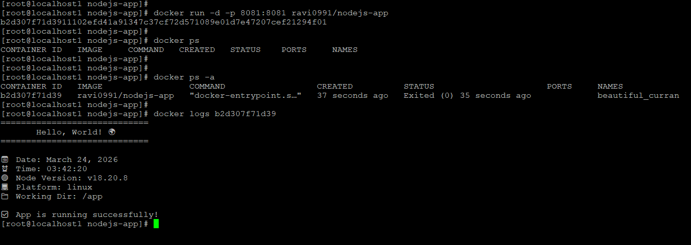

# Day 35 – Multi-Stage Builds & Docker Hub

## Task
Today's goal is to build optimized images and share them using Docker Hub.

---

## Task 1: The Problem with Large Images

### Single Stage Dockerfile
```dockerfile
FROM node:18

WORKDIR /app

COPY . .

RUN npm install

CMD ["node", "app.js"]
```

### Observation
- Image Size: ~1.1 GB (from screenshot)

### Screenshot


---

## Task 2: Multi-Stage Build

### Multi-Stage Dockerfile
```dockerfile
# Stage 1: Builder
FROM node:18 AS builder

WORKDIR /app
COPY package.json .
RUN npm install
COPY app.js .

# Stage 2: Production
FROM node:18-alpine

WORKDIR /app
COPY package.json .
RUN npm install --production
COPY --from=builder /app/app.js .

RUN adduser -S appuser && chown -R appuser /app
USER appuser

CMD ["node", "app.js"]
```

### Observation
- Image Size: ~132 MB

### Screenshots



### Notes
Multi-stage removes dev dependencies and build tools → smaller image.

---

## Task 3: Push to Docker Hub

### Commands
```bash
docker login
docker tag nodejs-app:v2 ravi0991/nodejs-app:v1
docker push ravi0991/nodejs-app:v1
docker pull ravi0991/nodejs-app:v1
```

### Screenshot


---

## Task 4: Docker Hub Repository

- Repo: ravi0991/nodejs-app
- Tags: latest, v1

### Screenshot


### Notes
- latest → default tag
- v1 → versioned release

---

## Task 5: Best Practices Applied

- Used alpine base image
- Non-root user (appuser)
- Multi-stage build
- Smaller image size

### Screenshots




---

## Final Comparison

| Type | Size |
|------|------|
| Single Stage | ~1.1 GB |
| Multi Stage | ~132 MB |


Docker Hub Repo:
https://hub.docker.com/r/ravi0991/nodejs-app

---

## Key Learnings

- Multi-stage builds drastically reduce size
- Alpine base images are lightweight
- Non-root improves security
- Docker Hub helps in sharing and versioning images

---

