# Day 36 – Docker Project: Dockerize a Full Application

## Task
Today's goal is to take a real application and Dockerize it end-to-end.

---

## Project Overview
**App Chosen:** Python Flask CRUD Application with MySQL  
**Why:** Real-world full-stack app (backend + DB), good for Docker Compose practice.

---

## Task 1: Pick Your App

### Application Structure
- Flask app (app.py)
- Templates & static files
- MySQL database

### Screenshots
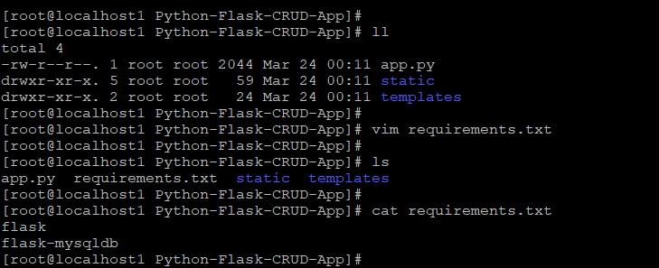
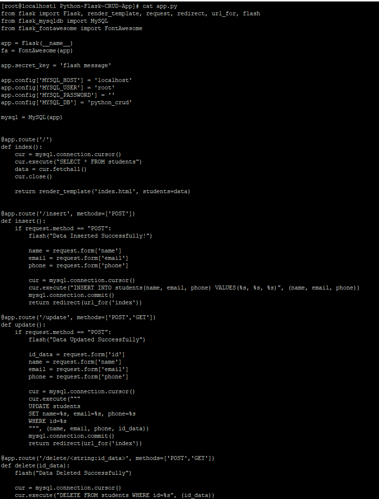

---

## Task 2: Write the Dockerfile

### Dockerfile (Multi-stage + Non-root)
```dockerfile
FROM python:3.11-slim AS builder
WORKDIR /app
RUN apt-get update && apt-get install -y gcc default-libmysqlclient-dev pkg-config
COPY requirements.txt .
RUN pip install --no-cache-dir --prefix=/install -r requirements.txt

FROM python:3.11-slim
RUN apt-get update && apt-get install -y default-libmysqlclient-dev && useradd -m appuser
WORKDIR /app
COPY --from=builder /install /usr/local
COPY --chown=appuser . .
USER appuser
EXPOSE 5000
ENV FLASK_APP=app.py
CMD ["flask", "run", "--host=0.0.0.0", "--port=5000"]
```

### .dockerignore
```
.git
__pycache__/
*.pyc
.env
venv/
```

### Screenshots
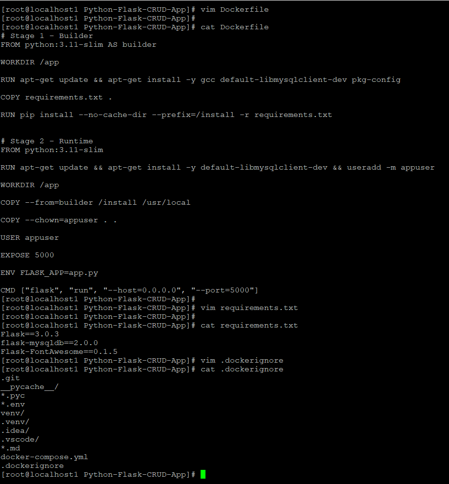
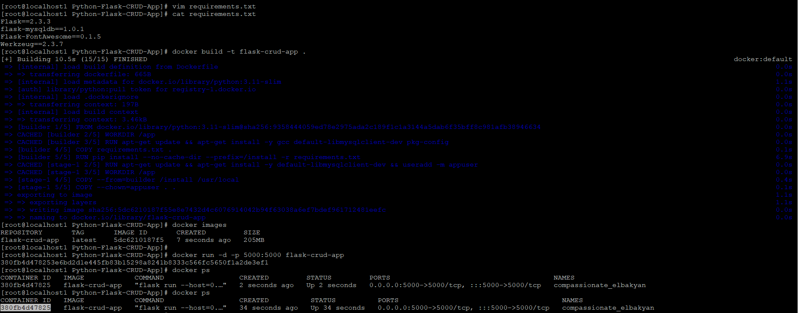
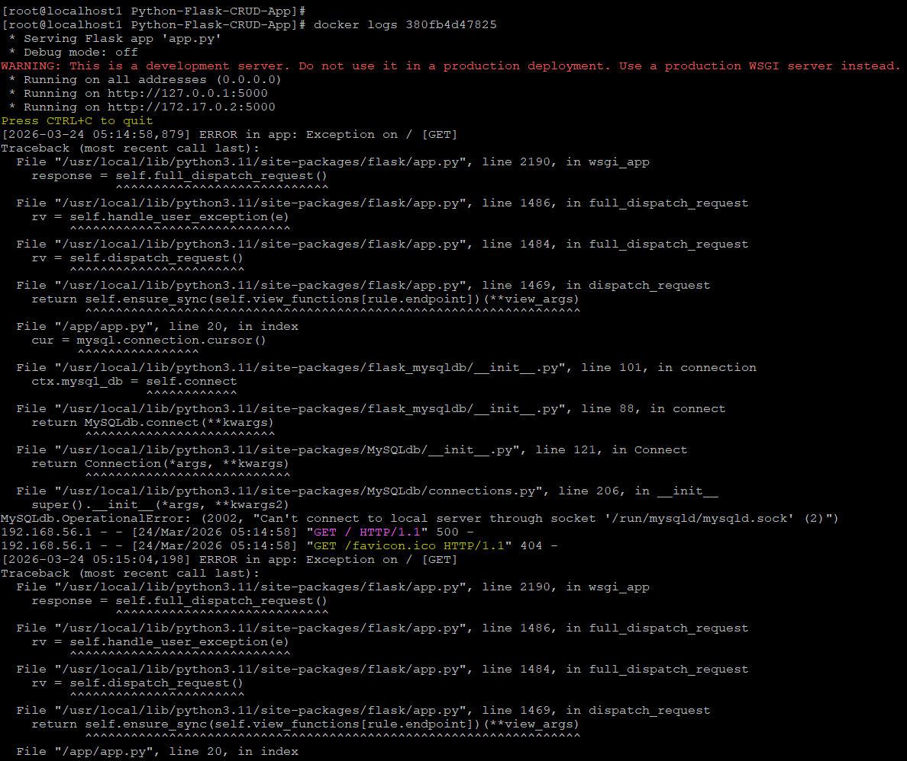

---

## Task 3: Docker Compose

### docker-compose.yml
```yaml
services:
  web:
    build: .
    ports:
      - "5000:5000"
    environment:
      - MYSQL_HOST=db
      - MYSQL_USER=root
      - MYSQL_PASSWORD=Pass@123
      - MYSQL_DB=flask_crud
    depends_on:
      db:
        condition: service_healthy
    networks:
      - my-network

  db:
    image: mysql:8.0
    environment:
      MYSQL_ROOT_PASSWORD: Pass@123
      MYSQL_DATABASE: flask_crud
    ports:
      - "3306:3306"
    volumes:
      - mysql_data:/var/lib/mysql
      - ./init.sql:/docker-entrypoint-initdb.d/init.sql
    networks:
      - my-network
    healthcheck:
      test: ["CMD","mysqladmin","ping","-h","localhost","-u","root","-pPass@123"]
      interval: 10s
      retries: 5

volumes:
  mysql_data:

networks:
  my-network:
```

### Screenshots
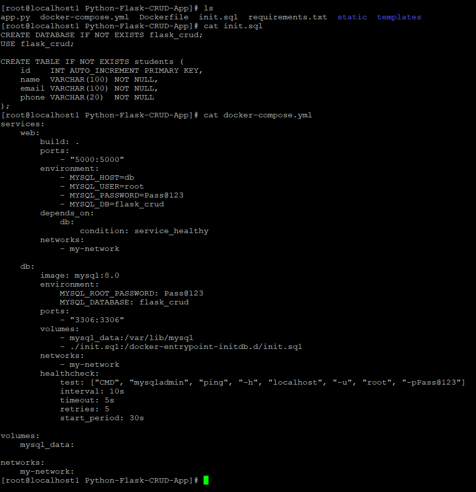
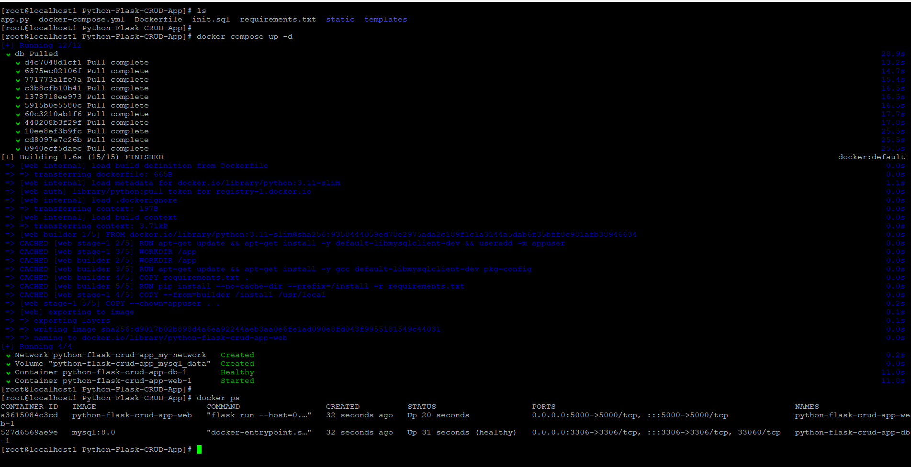
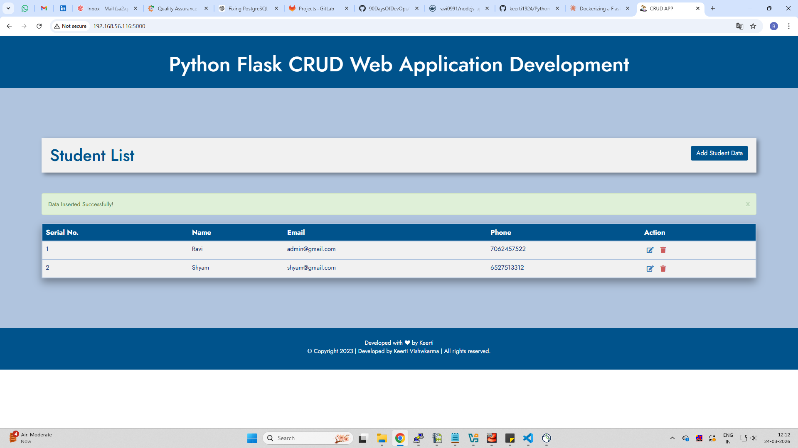

---

## Task 4: Ship It

### Commands
```bash
docker tag python-flask-crud-app-web:latest ravi0991/python-flask-crud-app:latest
docker push ravi0991/python-flask-crud-app:latest
```

### Docker Hub Link
https://hub.docker.com/r/ravi0991/python-flask-crud-app

### Screenshots
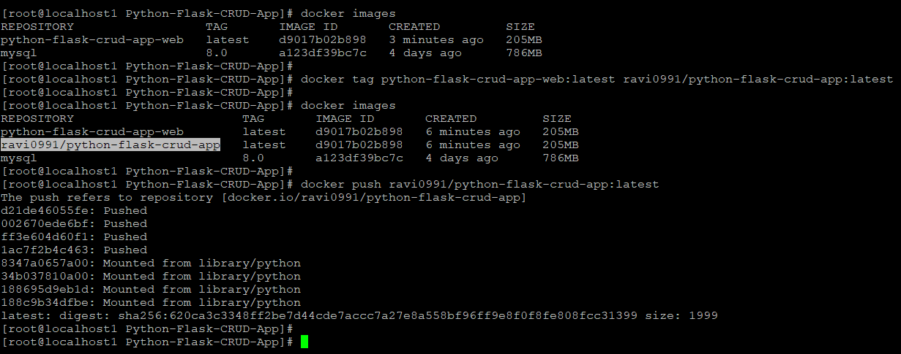
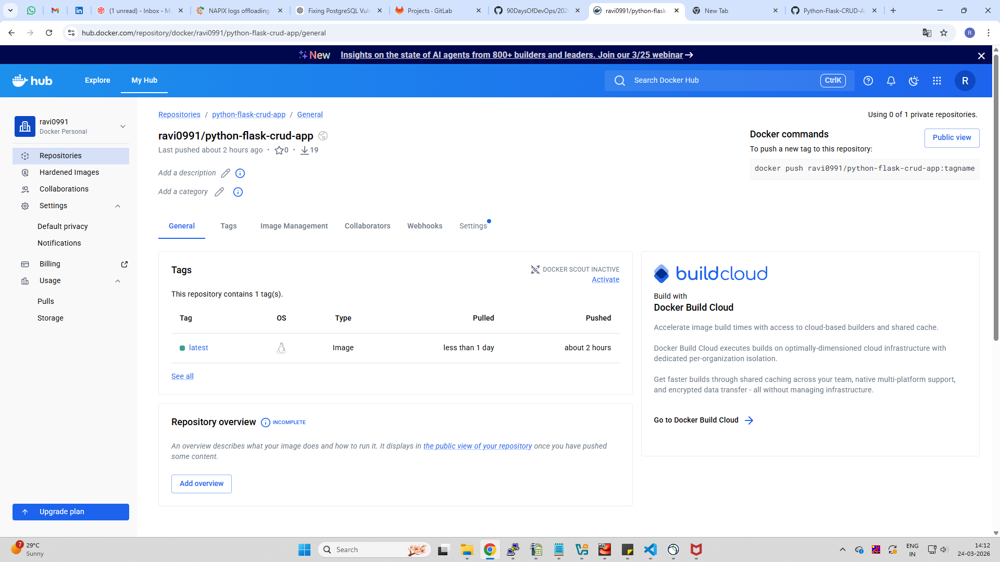
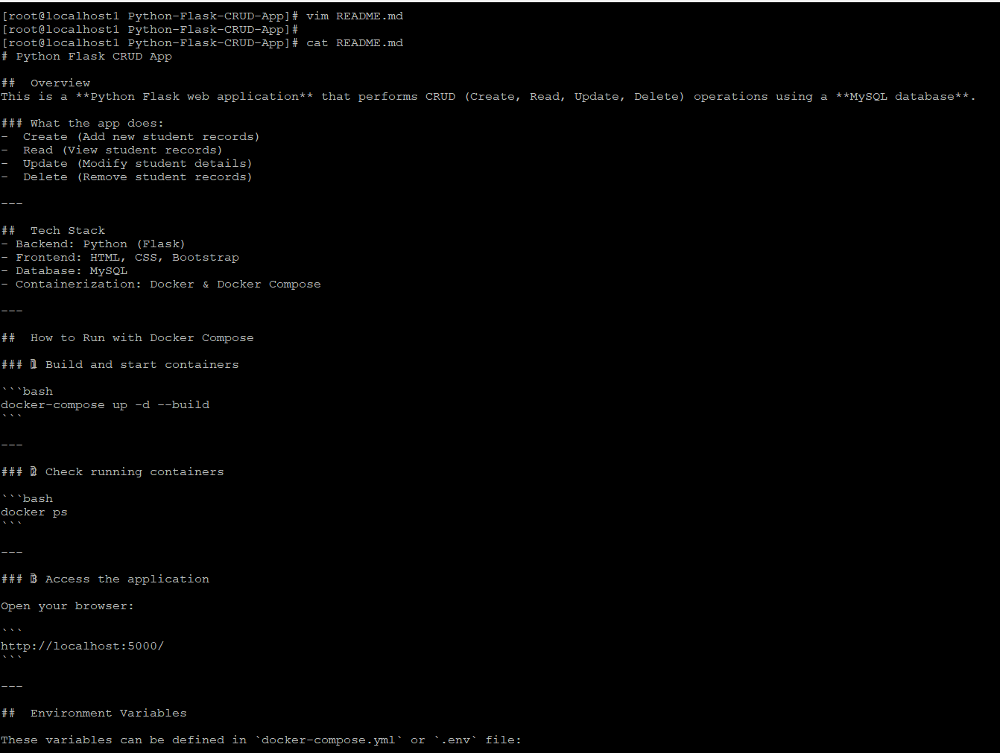

---

## Task 5: Test the Whole Flow

### Steps
```bash
docker rmi <images>
docker compose up -d
```

### Screenshots
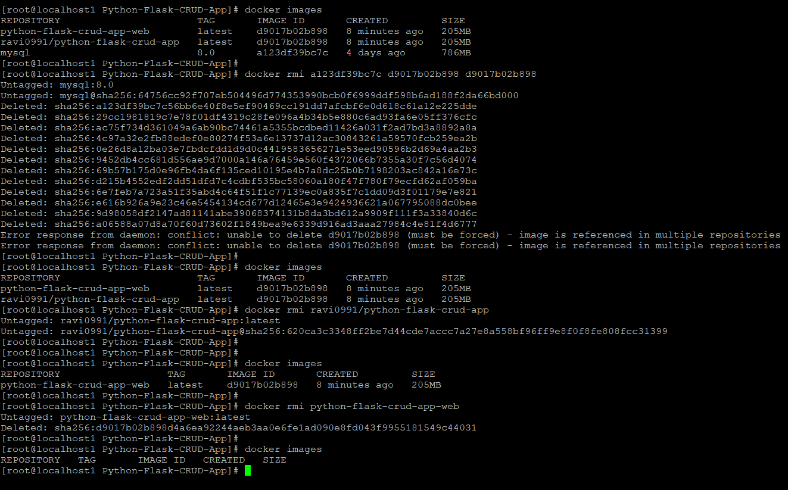
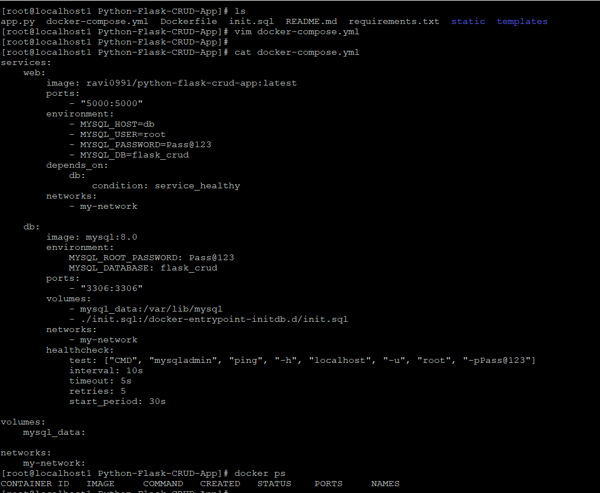
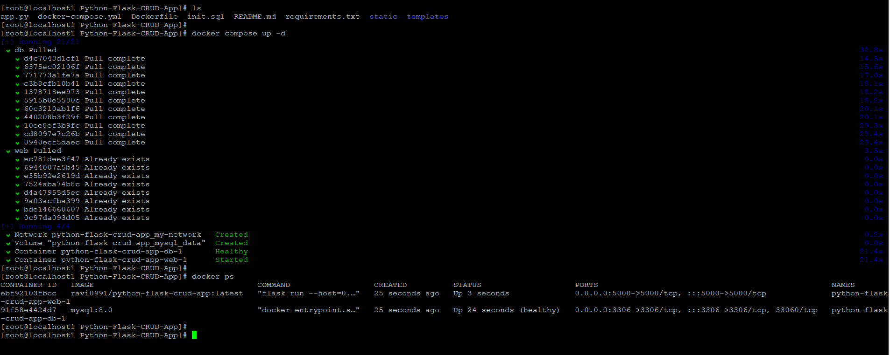
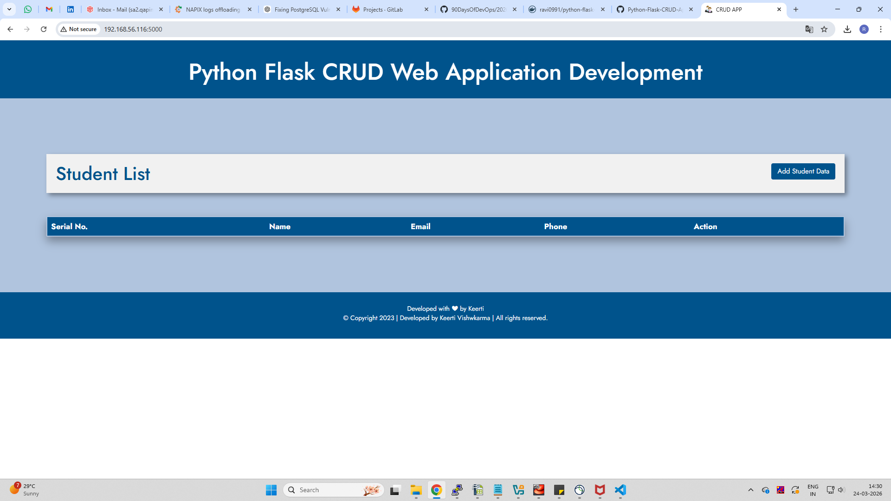

---

## Challenges Faced

- ❌ MySQL connection error (localhost issue)  
  ✔ Fixed by using service name `db`  

- ❌ App started before DB ready  
  ✔ Fixed using healthcheck  

- ❌ Permission issues  
  ✔ Used non-root user  

---

## Final Image Size
- ~205 MB

---

## Key Learnings

- Multi-stage builds reduce size  
- Docker Compose for multi-service apps  
- Service-to-service communication  
- Healthchecks are critical  

---

## Submission

Path:
```
2026/day-36/day-36-docker-project.md
```
