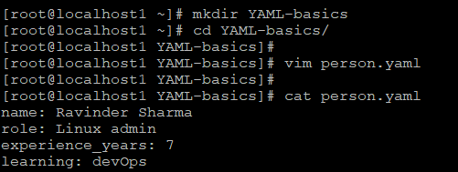
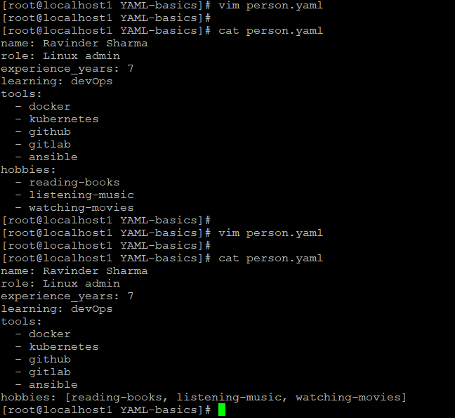
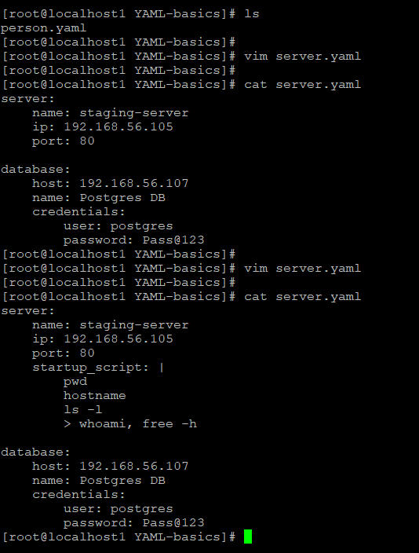
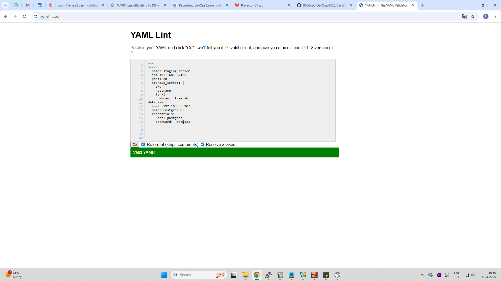
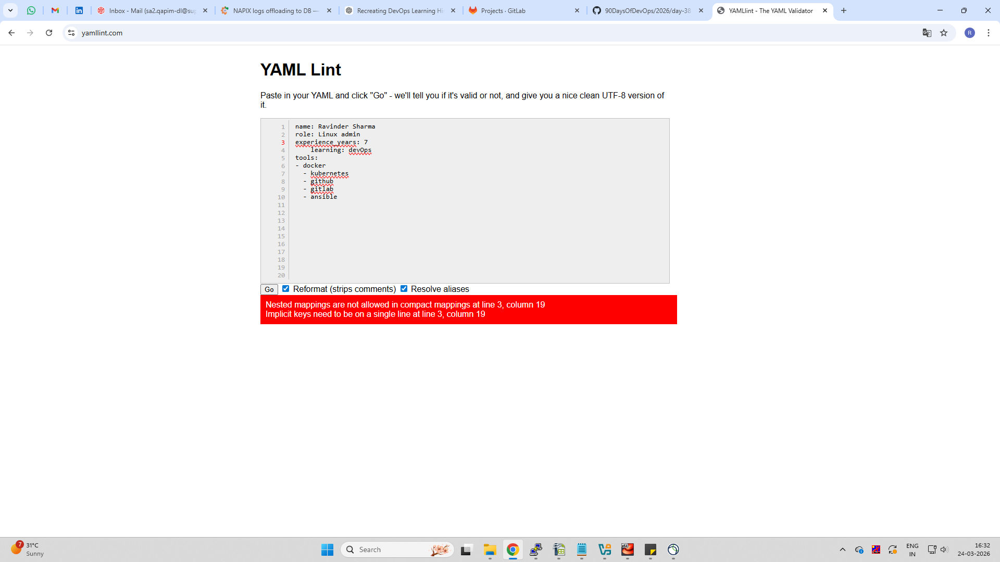

#  Day 38 – YAML Basics

##  Task
Learn YAML syntax, write files, and validate them.

---

##  Task 1: Key-Value Pairs

Created **person.yaml**

```yaml
name: Ravinder Sharma
role: Linux admin
experience_years: 7
learning: devOps
```

### Screenshot


Learned:
- YAML uses key: value format
- No tabs allowed
- Clean structure matters

---

##  Task 2: Lists

Updated **person.yaml**

```yaml
tools:
  - docker
  - kubernetes
  - github
  - gitlab
  - ansible

hobbies: [reading-books, listening-music, watching-movies]
```

### Screenshot


Two ways to write lists:
1. Dash format (- item)
2. Inline format [item1, item2]

---

##  Task 3: Nested Objects

Created **server.yaml**

```yaml
server:
  name: staging-server
  ip: 192.168.56.105
  port: 80

database:
  host: 192.168.56.107
  name: Postgres DB
  credentials:
    user: postgres
    password: Pass@123
```

### Screenshot


Learned:
- Indentation defines structure
- Nested blocks use spaces only

---

##  Task 4: Multi-line Strings

```yaml
startup_script: |
  pwd
  hostname
  ls -l

startup_script_folded: >
  whoami
  free -h
```

Difference:
- | → preserves line breaks
- > → merges into single line

---

##  Task 5: YAML Validation

Validated using yamllint.com

### Valid YAML


### Another Valid YAML


### Broken YAML Error


Error observed:
- Wrong indentation
- Nested mappings error

Fix:
- Correct spacing (2 spaces)
- Remove invalid formatting

---

##  Task 6: Spot the Difference

Broken YAML:
```yaml
tools:
- docker
  - kubernetes
```

Issue:
- Incorrect indentation

Correct:
```yaml
tools:
  - docker
  - kubernetes
```

---

##  What I Learned

1. YAML is indentation-sensitive (spaces only)
2. Lists can be written in multiple formats
3. Validation is important before using in CI/CD

---


